::: {.callout-tip icon=false title="📌 Come usare questa dispensa"}
Questo documento raccoglie tutto il materiale della lezione. Parte del materiale didattico è stato adattato dalle slide del Prof. [Massimiliano Pastore](https://dpss.psy.unipd.it/~massimiliano.pastore/index.html) (a.a. 2024/2025). Eventuali errori sono da attribuire alla sottoscritta (ovviamente).

Lungo il percorso troverete degli **esercizi** (riquadri azzurri ✏️): provate a risolverli da soli prima di aprire la soluzione.

Prima di iniziare:

1. installate i pacchetti necessari:
   `install.packages(c("ggplot2", "sjPlot", "effects", "performance", "MuMIn"))`
2. scaricate il file [kidiq.csv](dati/kidiq.csv) e salvatelo in una cartella `dati` dentro la vostra cartella di lavoro ([dati di supporto](https://github.com/masspastore/ADati) al manuale 'Analisi dei dati in Psicologia', Pastore M., *Il Mulino*, 2015).
:::

# Il modello lineare

Un **modello lineare** è un modello statistico della forma

$$
Y = X\beta + \epsilon
$$

dove $Y$ è la **variabile risposta** (o variabile dipendente), $X$ è un insieme di
**predittori** (o variabili indipendenti) e $\epsilon$ è la **componente d'errore**,
cioè la parte di $Y$ che il modello non spiega.

Con $\beta$ indichiamo i **coefficienti di regressione**: lo scopo del modello è
proprio stimare questi parametri a partire dai dati osservati.

Questi modelli si chiamano *lineari* perché la relazione ipotizzata tra i predittori
e la variabile dipendente è assunta essere lineare: ogni predittore contribuisce alla
previsione di $Y$ in modo additivo, moltiplicato per il proprio coefficiente.

I predittori possono essere **quantitativi** (es. età, QI) oppure **categoriali** (es. genere, gruppo sperimentale): vedremo che il modello lineare li gestisce entrambi.

## Che cosa stima un modello lineare? {#sec-valore-atteso}

Un modello lineare stima il **valore atteso** (cioè la media) della variabile risposta, dati i valori dei predittori.

> Il [valore atteso](https://it.wikipedia.org/wiki/Valore_atteso) di una variabile
> casuale è la media ponderata di tutti gli esiti possibili, ciascuno pesato con la propria probabilità.

La retta di regressione (in rosso, qui sotto) è proprio la sequenza dei valori attesi di $Y$ al variare di $x$: i punti osservati le stanno *attorno*. E poiché la relazione è una retta, **a una variazione costante di
$x$ corrisponde una variazione costante del valore atteso**: nel pannello di
destra, ogni volta che $x$ aumenta di 0.2 il valore atteso aumenta di 0.04
(l'incremento moltiplicato per la pendenza, qui 0.2).


::: {.cell}

```{.r .cell-code  code-fold="true" code-summary="Codice del grafico"}
set.seed(6)
x_oss <- runif(100, 0, 1)                      # 100 osservazioni simulate
y_oss <- rnorm(100, 0.1 + 0.2 * x_oss, 0.05)   # vera retta: 0.1 + 0.2x
xs <- seq(0, 1, 0.2)                           # griglia di valori di x
mu <- 0.1 + 0.2 * xs                           # valori attesi sulla griglia

par(mfrow = c(1, 2), mar = c(4, 4, 3, 1))
plot(x_oss, y_oss, pch = 19, col = "grey60", xlab = "x", ylab = "y",
     main = "La retta dei valori attesi")
abline(a = 0.1, b = 0.2, col = "red", lwd = 3)

plot(x_oss, y_oss, pch = 19, col = "grey85", xlab = "x", ylab = "y",
     main = "Variazioni costanti")
abline(a = 0.1, b = 0.2, col = "red", lwd = 3)
segments(xs[-6], mu[-6], xs[-1], mu[-6], col = "blue", lwd = 2)
segments(xs[-1], mu[-6], xs[-1], mu[-1], col = "blue", lwd = 2)
text(xs[-1] - 0.02, mu[-6] - 0.018, "+0.04", col = "blue", cex = 0.8)
```

::: {.cell-output-display}
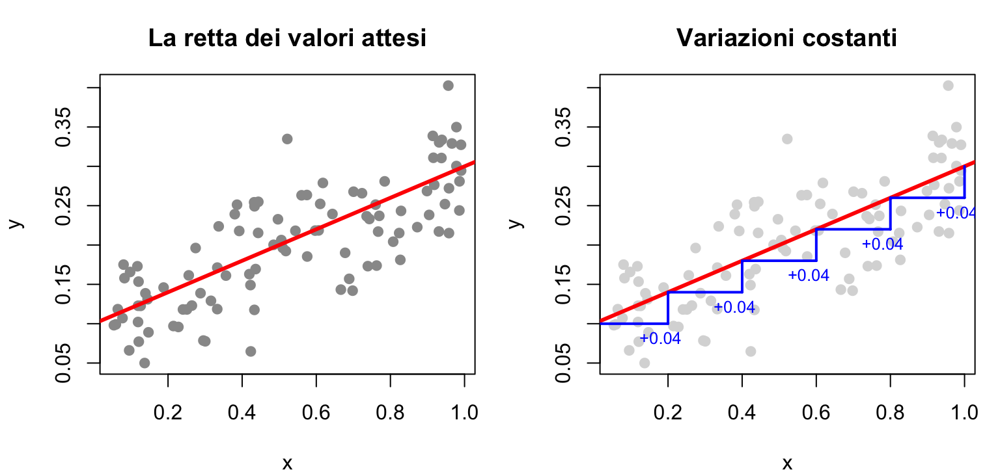{width=768}
:::
:::


::: {.cell}

:::


Il modello però non descrive solo la media: attorno a ciascun valore atteso c'è **variabilità** — i punti si disperdono intorno alla retta. Per descriverla servono le **distribuzioni di probabilità**.

## Le distribuzioni di probabilità {#sec-distribuzioni}

I modelli non riproducono mai esattamente i dati: prevedono **il valore medio**
della risposta dati i predittori. Le distribuzioni di probabilità servono proprio
a questo:

- **caratterizzare la variabilità** che resta *dopo* aver previsto la media;
- **quantificare l'incertezza** nelle stime dei parametri del modello.

Una **distribuzione di probabilità** descrive tutti i valori che una variabile
casuale $Y$ può assumere, con le probabilità associate, dati certi parametri:

$$
f(y \mid \boldsymbol{\theta})
$$

dove:

- $y$ è un valore specifico;
- $\boldsymbol{\theta}$ è un vettore di parametri (es. $\mu$, $\sigma^2$);
- $f(\cdot)$ è la funzione di probabilità.

La forma che prende $f$ dipende dal tipo di variabile:

- per le variabili casuali **continue** (tempo, peso, temperatura, ...) $f$ è una
  **funzione di densità di probabilità** (PDF, *probability density function*):
  $f(y \mid \boldsymbol{\theta})$ è la *densità* di probabilità in $y$ — non una
  probabilità! Per un valore specifico, infatti, $P(Y = y) = 0$;
- per le variabili casuali **discrete** (conteggi, esiti binari, ...) $f$ è una
  **funzione di massa di probabilità** (PMF, *probability mass function*):
  $P(Y = y \mid \boldsymbol{\theta})$ è la *probabilità* di osservare esattamente
  $y$. Ad esempio, $P(Y = 3) = 0.25$ significa che c'è il 25% di probabilità di
  ottenere proprio 3.


::: {.cell}

```{.r .cell-code  code-fold="true" code-summary="Codice del grafico"}
par(mfrow = c(2, 2), mar = c(4, 4, 3, 1))
curve(dnorm(x, 0, 1), from = -4, to = 4, lwd = 2,
      xlab = "y", ylab = "f(y)", main = "Normale (PDF)")
curve(dgamma(x, shape = 2, rate = 1), from = 0, to = 8, lwd = 2,
      xlab = "y", ylab = "f(y)", main = "Gamma (PDF)")
k <- 0:10
plot(k, dpois(k, lambda = 3), type = "h", lwd = 2,
     xlab = "y", ylab = "P(Y = y)", main = "Poisson (PMF)")
points(k, dpois(k, lambda = 3), pch = 19)
plot(k, dbinom(k, size = 10, prob = 0.4), type = "h", lwd = 2,
     xlab = "y", ylab = "P(Y = y)", main = "Binomiale (PMF)")
points(k, dbinom(k, size = 10, prob = 0.4), pch = 19)
```

::: {.cell-output-display}
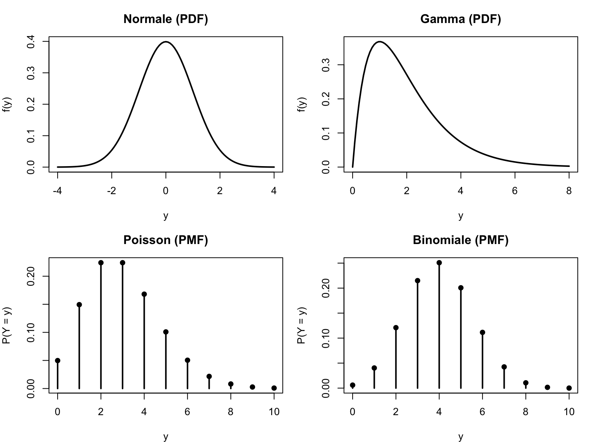{width=768}
:::
:::


::: {.cell}

:::


Tre quantità ci accompagneranno per tutto il corso:

- il **valore atteso** (media), $E[Y] = \mu$: la media di lungo periodo di $Y$
  sotto la sua distribuzione;
- il **valore atteso condizionato**, $E[Y \mid X] = \mu(X)$: la media della
  risposta **per un valore fissato del predittore** $X = x$;
- la **varianza**, $\mathrm{Var}(Y)$ (o, nella regressione, $\mathrm{Var}(Y \mid X)$):
  quanto i valori variano attorno alla media (in generale, o per un dato $x$).

Nei modelli lineari normali (e nei modelli lineari *generalizzati*) i predittori
entrano, di norma, **sulla media** della distribuzione.

Le definizioni di valore atteso e varianza sono universali, ma *come si calcolano*
— e a che cosa sono uguali — dipende dai parametri della distribuzione. Per una
distribuzione normale $Y \sim \mathcal{N}(\mu, \sigma^2)$ i parametri sono
esattamente la media e la varianza:

- **valore atteso** (media): $E[Y] = \mu$;
- **varianza**: $\mathrm{Var}(Y) = \sigma^2$.

## La distribuzione normale {#sec-normale}

La distribuzione normale ha due parametri, $\mu$ (media) e $\sigma^2$ (varianza):

$$
f(y \mid \mu, \sigma^2) = \frac{1}{\sqrt{2\pi\sigma^2}} \exp\left( - \frac{(y - \mu)^2}{2\sigma^2} \right)
$$


::: {.cell}

```{.r .cell-code  code-fold="true" code-summary="Codice del grafico"}
par(mfrow = c(1, 1))
curve(dnorm(x, 0, 1), from = -8, to = 8, lwd = 2,
      xlab = "y", ylab = "f(y)", ylim = c(0, 0.42))
curve(dnorm(x, 0, 2), add = TRUE, lwd = 2, col = "blue")
curve(dnorm(x, 2, 1), add = TRUE, lwd = 2, col = "red")
legend("topleft", lwd = 2, col = c("black", "blue", "red"), bty = "n",
       legend = c(expression(mu == 0 ~ "," ~ sigma == 1),
                  expression(mu == 0 ~ "," ~ sigma == 2),
                  expression(mu == 2 ~ "," ~ sigma == 1)))
```

::: {.cell-output-display}
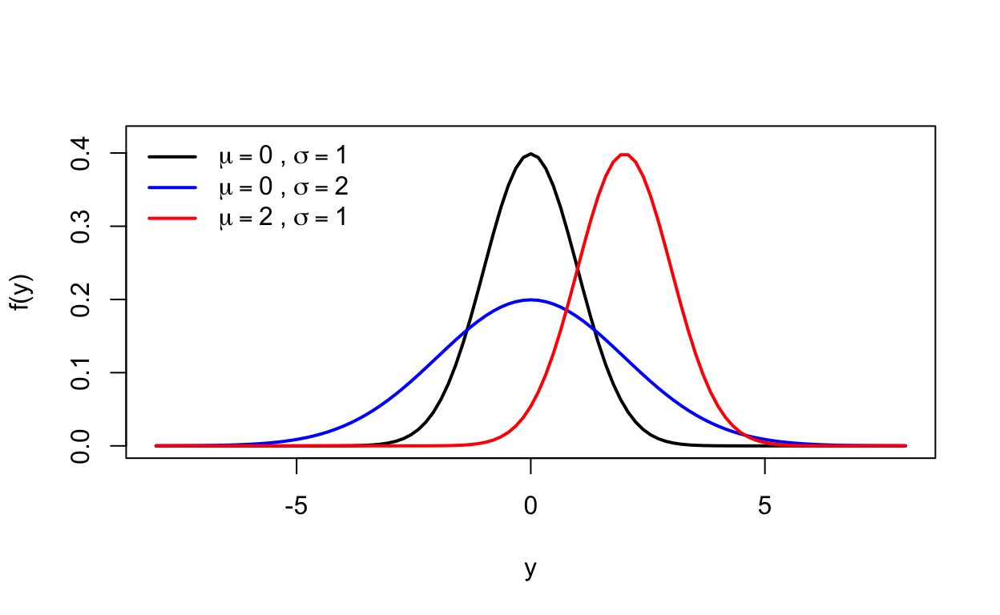{width=624}
:::
:::


Le sue proprietà principali:

- **supporto**: $(-\infty, +\infty)$ — qualunque valore reale è possibile;
- media = moda = mediana;
- **media** (valore atteso): $\mu$;
- **varianza**: $\sigma^2$;
- **indipendenza tra media e varianza**: cambiare la media *non* cambia la
  varianza.

Le misure del mondo reale non sono automaticamente normali: la **normalità è una scelta di modellazione**. Scegliere la distribuzione per i propri dati significa chiedersi:

- **supporto**: quali valori sono possibili per la mia variabile?
- **media**: quale valore prevedere, in media?
- **varianza**: quanta variabilità attorno alla media?
- **relazione media–varianza**: la varianza cambia al variare della media?

::: {.callout-note collapse="true"}

## GLM

Per la normale la risposta è **no**: media e varianza sono parametri separati
e indipendenti. Per altre distribuzioni, invece...

| Distribuzione | Supporto | media: $E[Y]$ | varianza: $\mathrm{Var}(Y)$ |
|------------------|------------------|:----------------:|:-----------------:|
| **Normale**: $f(y \mid \mu,\sigma^2)$ | $y \in \mathbb{R}$ | $\mu$ | $\sigma^2$ |
| **Gamma**: $f(y \mid \alpha,\lambda)$ | $y \in (0,\infty)$ | $\alpha/\lambda$ | $\alpha/\lambda^2$ |
| **Binomiale**: $f(y \mid n,p)$ | $y \in \{0,1,\dots,n\}$ | $np$ | $np(1-p)$ |
| **Poisson**: $f(y \mid \lambda)$ | $y \in \{0,1,2,\dots\}$ | $\lambda$ | $\lambda$ |

Notate la colonna della varianza: per la Binomiale e la Poisson la varianza *dipende dalla media*, per la Normale no. Per esempio per la Poisson: spostando la media da 2 a 10 la distribuzione *si "allarga" da sola* — media e varianza viaggiano insieme (sono entrambe uguali a $\lambda$).


::: {.cell}

```{.r .cell-code  code-fold="true" code-summary="Codice del grafico"}
par(mfrow = c(1, 2), mar = c(4, 4, 3, 1))
kk <- 0:22
plot(kk, dpois(kk, 2), type = "h", lwd = 2, ylim = c(0, 0.28),
     xlab = "y", ylab = "P(Y = y)", main = "Poisson, media = 2")
plot(kk, dpois(kk, 10), type = "h", lwd = 2, ylim = c(0, 0.28),
     xlab = "y", ylab = "P(Y = y)", main = "Poisson, media = 10")
```

::: {.cell-output-display}
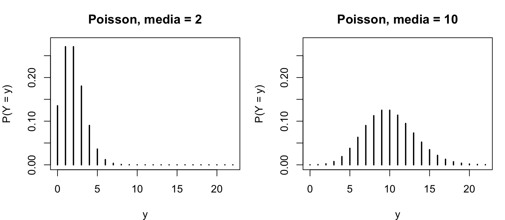{width=768}
:::
:::

:::


::: {.cell}

:::


Con la distribuzione normale possiamo allora scrivere il modello di regressione
in due modi **equivalenti**. Il primo mette i predittori sulla media della
distribuzione:

$$
\mu_i = \beta_0 + \beta_1 x_i, \qquad y_i \sim \mathcal{N}(\mu_i, \sigma^2)
$$

il secondo isola la componente d'errore:

$$
y_i = \beta_0 + \beta_1 x_i + \epsilon_i, \qquad \epsilon_i \sim \mathcal{N}(0, \sigma^2)
$$


::: {.cell}

```{.r .cell-code  code-fold="true" code-summary="Codice del grafico"}
s <- 0.05                              # ampiezza delle campane normali
campana <- function(x0, y0) {          # disegna una normale "in piedi" in (x0, y0)
  yg <- seq(y0 - 3 * s, y0 + 3 * s, length.out = 80)
  d  <- dnorm(yg, y0, s);  d <- d / max(d) * 0.07
  polygon(c(x0, x0 + d, x0), c(yg[1], yg, yg[80]),
          col = adjustcolor("blue", 0.25), border = "blue")
}

par(mfrow = c(1, 2), mar = c(4, 4, 3, 1))
plot(x_oss, y_oss, pch = 19, col = "grey60", xlim = c(0, 1.1),
     ylim = c(-0.06, 0.48), xlab = "x", ylab = "y",
     main = "Distribuzione della risposta")
abline(a = 0.1, b = 0.2, col = "red", lwd = 2)
for (i in seq_along(xs)) campana(xs[i], mu[i])
points(xs, mu, pch = 19, col = "red")

e_oss <- y_oss - (0.1 + 0.2 * x_oss)
plot(x_oss, e_oss, pch = 19, col = "grey60", xlim = c(0, 1.1),
     ylim = c(-0.2, 0.2), xlab = "x", ylab = expression(epsilon == y - hat(y)),
     main = "Distribuzione degli errori")
abline(h = 0, col = "red", lwd = 2)
for (i in seq_along(xs)) campana(xs[i], 0)
points(xs, rep(0, 6), pch = 19, col = "red")
```

::: {.cell-output-display}
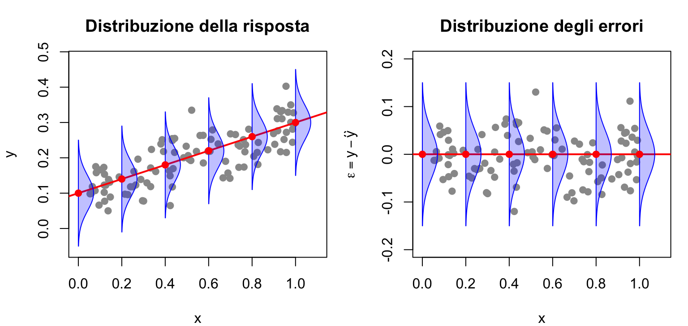{width=768}
:::
:::


::: {.cell}

:::


A sinistra la normale descrive la risposta attorno alla retta; a destra descrive gli errori attorno allo zero: sono due modi di esprimere **la stessa assunzione di modellazione**. 

## Le assunzioni del modello di regressione {#sec-assunzioni}

Perché le stime e le inferenze del modello siano valide, il modello di
regressione si fonda su alcune assunzioni. Per capire di che cosa parlano,
partiamo dal loro oggetto comune: **gli errori**, cioè le distanze verticali tra
i dati osservati e la retta del modello.


::: {.cell}

```{.r .cell-code  code-fold="true" code-summary="Codice del grafico"}
set.seed(4)
xe <- 1:12
ye <- 2 + 0.8 * xe + rnorm(12, 0, 1.6)
me <- lm(ye ~ xe)

plot(xe, ye, pch = 19, col = "grey30", xlab = "x", ylab = "y")
abline(me, col = "blue", lwd = 2)
segments(xe, ye, xe, fitted(me), col = "red")     # gli errori: distanze verticali
i <- 9                                             # ne evidenziamo uno
text(xe[i] + 0.2, (ye[i] + fitted(me)[i]) / 2,
     expression(epsilon[i]), col = "red", pos = 4)
```

::: {.cell-output-display}
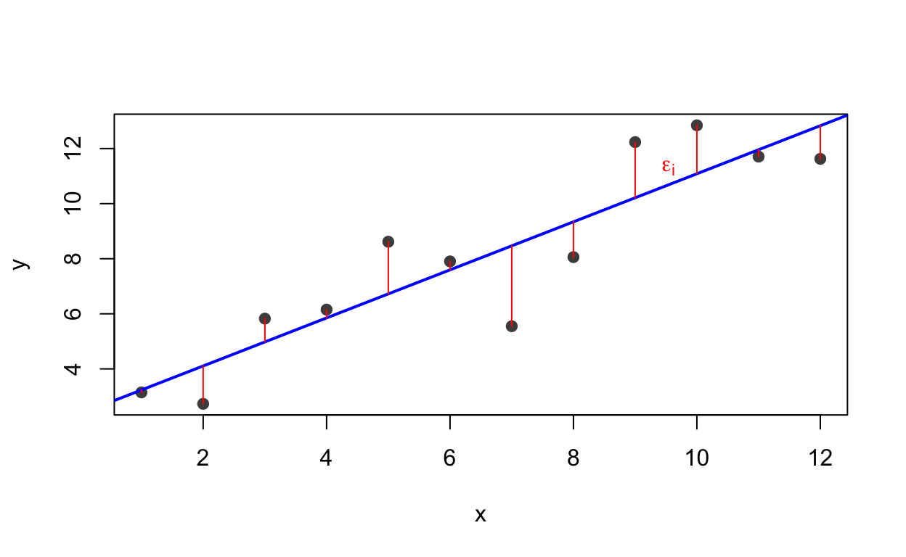{width=624}
:::
:::


Ogni segmento rosso è un errore: di quanto il dato osservato si discosta dal valore atteso sulla retta. (A rigore
l'errore si misura dalla retta *vera*; quando la retta viene *stimata* dai dati, quella distanza si chiama **residuo** — è la stessa idea, e la calcoleremo nella
@sec-scarti.)

Le cinque assunzioni dicono, ciascuna, qualcosa su **come devono comportarsi questi segmenti**. Accanto a ognuna trovate un grafico con dati simulati: a sinistra l'assunzione rispettata, a destra violata. 

**1. Indipendenza tra $X$ ed errore.** La variabile $X$ e l'errore sono
indipendenti nella popolazione: i predittori non contengono informazione
sull'errore.


::: {.cell}

```{.r .cell-code  code-fold="true" code-summary="Codice del grafico"}
set.seed(1)
x    <- runif(80, 0, 10)
e_ok <- rnorm(80, 0, 1.5)                    # errore indipendente da X
e_no <- 0.7 * (x - 5) + rnorm(80, 0, 1.5)    # errore correlato con X

par(mfrow = c(1, 2), mar = c(4, 4, 3, 1))
plot(x, e_ok, pch = 19, col = "grey40", xlab = "X", ylab = expression(epsilon),
     main = "Errore indipendente da X")
abline(h = 0, lty = 2)
plot(x, e_no, pch = 19, col = "grey40", xlab = "X", ylab = expression(epsilon),
     main = "Errore correlato con X")
abline(h = 0, lty = 2)
abline(lm(e_no ~ x), col = "red", lwd = 2)
```

::: {.cell-output-display}
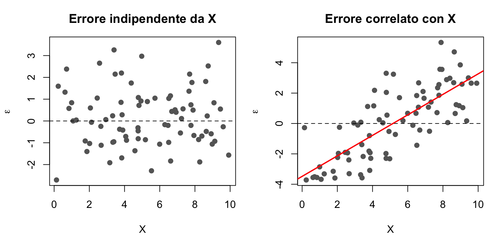{width=768}
:::
:::


A destra gli errori tendono a essere negativi per $X$ piccolo e positivi per $X$ grande (linea rossa).


::: {.cell}

:::


**2. Indipendenza degli errori.** Ogni coppia di errori $\epsilon_i$ e
$\epsilon_j$ è indipendente, per $i \neq j$: l'errore di un'osservazione non dice nulla sull'errore di un'altra.


::: {.cell}

```{.r .cell-code  code-fold="true" code-summary="Codice del grafico"}
set.seed(2)
e_ind  <- rnorm(80)                          # errori indipendenti
e_auto <- numeric(80)                        # errori autocorrelati:
for (i in 2:80) e_auto[i] <- 0.9 * e_auto[i - 1] + rnorm(1, 0, 0.5)

par(mfrow = c(1, 2), mar = c(4, 4, 3, 1))
plot(e_ind, type = "b", pch = 19, col = "grey40", cex = 0.8,
     xlab = "Ordine di osservazione", ylab = expression(epsilon),
     main = "Errori indipendenti")
abline(h = 0, lty = 2)
plot(e_auto, type = "b", pch = 19, col = "grey40", cex = 0.8,
     xlab = "Ordine di osservazione", ylab = expression(epsilon),
     main = "Errori autocorrelati")
abline(h = 0, lty = 2)
```

::: {.cell-output-display}
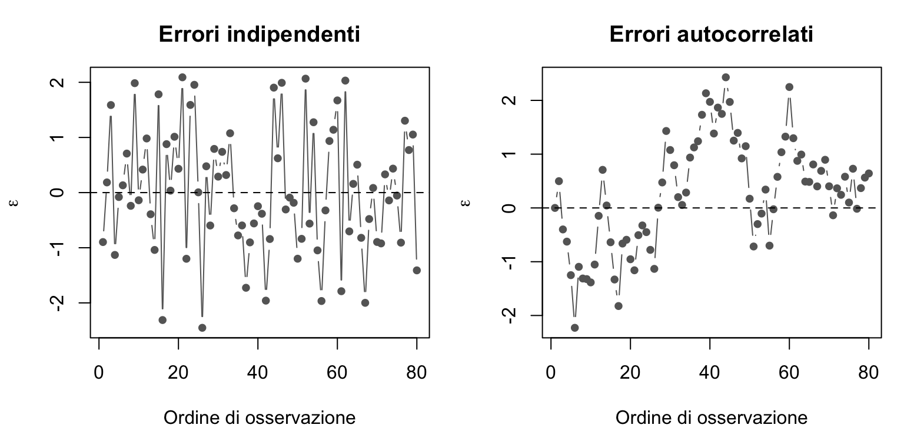{width=768}
:::
:::


::: {.cell}

:::


A sinistra ogni errore non dice nulla sui vicini; a destra ogni errore "somiglia" al precedente e i punti restano a lungo sopra o sotto lo zero. 

**3. Linearità.** Il valore atteso dell'errore, dato il valore di $X$, è zero: $E(\epsilon_i) = E(\epsilon\,|\,x_i) = 0$. In altre parole, la relazione tra $X$ e $Y$ è davvero una retta: il modello non sbaglia *sistematicamente* in nessuna zona di $X$.


::: {.cell}

```{.r .cell-code  code-fold="true" code-summary="Codice del grafico"}
set.seed(3)
x    <- runif(80, 0, 10)
y_ok <- 2 + 0.8 * x + rnorm(80, 0, 1.5)              # relazione lineare
y_no <- 2 + 0.3 * (x - 5)^2 + rnorm(80, 0, 1.2)      # relazione curvilinea

par(mfrow = c(1, 2), mar = c(4, 4, 3, 1))
plot(x, y_ok, pch = 19, col = "grey40", xlab = "X", ylab = "Y",
     main = "Relazione lineare")
abline(lm(y_ok ~ x), col = "red", lwd = 2)
plot(x, y_no, pch = 19, col = "grey40", xlab = "X", ylab = "Y",
     main = "Relazione non lineare")
abline(lm(y_no ~ x), col = "red", lwd = 2)
```

::: {.cell-output-display}
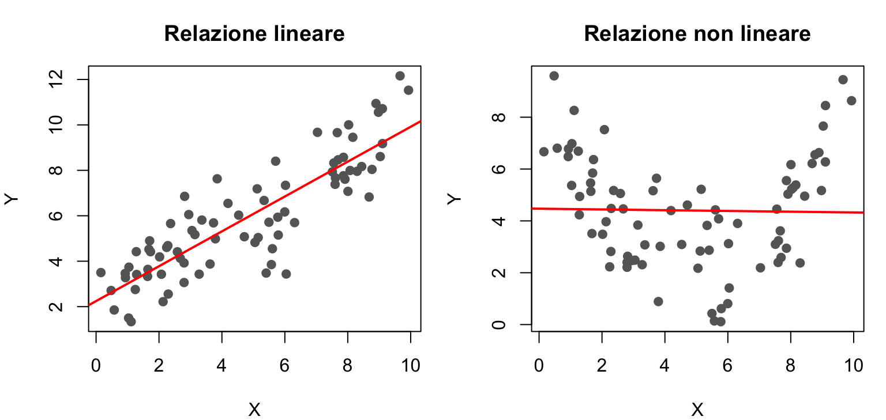{width=768}
:::
:::


::: {.cell}

:::


A sinistra la retta è una buona descrizione dei dati: sbaglia un po' ovunque, ma
senza una direzione precisa. A destra il modello sbaglia *sistematicamente* —
sovrastima al centro e sottostima agli estremi di $X$: il valore atteso dell'errore
non è zero in ogni zona di $X$.

**4. Omoschedasticità (varianza costante).** La varianza degli errori è la stessa
per qualunque valore di $X$: $V(\epsilon\,|\,x_i) = \sigma^2$.


::: {.cell}

```{.r .cell-code  code-fold="true" code-summary="Codice del grafico"}
set.seed(4)
x       <- runif(80, 0, 10)
y_omo   <- 2 + 0.8 * x + rnorm(80, 0, 1.5)               # varianza costante
y_etero <- 2 + 0.8 * x + rnorm(80, 0, 0.2 + 0.35 * x)    # varianza crescente con X

par(mfrow = c(1, 2), mar = c(4, 4, 3, 1))
plot(x, y_omo, pch = 19, col = "grey40", xlab = "X", ylab = "Y",
     main = "Varianza costante")
abline(lm(y_omo ~ x), col = "red", lwd = 2)
plot(x, y_etero, pch = 19, col = "grey40", xlab = "X", ylab = "Y",
     main = "Varianza crescente con X")
abline(lm(y_etero ~ x), col = "red", lwd = 2)
```

::: {.cell-output-display}
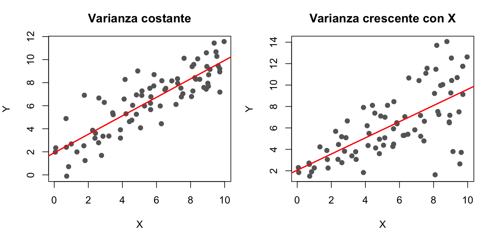{width=768}
:::
:::


::: {.cell}

:::


A sinistra la dispersione dei punti attorno alla retta è la stessa lungo tutto l'asse $X$; a destra cresce al crescere di $X$: è la tipica forma a imbuto dell'**eteroschedasticità**.

**5. Normalità.** Gli errori si distribuiscono normalmente:
$\epsilon_i \sim \mathcal{N}(0, \sigma^2)$.


::: {.cell}

```{.r .cell-code  code-fold="true" code-summary="Codice del grafico"}
set.seed(5)
e_norm <- rnorm(500)                # errori normali
e_asim <- rchisq(500, df = 2) - 2   # errori asimmetrici (media 0)

par(mfrow = c(1, 2), mar = c(4, 4, 3, 1))
hist(e_norm, breaks = 20, freq = FALSE, xlab = expression(epsilon),
     main = "Errori normali")
curve(dnorm(x, mean(e_norm), sd(e_norm)), add = TRUE, col = "red", lwd = 2)
hist(e_asim, breaks = 20, freq = FALSE, xlab = expression(epsilon),
     main = "Errori asimmetrici")
curve(dnorm(x, mean(e_asim), sd(e_asim)), add = TRUE, col = "red", lwd = 2)
```

::: {.cell-output-display}
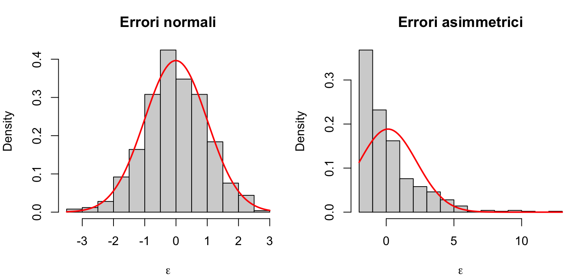{width=768}
:::
:::


::: {.cell}

:::


In entrambi i pannelli la curva rossa è la normale con la stessa media e deviazione standard dei dati. A sinistra l'istogramma la segue bene; a destra gli errori sono asimmetrici e la curva normale non li descrive.

# La regressione lineare semplice

Un modello con **un solo predittore** $X$ e una variabile dipendente $Y$ si chiama **regressione lineare semplice**.

## Un solo predittore: quantitativo o categoriale

Con un solo predittore, la formulazione del modello cambia a seconda del tipo di
variabile:

**1. Se $X$ è continua/quantitativa:**

$$
Y = \beta_0 + \beta_1 X + \epsilon
$$

dove $\beta_0$ è l'**intercetta** (il valore atteso di $Y$ quando $X = 0$) e
$\beta_1$ è la **pendenza** (di quanto cambia, in media, $Y$ quando $X$ aumenta di
una unità).

**2. Se $X$ è categoriale con $k$ categorie:**

$$
Y = \beta_0 + \sum_{j=1}^{k-1} \beta_j D_j + \epsilon
$$

dove le $D_j$ sono **variabili dummy**: "nuove variabili", costruite dalla variabile categoriale, che valgono **1** se l'osservazione appartiene a una certa categoria
e **0** altrimenti. 

Concretamente, è così che R ricodifica un `factor`:


::: {.cell}

```{.r .cell-code}
gruppo <- factor(c("A", "A", "B", "C", "B", "C"))   # una categoriale a 3 livelli
data.frame(gruppo, model.matrix(~ gruppo))# le due dummy costruite da R
```

::: {.cell-output .cell-output-stdout}

```
  gruppo X.Intercept. gruppoB gruppoC
1      A            1       0       0
2      A            1       0       0
3      B            1       1       0
4      C            1       0       1
5      B            1       1       0
6      C            1       0       1
```


:::
:::


R crea **due** dummy, `gruppoB` e `gruppoC`; la categoria `A` (la prima, in ordine
alfabetico) è quella di **riferimento** e non ha una sua colonna. Riga per riga:
un'osservazione del gruppo A ha entrambe le dummy a 0, una del gruppo B ha
`gruppoB = 1`, una del gruppo C ha `gruppoC = 1`. Le tre categorie restano così
perfettamente distinte con sole due colonne.

In forma di modello, con $k = 2$ categorie serve quindi una sola dummy,
$$
Y = \beta_0 + \beta_1 D_1 + \epsilon,
$$
mentre con $k = 3$ categorie ne servono due,
$$
Y = \beta_0 + \beta_1 D_1 + \beta_2 D_2 + \epsilon.
$$

Non dobbiamo occuparci noi della ricodifica: R la fa da sé quando il predittore è
un `factor`. Quello che conta è capire il *significato* di quei numeri, per
interpretare correttamente i coefficienti.

### L'interpretazione dei parametri {#sec-codifica}

Vediamo in dettaglio il caso più semplice, $k = 2$, con un esempio: confrontiamo i
punteggi raccolti in due tipi di esperimento, in **laboratorio** oppure **online**.
Con la **codifica treatment** (quella di default in R) la categoria di riferimento
è "lab", quindi la dummy vale $X = 0$ per gli esperimenti in laboratorio e $X = 1$
per quelli online:

$$
y_i = \beta_0 + \beta_1 X_i + \epsilon_i
$$

Sostituendo i due valori della dummy, il modello si "sdoppia" in un'equazione per
gruppo:

$$
y_{\text{lab}_i} = 1 \cdot \beta_0 + 0 \cdot \beta_1 + \epsilon_i
$$

$$
y_{\text{online}_i} = 1 \cdot \beta_0 + 1 \cdot \beta_1 + \epsilon_i
$$

L'interpretazione dei parametri segue di conseguenza:

| Parametro           | Significato                                      |
|---------------------|--------------------------------------------------|
| $\beta_0$           | valore atteso quando $X = 0$ (laboratorio)       |
| $\beta_1$           | differenza: online $-$ laboratorio               |
| $\beta_0 + \beta_1$ | valore atteso per gli esperimenti online         |


### Esempio via simulazione

Scegliamo noi i valori veri di $\beta_0$ e $\beta_1$, costruiamo la dummy e generiamo i dati; poi stimiamo il modello e controlliamo di recuperare i parametri.


::: {.cell}

```{.r .cell-code}
set.seed(23)
k  <- 100   # numero di osservazioni
b0 <- 20    # valore atteso in laboratorio
b1 <- 5     # differenza: online - laboratorio

tipo <- rep(c("lab", "online"), each = k / 2)
D    <- ifelse(tipo == "lab", 0, 1)    # codifica treatment
mu   <- b0 + b1 * D                    # valori attesi dei due gruppi

head(data.frame(tipo, D, mu)) #prime osservazioni
```

::: {.cell-output .cell-output-stdout}

```
  tipo D mu
1  lab 0 20
2  lab 0 20
3  lab 0 20
4  lab 0 20
5  lab 0 20
6  lab 0 20
```


:::

```{.r .cell-code}
tail(data.frame(tipo, D, mu)) #ultime
```

::: {.cell-output .cell-output-stdout}

```
      tipo D mu
95  online 1 25
96  online 1 25
97  online 1 25
98  online 1 25
99  online 1 25
100 online 1 25
```


:::
:::


::: {.cell}

```{.r .cell-code}
y_sim <- rnorm(k, mean = mu, sd = 4)   # aggiungiamo l'errore
head(data.frame(tipo, D, mu,y_sim)) #prime osservazioni
```

::: {.cell-output .cell-output-stdout}

```
  tipo D mu    y_sim
1  lab 0 20 20.77285
2  lab 0 20 18.26127
3  lab 0 20 23.65307
4  lab 0 20 27.17355
5  lab 0 20 23.98642
6  lab 0 20 24.42996
```


:::

```{.r .cell-code}
tail(data.frame(tipo, D, mu,y_sim)) #ultime
```

::: {.cell-output .cell-output-stdout}

```
      tipo D mu    y_sim
95  online 1 25 23.26262
96  online 1 25 23.87075
97  online 1 25 30.35892
98  online 1 25 29.18656
99  online 1 25 27.99686
100 online 1 25 27.31199
```


:::

```{.r .cell-code}
df <- data.frame(tipo = factor(tipo), y_sim = y_sim)
m_sim <- lm(y_sim ~ tipo, data = df) # lm = linear model
coef(m_sim) # coefficienti del modello
```

::: {.cell-output .cell-output-stdout}

```
(Intercept)  tipoonline 
  20.219222    5.159521 
```


:::
:::


Le stime recuperano i valori veri ($\hat\beta_0 \approx 20$,
$\hat\beta_1 \approx 5$), a meno dell'errore di campionamento.

La media del gruppo lab è $\beta_0$, la differenza fino alla media del gruppo online è $\beta_1$ (freccia blu); la linea tratteggiata è la media generale.


::: {.cell}

```{.r .cell-code  code-fold="true" code-summary="Codice del grafico"}
medie <- tapply(y_sim, tipo, mean)

plot(jitter(D, amount = 0.06), y_sim, pch = 19, col = "grey60",
     xlim = c(-0.5, 1.5), xaxt = "n", xlab = "", ylab = "y")
axis(1, at = c(0, 1), labels = c("lab (X = 0)", "online (X = 1)"))
segments(c(-0.2, 0.8), medie, c(0.2, 1.2), medie, col = "red", lwd = 3)
abline(h = mean(medie), lty = 2, col = "grey40")   # media generale
arrows(1.35, medie[1], 1.35, medie[2], code = 3, length = 0.08,
       col = "blue", lwd = 2)
text(1.44, mean(medie), expression(beta[1]), col = "blue")
text(-0.38, medie[1], expression(beta[0]), col = "red")
text(0.57, medie[2], expression(beta[0] + beta[1]), col = "red")
```

::: {.cell-output-display}
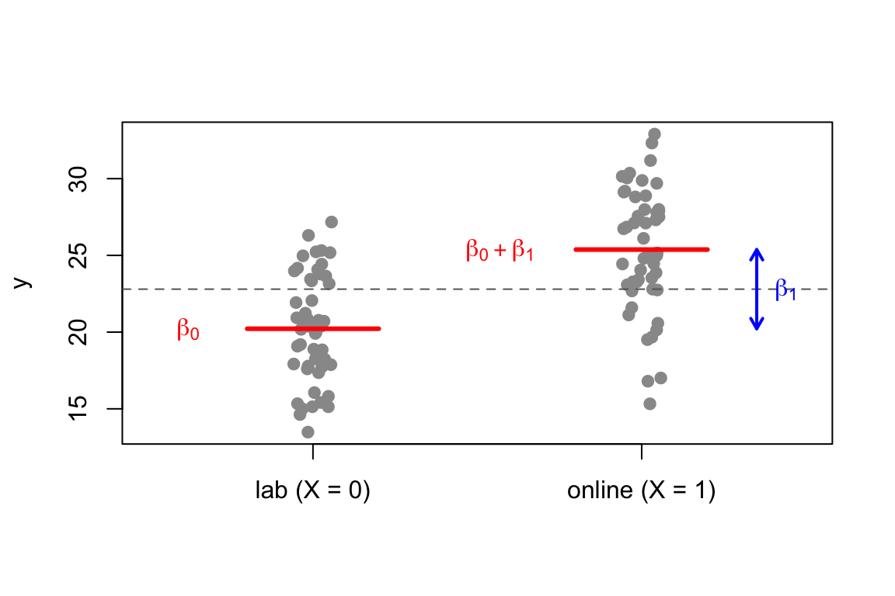{width=576}
:::
:::


::: {.cell}

:::


Dalle stime possiamo ricostruire le medie dei due gruppi con una **matrice di contrasti**, che esprime le medie come combinazioni lineari dei parametri:

$$
\begin{pmatrix} 1 & 0 \\ 1 & 1 \end{pmatrix}
\begin{pmatrix} \beta_0 \\ \beta_1 \end{pmatrix} =
\begin{pmatrix} \beta_0 \\ \beta_0 + \beta_1 \end{pmatrix} =
\begin{pmatrix} \mu_{\text{lab}} \\ \mu_{\text{online}} \end{pmatrix}
$$


::: {.cell}

```{.r .cell-code}
C <- rbind(c(1, 0), c(1, 1))
B <- coef(m_sim)
C %*% B                     # equivale a: B[1] e B[1] + B[2]
```

::: {.cell-output .cell-output-stdout}

```
         [,1]
[1,] 20.21922
[2,] 25.37874
```


:::

```{.r .cell-code}
tapply(y_sim, tipo, mean)   # verifica: le medie campionarie dei gruppi
```

::: {.cell-output .cell-output-stdout}

```
     lab   online 
20.21922 25.37874 
```


:::
:::


Esiste anche una parametrizzazione alternativa: **togliere l'intercetta** dalla
formula (con `0 +`), così R stima direttamente una media per ciascun gruppo:


::: {.cell}

```{.r .cell-code  code-fold="true" code-summary="Codice del grafico"}
medie <- tapply(y_sim, tipo, mean)

plot(jitter(D, amount = 0.06), y_sim, pch = 19, col = "grey60",
     xlim = c(-0.5, 1.5), xaxt = "n", xlab = "", ylab = "y")
axis(1, at = c(0, 1), labels = c("lab (X = 1)", "online (X = 1)"))
segments(c(-0.2, 0.8), medie, c(0.2, 1.2), medie, col = "red", lwd = 3)
abline(h = mean(medie), lty = 2, col = "grey40")   # media generale

text(-0.38, medie[1], expression(beta[0][lab]), col = "red")
text(0.57, medie[2], expression(beta[0][online]), col = "blue")
```

::: {.cell-output-display}
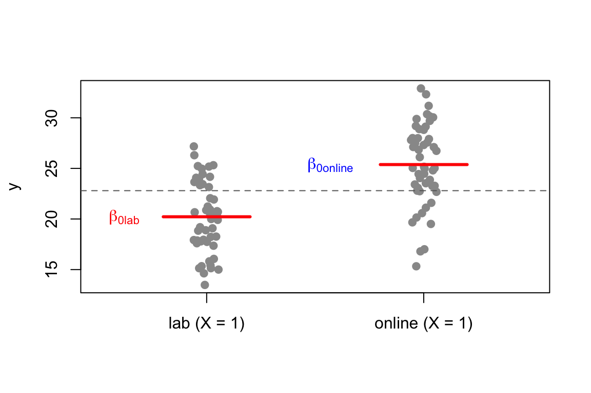{width=576}
:::
:::


::: {.cell}

```{.r .cell-code}
coef(lm(y_sim ~ 0 + tipo, data = df))
```

::: {.cell-output .cell-output-stdout}

```
   tipolab tipoonline 
  20.21922   25.37874 
```


:::
:::


Stesso modello, parametri diversi: ora i coefficienti *sono* le due medie.

Le due dummy funzionano come **interruttori on/off**: per ogni osservazione una
sola è accesa (1) e seleziona la media del suo gruppo, l'altra è spenta (0). 

$$
\begin{aligned}
\text{lab:}\quad    & y_i = 1\cdot\beta_{\text{lab}} + 0\cdot\beta_{\text{online}} + \varepsilon_i = \beta_{\text{lab}} + \varepsilon_i,\\
\text{online:}\quad & y_i = 0\cdot\beta_{\text{lab}} + 1\cdot\beta_{\text{online}} + \varepsilon_i = \beta_{\text{online}} + \varepsilon_i,
\end{aligned}
$$


Si vede nella matrice del modello (le colonne che R passa a `lm()`):


::: {.cell}

```{.r .cell-code}
X <- model.matrix(~ 0 + tipo, data = df)
head(X, 3)   # osservazioni "lab":    acceso l'interruttore lab
```

::: {.cell-output .cell-output-stdout}

```
  tipolab tipoonline
1       1          0
2       1          0
3       1          0
```


:::

```{.r .cell-code}
tail(X, 3)   # osservazioni "online": acceso l'interruttore online
```

::: {.cell-output .cell-output-stdout}

```
    tipolab tipoonline
98        0          1
99        0          1
100       0          1
```


:::
:::


e i due coefficienti sono direttamente le medie dei due gruppi.

Un'altra parametrizzazione comune è la codifica **a somma zero**:


::: {.cell}

```{.r .cell-code}
contrasts(df$tipo)
```

::: {.cell-output .cell-output-stdout}

```
       online
lab         0
online      1
```


:::

```{.r .cell-code}
contrasts(df$tipo) <- contr.sum(2)/2
contrasts(df$tipo) 
```

::: {.cell-output .cell-output-stdout}

```
       [,1]
lab     0.5
online -0.5
```


:::

```{.r .cell-code}
coef(lm(y_sim ~ tipo, data = df))
```

::: {.cell-output .cell-output-stdout}

```
(Intercept)       tipo1 
  22.798983   -5.159521 
```


:::
:::


Che cosa rappresentano i due coefficienti, secondo voi? 


$$
\begin{aligned}
\text{lab:}\quad    & y_i = 1\cdot\beta_{\text{mean}} + 0.5\cdot\beta_{\text{lab-online}} + \varepsilon_i\\
\text{online:}\quad & y_i = 1\cdot\beta_{\text{mean}} - 0.5\cdot\beta_{\text{lab-online}} + \varepsilon_i
\end{aligned}
$$


::: {.cell}

```{.r .cell-code  code-fold="true" code-summary="Codice del grafico"}
medie <- tapply(y_sim, tipo, mean)

plot(jitter(D, amount = 0.06), y_sim, pch = 19, col = "grey60",
     xlim = c(-0.5, 1.5), xaxt = "n", xlab = "", ylab = "y")
axis(1, at = c(0, 1), labels = c("lab (X = 0.5)", "online (X = -0.5)"))
segments(c(-0.2, 0.8), medie, c(0.2, 1.2), medie, col = "red", lwd = 3)
abline(h = mean(medie), lty = 2, col = "grey40")   # media generale
arrows(1.35, medie[1], 1.35, medie[2], code = 3, length = 0.08,
       col = "red", lwd = 2)
text(1.44, mean(medie), expression(beta[1]), col = "red",cex = 1)
text(0.5, mean(medie), expression(beta[0]), col = "blue", cex = 1)
```

::: {.cell-output-display}
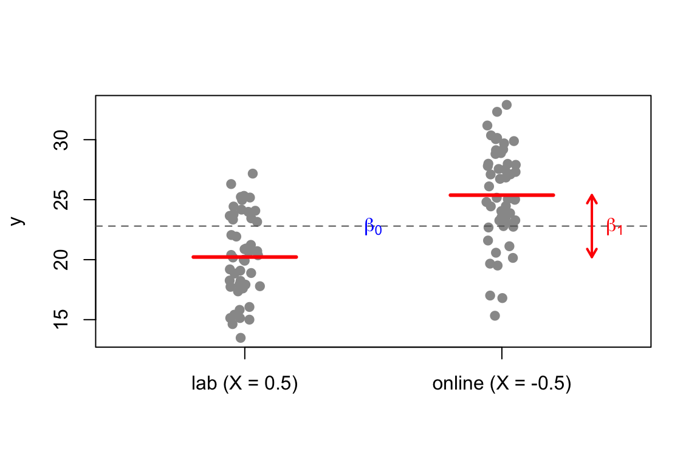{width=576}
:::
:::


::: callout-warning
## Attenzione 
Stime, significato e test dei parametri dipendono dalla codifica scelta!
:::

## I dati: `kidiq` {#sec-dati}

In tutta la dispensa useremo un dataset, che contiene le
seguenti variabili relative a un campione di bambini di 3–4 anni:

- `kid_score`: punteggio del bambino in un test cognitivo;
- `mom_hs`: istruzione della madre (1 = diplomata, 0 = non diplomata);
- `mom_iq`: QI della madre;
- `mom_work`: condizione lavorativa della madre nei primi anni di vita del bambino (4 categorie);
- `mom_age`: età della madre.

Carichiamo i dati e sistemiamo le variabili categoriali, che nel file sono
codificate come numeri:


::: {.cell}

```{.r .cell-code}
kidiq <- read.csv("dati/kidiq.csv")
kidiq$mom_hs <- factor(kidiq$mom_hs)
kidiq$mom_work <- factor(kidiq$mom_work)

str(kidiq)
```

::: {.cell-output .cell-output-stdout}

```
'data.frame':	434 obs. of  5 variables:
 $ kid_score: int  65 98 85 83 115 98 69 106 102 95 ...
 $ mom_hs   : Factor w/ 2 levels "0","1": 2 2 2 2 2 1 2 2 2 2 ...
 $ mom_iq   : num  121.1 89.4 115.4 99.4 92.7 ...
 $ mom_work : Factor w/ 4 levels "1","2","3","4": 4 4 4 3 4 1 4 3 1 1 ...
 $ mom_age  : int  27 25 27 25 27 18 20 23 24 19 ...
```


:::
:::


::: {.cell}

```{.r .cell-code}
head(kidiq)
```

::: {.cell-output .cell-output-stdout}

```
  kid_score mom_hs    mom_iq mom_work mom_age
1        65      1 121.11753        4      27
2        98      1  89.36188        4      25
3        85      1 115.44316        4      27
4        83      1  99.44964        3      25
5       115      1  92.74571        4      27
6        98      0 107.90184        1      18
```


:::
:::


Abbiamo 434 osservazioni e 5 variabili. Notate che `mom_hs` e `mom_work` ora sono
`factor`: è così che R sa che deve trattarle come categoriali (e costruire le dummy
al posto nostro).

::: {.callout-note icon=false title="✏️ Esercizio 1 — Esplorare i dati"}
Prima di stimare qualsiasi modello, è buona pratica guardare i dati. 

a. quante madri sono diplomate e quante no?
b. calcolate media e deviazione standard di `kid_score`;
c. disegnate l'istogramma di `kid_score` per il gruppo madri diplomate vs. no: come descrivereste le distribuzioni?
:::

::: {.callout-tip collapse="true" title="Soluzione — Esercizio 1"}

::: {.cell}

```{.r .cell-code}
table(kidiq$mom_hs)
```

::: {.cell-output .cell-output-stdout}

```

  0   1 
 93 341 
```


:::

```{.r .cell-code}
mean(kidiq$kid_score)
```

::: {.cell-output .cell-output-stdout}

```
[1] 86.79724
```


:::

```{.r .cell-code}
sd(kidiq$kid_score)
```

::: {.cell-output .cell-output-stdout}

```
[1] 20.41069
```


:::

```{.r .cell-code}
g0 <- kidiq$kid_score[kidiq$mom_hs == 0]
hist(g0, main = "", xlab = "Punteggio del bambino, madri non diplomate")
```

::: {.cell-output-display}
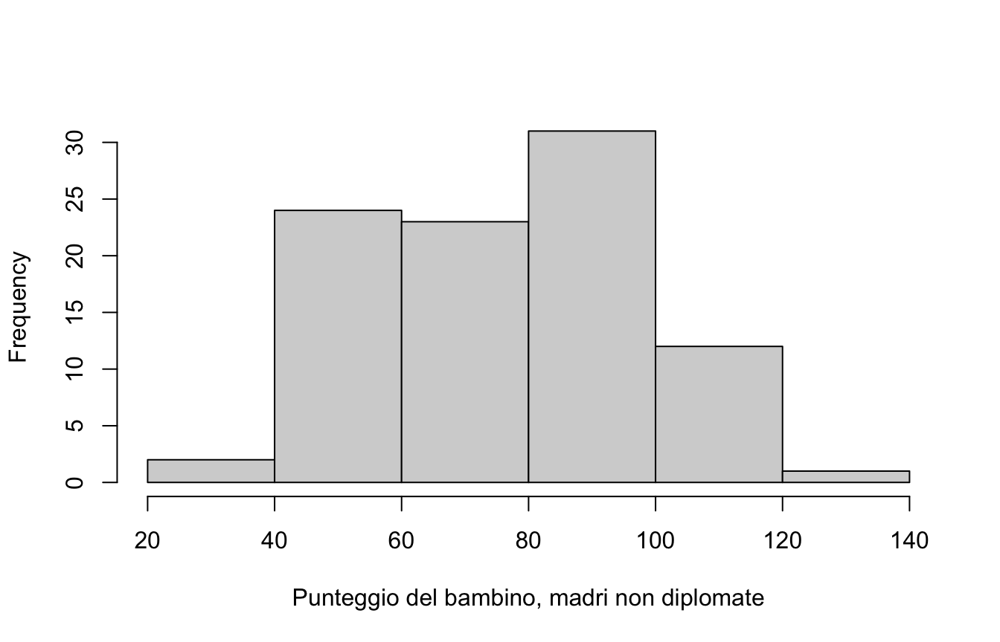{width=672}
:::

```{.r .cell-code}
mean(g0)
```

::: {.cell-output .cell-output-stdout}

```
[1] 77.54839
```


:::

```{.r .cell-code}
sd(g0)
```

::: {.cell-output .cell-output-stdout}

```
[1] 22.5738
```


:::

```{.r .cell-code}
g1 <- kidiq$kid_score[kidiq$mom_hs == 1]
hist(g1, main = "", xlab = "Punteggio del bambino, madri diplomate")
```

::: {.cell-output-display}
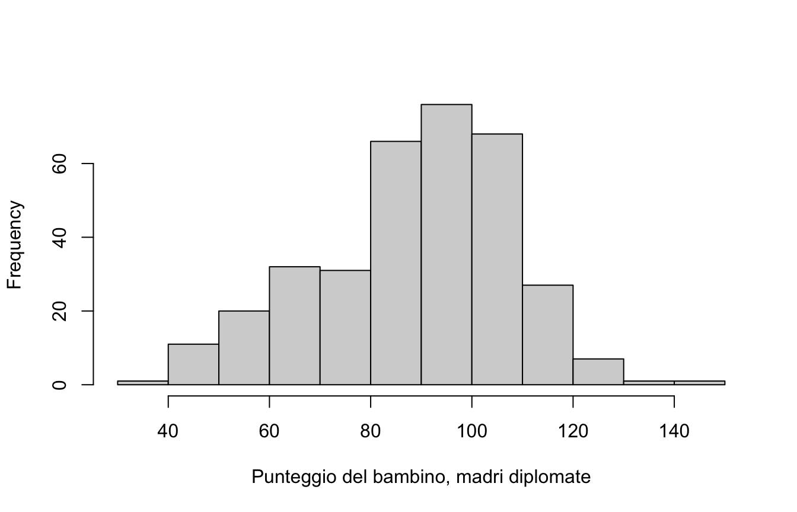{width=672}
:::

```{.r .cell-code}
mean(g1)
```

::: {.cell-output .cell-output-stdout}

```
[1] 89.31965
```


:::

```{.r .cell-code}
sd(g1)
```

::: {.cell-output .cell-output-stdout}

```
[1] 19.04948
```


:::
:::


:::

## Un predittore numerico {#sec-numerico}

Vogliamo valutare se il **QI della madre** è predittivo del punteggio del bambino. Stimiamo il modello con la funzione `lm()` (*linear model*), la cui sintassi è `lm(risposta ~ predittore, data = dati)`:


::: {.cell}

```{.r .cell-code}
m1 <- lm(kid_score ~ mom_iq, data = kidiq)

plot(kid_score ~ mom_iq, data = kidiq,
     xlab = "QI della madre", ylab = "Punteggio del bambino")
abline(m1, col = "red", lwd = 2)
```

::: {.cell-output-display}
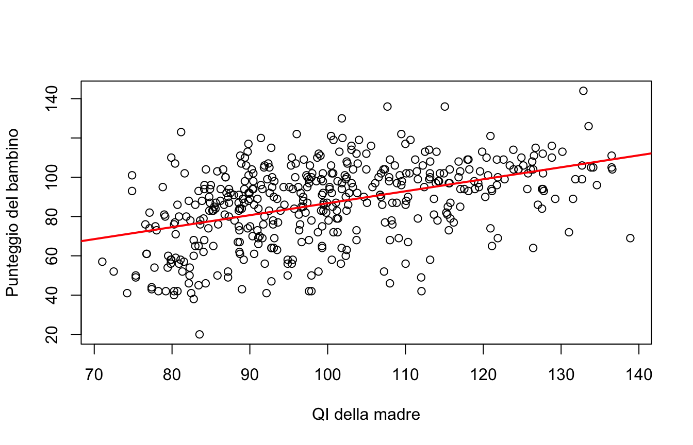{width=672}
:::
:::


I coefficienti stimati sono:


::: {.cell}

```{.r .cell-code}
coef(m1)
```

::: {.cell-output .cell-output-stdout}

```
(Intercept)      mom_iq 
 25.7997778   0.6099746 
```


:::
:::


L'equazione di regressione è dunque

$$
\hat{Y} = 25.8 + 0.61 X
$$

dove il "cappello" su $Y$ indica che si tratta dei valori *previsti* dal modello.


**Come si leggono i coefficienti?**


- $\beta_1 = 0.61$: per ogni punto di QI in più della madre, il punteggio atteso
  del bambino aumenta in media di 0.61 punti;
- $\beta_0 = 25.8$: è il punteggio atteso di un bambino la cui madre ha QI pari a
  zero. Un valore privo di senso! L'intercetta serve al modello, ma non sempre ha
  un'interpretazione sostantiva: per renderla interpretabile si può *centrare* il
  predittore (es. `mom_iq - 100`), così l'intercetta diventa il punteggio atteso
  per una madre con QI = 100.
  

::: {.cell}

```{.r .cell-code}
kidiq$mom_iq_s <- kidiq$mom_iq - 100   # QI centrato sul valore 100
```
:::


::: {.cell}

```{.r .cell-code  code-fold="true"}
par(mfrow = c(1, 2), mar = c(4, 4, 3, 1))
hist(kidiq$mom_iq, main = "mom_iq", xlab = "QI della madre")
abline(v = 100, col = "red", lwd = 2, lty = 2)
hist(kidiq$mom_iq_s, main = "mom_iq - 100", xlab = "QI centrato")
abline(v = 0, col = "red", lwd = 2, lty = 2)
```

::: {.cell-output-display}
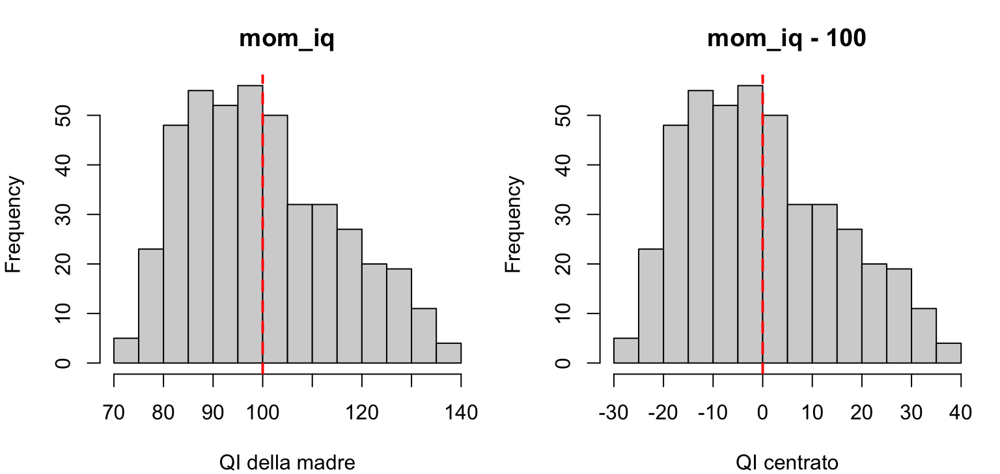{width=768}
:::
:::


::: {.cell}

:::


La distribuzione è identica: abbiamo solo spostato lo zero della scala (linea rossa) nel punto più sensato, il QI medio.


::: {.cell}

```{.r .cell-code}
mcen <- lm(kid_score ~ mom_iq_s, data = kidiq)
coef(mcen)
```

::: {.cell-output .cell-output-stdout}

```
(Intercept)    mom_iq_s 
 86.7972350   0.6099746 
```


:::
:::


**Come si leggono i coefficienti?**


E se fosse...


::: {.cell}

```{.r .cell-code}
kidiq$mom_iq_s2 <- (kidiq$mom_iq - 100)/10
```
:::


::: {.cell}

```{.r .cell-code}
mcen <- lm(kid_score ~ mom_iq_s2, data = kidiq)
coef(mcen)
```

::: {.cell-output .cell-output-stdout}

```
(Intercept)   mom_iq_s2 
  86.797235    6.099746 
```


:::
:::


### Il `summary()` del modello {#sec-overview}

Prima di proseguire, guardiamo *tutto* quello che R sa dirci su `m1`, con un solo comando:


::: {.cell}

```{.r .cell-code}
summary(m1)
```

::: {.cell-output .cell-output-stdout}

```

Call:
lm(formula = kid_score ~ mom_iq, data = kidiq)

Residuals:
    Min      1Q  Median      3Q     Max 
-56.753 -12.074   2.217  11.710  47.691 

Coefficients:
            Estimate Std. Error t value Pr(>|t|)    
(Intercept) 25.79978    5.91741    4.36 1.63e-05 ***
mom_iq       0.60997    0.05852   10.42  < 2e-16 ***
---
Signif. codes:  0 '***' 0.001 '**' 0.01 '*' 0.05 '.' 0.1 ' ' 1

Residual standard error: 18.27 on 432 degrees of freedom
Multiple R-squared:  0.201,	Adjusted R-squared:  0.1991 
F-statistic: 108.6 on 1 and 432 DF,  p-value: < 2.2e-16
```


:::
:::


- **`Residuals`** → gli scarti e i residui (@sec-scarti);
- **`Residual standard error`** → la variabilità residua $\sigma$
  (@sec-variabilita);
- **`Std. Error`, `t value`, `Pr(>|t|)`** → l'incertezza e la precisione delle stime (@sec-bande);
- **`Multiple R-squared`** e **`Adjusted R-squared`** → la variabilità spiegata (@sec-variabilita);
- **`F-statistic`** → il test globale del modello (@sec-summary).


## La variabilità residua e la variabilità spiegata {#sec-scarti}

Immaginiamo di avere una misura di stile genitoriale (`ParSty`) e una di comportamento del bambino (`ChildBeh`).


::: {.cell}

```{.r .cell-code}
set.seed(8)
ParSty   <- runif(n = 30, 5, 20)
ChildBeh <- 2 + 1.1 * ParSty + rnorm(n = 30, mean = 0, sd = 2.5)
# equivale a 
# ChildBeh <- rnorm(n = 30, mean = 2 + 1.1 * ParSty, sd = 2.5)

mod <- lm(ChildBeh ~ ParSty)
```
:::


Data l'osservazione empirica $y_i$, possiamo individuare **tre tipi di deviazione o
scarti**:

1. lo scarto del punto osservato $y_i$ dalla media dei punteggi $\bar{y}$:
   $\;y_i - \bar{y}$;
2. lo scarto del punto teorico $\hat{y}_i$ (sulla retta) dalla media $\bar{y}$:
   $\;\hat{y}_i - \bar{y}$;
3. lo scarto del punto osservato $y_i$ dal suo corrispondente teorico sulla retta
   di regressione: $\;y_i - \hat{y}_i$ — questo è il **residuo**.


::: {.cell}

```{.r .cell-code  code-fold="true"}
par(mfrow = c(1, 3), mar = c(4, 4, 3, 1))
titoli <- c(expression(y[i] - bar(y)),
            expression(hat(y)[i] - bar(y)),
            expression(y[i] - hat(y)[i]))
for (tipo in 1:3) {
  plot(ParSty, ChildBeh, pch = 19, col = "grey40", main = titoli[tipo])
  abline(h = mean(ChildBeh), lty = 2)          # media di Y
  abline(mod, col = "blue", lwd = 2)           # retta di regressione
  if (tipo == 1) segments(ParSty, mean(ChildBeh), ParSty, ChildBeh,      col = "red")
  if (tipo == 2) segments(ParSty, mean(ChildBeh), ParSty, fitted(mod),   col = "red")
  if (tipo == 3) segments(ParSty, fitted(mod),   ParSty, ChildBeh,       col = "red")
}
```

::: {.cell-output-display}
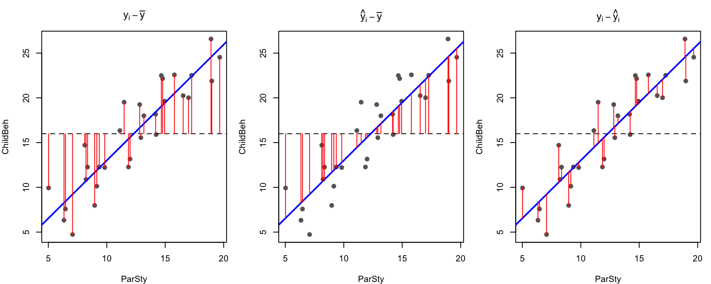{width=864}
:::
:::


::: {.cell}

:::


Nel primo pannello gli scarti ignorano completamente il modello (distanze dalla media); nel secondo ci sono le distanze *spiegate* dalla retta; nel terzo ciò che resta: i residui.

In R i residui di un modello si ottengono con `residuals()`:


::: {.cell}

```{.r .cell-code}
round(residuals(mod), 3)
```

::: {.cell-output .cell-output-stdout}

```
     1      2      3      4      5      6      7      8      9     10     11 
-2.427  4.137 -2.046  2.960 -0.566  2.076  0.094 -2.754 -1.223  3.442 -3.136 
    12     13     14     15     16     17     18     19     20     21     22 
-1.946  4.582  0.883 -4.489  2.026  3.371 -3.690 -1.775  2.597  1.384  1.887 
    23     24     25     26     27     28     29     30 
-2.576  0.177  0.208 -0.977 -0.856 -0.247 -1.229  0.113 
```


:::
:::


**I residui sono una misura di cosa?**


### La variabilità residua: $\sigma$


::: {.cell}

```{.r .cell-code}
summary(m1)
```

::: {.cell-output .cell-output-stdout}

```

Call:
lm(formula = kid_score ~ mom_iq, data = kidiq)

Residuals:
    Min      1Q  Median      3Q     Max 
-56.753 -12.074   2.217  11.710  47.691 

Coefficients:
            Estimate Std. Error t value Pr(>|t|)    
(Intercept) 25.79978    5.91741    4.36 1.63e-05 ***
mom_iq       0.60997    0.05852   10.42  < 2e-16 ***
---
Signif. codes:  0 '***' 0.001 '**' 0.01 '*' 0.05 '.' 0.1 ' ' 1

Residual standard error: 18.27 on 432 degrees of freedom
Multiple R-squared:  0.201,	Adjusted R-squared:  0.1991 
F-statistic: 108.6 on 1 and 432 DF,  p-value: < 2.2e-16
```


:::
:::


Il parametro $\sigma$ esprime la variabilità dei residui (@sec-normale).


::: {.cell}

```{.r .cell-code}
sigma(m1)
```

::: {.cell-output .cell-output-stdout}

```
[1] 18.26612
```


:::

```{.r .cell-code}
er <- residuals(m1)
sd(er)
```

::: {.cell-output .cell-output-stdout}

```
[1] 18.24502
```


:::

```{.r .cell-code}
# n -  k - 1 (obs, parametri) = 432 df
sqrt((sum((er-mean(er))^2))/(length(er)-1-1))
```

::: {.cell-output .cell-output-stdout}

```
[1] 18.26612
```


:::
:::


Nel modello `m1`, $\sigma \approx 18$ significa che il modello predice il punteggio del bambino con un'accuratezza media di circa 18 punti: di tanto, in media, i punteggi osservati si discostano da quelli attesi. 

Visivamente, $\sigma$ è l'ampiezza della banda attorno alla retta: se gli errori sono normali, la banda retta $\pm\sigma$ contiene circa il 68% dei punti (e $\pm 2\sigma$ circa il 95%).


::: {.cell}

```{.r .cell-code  code-fold="true" code-summary="Codice del grafico"}
plot(kid_score ~ mom_iq, data = kidiq, pch = 19, col = "grey70",
     xlab = "QI della madre", ylab = "Punteggio del bambino")
xx <- seq(min(kidiq$mom_iq), max(kidiq$mom_iq), length.out = 100)
yy <- coef(m1)[1] + coef(m1)[2] * xx
polygon(c(xx, rev(xx)), c(yy - 2*sigma(m1), rev(yy + 2*sigma(m1))),
        col = adjustcolor("red", 0.15), border = NA)
abline(m1, col = "red", lwd = 2)
```

::: {.cell-output-display}
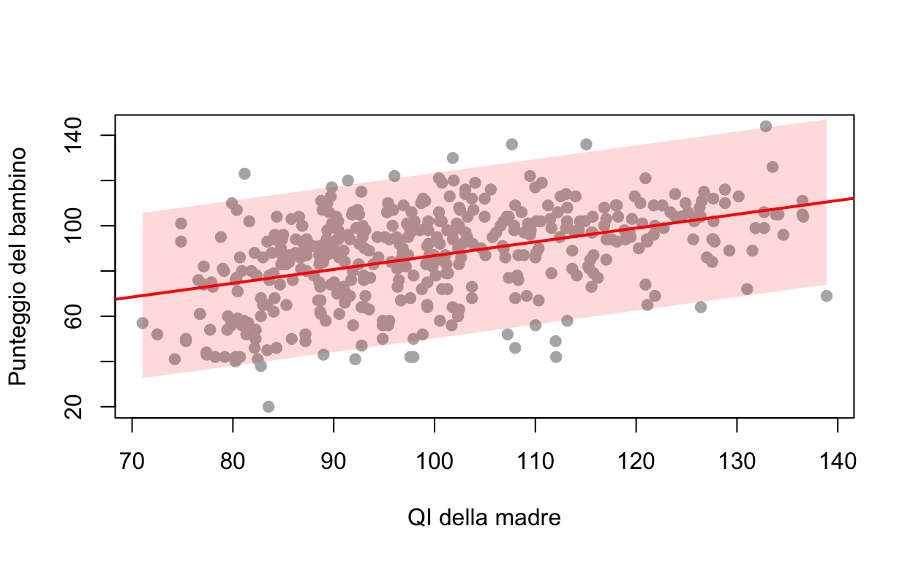{width=624}
:::
:::


::: {.callout-tip collapse = "true"}
### L'errore standard: quanto varia una stima {#sec-se}

Attenzione a non confondere due variabilità diverse. La $\sigma$ appena vista
misura quanto i **dati** si disperdono attorno alla retta. Ma a noi interessa
anche un'altra cosa: quanto varierebbe la **stima** (un coefficiente, una media)
se rifacessimo lo studio su un nuovo campione. Questa seconda variabilità è
l'**errore standard** della stima.

Prendiamo il caso più semplice, una media. Immaginiamo di estrarre tanti
campioni — stesso $n$, stessa popolazione — e di calcolare ogni volta la media:
otteniamo una distribuzione di medie, la **distribuzione campionaria** della
media.


::: {.cell}

```{.r .cell-code  code-fold="true" code-summary="Codice del grafico"}
set.seed(111)
medie <- replicate(10000, mean(rnorm(50, mean = 10, sd = 2)))  # 10000 medie, n = 50

hist(medie, breaks = 40, col = "grey85", xlab = expression(bar(x)),
     main = "Distribuzione campionaria della media")
abline(v = 10, col = "red", lwd = 2)   # la media vera della popolazione
```

::: {.cell-output-display}
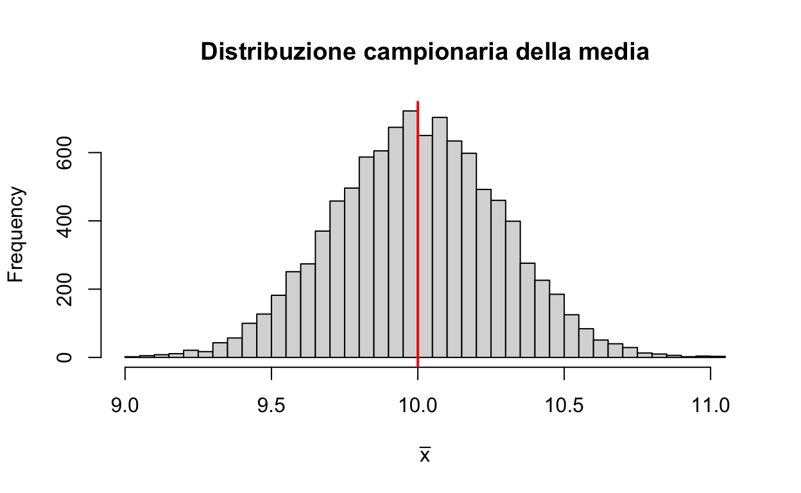{width=624}
:::
:::


::: {.cell}

```{.r .cell-code}
sd(medie)   # quanto variano le medie da campione a campione = errore standard
```

::: {.cell-output .cell-output-stdout}

```
[1] 0.2837447
```


:::
:::


Le medie campionarie si dispongono attorno al valore vero (10), e la loro
**deviazione standard** (qui $\approx 0.28$) è proprio l'errore standard della
media. Non serve simulare ogni volta: per la media c'è la formula
$$
\text{SE}_{\bar x} = \frac{s}{\sqrt{n}},
$$
il rapporto tra la deviazione standard *del campione* e la radice di $n$.


::: {.cell}

```{.r .cell-code}
sd(rnorm(50, mean = 10, sd = 2))/sqrt(50)
```

::: {.cell-output .cell-output-stdout}

```
[1] 0.2936348
```


:::

```{.r .cell-code}
# con sigma noto (= 2): sigma / sqrt(n) 
2 / sqrt(50)  
```

::: {.cell-output .cell-output-stdout}

```
[1] 0.2828427
```


:::
:::


- **ogni stima ha il suo errore standard** — non solo la media, ma anche
  $\hat\beta_0$, $\hat\beta_1$, ogni valore previsto $\hat y_0$. È il "$\pm$ errore standard" di ogni intervallo.
- l'errore standard **si restringe al crescere di $n$** (c'è $\sqrt{n}$ al denominatore).

La formula usa $s$, la deviazione standard **stimata** dal campione, non la $\sigma$ vera della popolazione (che non conosciamo). 

:::

### Precisione delle stime, accuratezza delle previsioni {#sec-bande}

La banda $\pm\sigma$ appena vista riguarda **le previsioni**: quanto una nuova
osservazione si discosterà dalla retta. Ma nel modello convive una seconda
incertezza, di natura diversa: quella sulla **retta stessa**, cioè sulle stime
dei coefficienti (i loro errori standard). Distinguerle è fondamentale:

- la **banda di confidenza** risponde a "dove sta la *retta vera*?" — è
  l'incertezza sul **valore atteso** $E(Y \mid x)$. Dipende dagli errori standard
  dei $\hat\beta$ e **si stringe** all'aumentare di $n$: è la *precisione di
  stima degli effetti*;
- la **banda di previsione** risponde a "dove cadrà la *prossima osservazione*?".
  Oltre all'incertezza sulla retta contiene $\sigma$, e per quanto $n$ cresca non
  potrà mai stringersi sotto $\pm\sigma$: è l'*accuratezza delle previsioni*.

In R si ottengono entrambe con `predict()`:


::: {.cell}

```{.r .cell-code}
nuovi <- data.frame(mom_iq = seq(70, 140, length.out = 100))
ic <- predict(m1, newdata = nuovi, interval = "confidence")   # banda di confidenza
ip <- predict(m1, newdata = nuovi, interval = "prediction")   # banda di previsione
head(ic, 3)
```

::: {.cell-output .cell-output-stdout}

```
       fit      lwr      upr
1 68.49800 64.64096 72.35504
2 68.92929 65.14484 72.71375
3 69.36059 65.64836 73.07282
```


:::

```{.r .cell-code}
head(ip, 3)
```

::: {.cell-output .cell-output-stdout}

```
       fit      lwr      upr
1 68.49800 32.38988 104.6061
2 68.92929 32.82885 105.0297
3 69.36059 33.26765 105.4535
```


:::
:::


::: {.cell}

```{.r .cell-code  code-fold="true" code-summary="Codice del grafico"}
plot(kid_score ~ mom_iq, data = kidiq, pch = 19, col = "grey80",
     xlab = "QI della madre", ylab = "Punteggio del bambino")
polygon(c(nuovi$mom_iq, rev(nuovi$mom_iq)), c(ip[, "lwr"], rev(ip[, "upr"])),
        col = adjustcolor("blue", 0.12), border = NA)
polygon(c(nuovi$mom_iq, rev(nuovi$mom_iq)), c(ic[, "lwr"], rev(ic[, "upr"])),
        col = adjustcolor("red", 0.35), border = NA)
abline(m1, col = "red", lwd = 2)
legend("topleft", bty = "n", border = NA,
       fill = c(adjustcolor("red", 0.35), adjustcolor("blue", 0.12)),
       legend = c("banda di confidenza (95%)", "banda di previsione (95%)"))
```

::: {.cell-output-display}
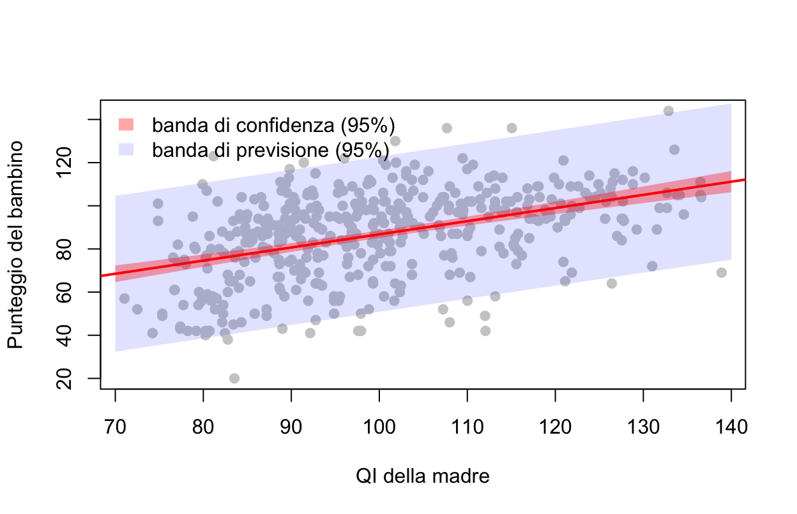{width=624}
:::
:::


Le due bande rispondono a domande diverse. Per una madre con QI = 100:


::: {.cell}

```{.r .cell-code}
predict(m1, newdata = data.frame(mom_iq = 100), interval = "confidence")
```

::: {.cell-output .cell-output-stdout}

```
       fit      lwr      upr
1 86.79724 85.07391 88.52056
```


:::

```{.r .cell-code}
predict(m1, newdata = data.frame(mom_iq = 100), interval = "prediction")
```

::: {.cell-output .cell-output-stdout}

```
       fit      lwr      upr
1 86.79724 50.85437 122.7401
```


:::
:::


Il punteggio **medio** dei bambini di madri con QI = 100 è stimato con grande
precisione (circa $\pm 1.7$ punti); il punteggio del **singolo** bambino resta
incerto di circa $\pm 36$ punti. Stessa retta, due incertezze diverse: la prima
è la precisione con cui conosciamo gli *effetti*, la seconda è l'accuratezza con cui possiamo *prevedere* (dominata
da $\sigma$).

Entrambi gli intervalli hanno la stessa struttura di tutti gli intervalli di confidenza:

$$
\hat{y}_0 \;\pm\; t^* \times \text{errore standard}
$$

dove $\hat{y}_0 = \hat\beta_0 + \hat\beta_1 x_0$ è il valore previsto nel punto $x_0$ che ci interessa, e $t^*$ è il **quantile della distribuzione $t$** con $n - k - 1$ gradi di libertà che lascia il 2.5% in ciascuna coda — in R, `qt(0.975, df)`; con i nostri 432 gradi di libertà vale 1.97, praticamente l'1.96 della normale.

Quello che distingue le due bande è solo **l'errore standard**:

$$
\underbrace{\hat\sigma \sqrt{\frac{1}{n} + \frac{(x_0-\bar{x})^2}{\sum_i (x_i-\bar{x})^2}}}_{\text{banda di confidenza}}
\qquad\qquad
\underbrace{\hat\sigma \sqrt{\,1 + \frac{1}{n} + \frac{(x_0-\bar{x})^2}{\sum_i (x_i-\bar{x})^2}}}_{\text{banda di previsione}}
$$


- $\dfrac{1}{n}$ è l'incertezza sull'**altezza** della retta (sulla media
  generale di $Y$): con $n$ grande la conosciamo quasi esattamente — questo
  termine si riduce al crescere del campione;
- $\dfrac{(x_0-\bar{x})^2}{\sum_i (x_i-\bar{x})^2}$ è l'incertezza sulla
  **pendenza**, che pesa tanto più quanto più $x_0$ è lontano da $\bar{x}$: la
  retta stimata "ruota" attorno al baricentro dei dati $(\bar{x}, \bar{y})$, e
  un piccolo errore di pendenza si amplifica man mano che ci si allontana dal
  centro. Ecco perché le bande sono più strette in $\bar{x}$ e si allargano agli
  estremi. Anche questo termine si riduce al crescere di $n$;
- $1$ compare **solo** nella banda di previsione: è la varianza del nuovo errore
  $\epsilon_0$, in unità di $\sigma^2$. Una nuova osservazione non cade sulla retta ma a distanza $\epsilon_0 \sim \mathcal{N}(0, \sigma^2)$ da essa, e questa incertezza **non dipende da $n$**.

Ricalcoliamo a mano gli intervalli per $x_0 = 100$ e
confrontiamoli con l'output di `predict()` qui sopra.


::: {.cell}

```{.r .cell-code}
x0    <- 100
n     <- nobs(m1)
xbar  <- mean(kidiq$mom_iq)
SSx   <- sum((kidiq$mom_iq - xbar)^2)
tstar <- qt(0.975, df = n - 2)   # gradi di liberta' residui: n - k - 1, k = 1

y0      <- unname(coef(m1)[1] + coef(m1)[2] * x0)
se_conf <- sigma(m1) * sqrt(    1/n + (x0 - xbar)^2 / SSx)
se_prev <- sigma(m1) * sqrt(1 + 1/n + (x0 - xbar)^2 / SSx)

rbind(confidenza = y0 + c(-1, 1) * tstar * se_conf,
      previsione = y0 + c(-1, 1) * tstar * se_prev)
```

::: {.cell-output .cell-output-stdout}

```
               [,1]      [,2]
confidenza 85.07391  88.52056
previsione 50.85437 122.74010
```


:::
:::


I numeri coincidono con quelli di `predict()`: l'1 sotto radice è tutta la
differenza tra "stimare la media" e "prevedere il singolo caso".

Guardiamo l'effetto del campione: lo stesso modello stimato su 40 bambini e su
tutti i 434.


::: {.cell}

```{.r .cell-code  code-fold="true" code-summary="Codice del grafico"}
set.seed(11)
sotto <- kidiq[sample(nrow(kidiq), 40), ]
modelli <- list("n = 40" = lm(kid_score ~ mom_iq, data = sotto),
                "n = 434" = m1)

par(mfrow = c(1, 2), mar = c(4, 4, 3, 1))
for (nome in names(modelli)) {
  mod_i <- modelli[[nome]]
  ic_i <- predict(mod_i, newdata = nuovi, interval = "confidence")
  ip_i <- predict(mod_i, newdata = nuovi, interval = "prediction")
  plot(kid_score ~ mom_iq, data = kidiq, type = "n", main = nome,
       xlab = "QI della madre", ylab = "Punteggio del bambino")
  polygon(c(nuovi$mom_iq, rev(nuovi$mom_iq)), c(ip_i[, "lwr"], rev(ip_i[, "upr"])),
          col = adjustcolor("blue", 0.12), border = NA)
  polygon(c(nuovi$mom_iq, rev(nuovi$mom_iq)), c(ic_i[, "lwr"], rev(ic_i[, "upr"])),
          col = adjustcolor("red", 0.35), border = NA)
  abline(mod_i, col = "red", lwd = 2)
}
```

::: {.cell-output-display}
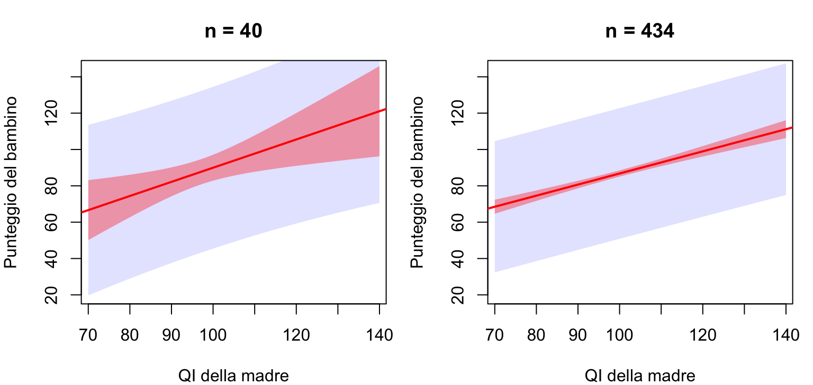{width=768}
:::
:::


::: {.cell}

:::


Da 40 a 434 osservazioni la banda di confidenza (rossa) si stringe vistosamente
— più dati, effetti stimati con più precisione — mentre la banda di previsione
(azzurra) resta praticamente uguale: sul singolo bambino comanda $\sigma$.


## Le devianze {#sec-devianze}

Data l'osservazione empirica $y_i$, possiamo individuare **tre tipi di deviazione o scarti**:


::: {.cell}

```{.r .cell-code  code-fold="true"}
par(mfrow = c(1, 3), mar = c(4, 4, 3, 1))
titoli <- c(expression(y[i] - bar(y)),
            expression(hat(y)[i] - bar(y)),
            expression(y[i] - hat(y)[i]))
for (tipo in 1:3) {
  plot(ParSty, ChildBeh, pch = 19, col = "grey40", main = titoli[tipo])
  abline(h = mean(ChildBeh), lty = 2)          # media di Y
  abline(mod, col = "blue", lwd = 2)           # retta di regressione
  if (tipo == 1) segments(ParSty, mean(ChildBeh), ParSty, ChildBeh,      col = "red")
  if (tipo == 2) segments(ParSty, mean(ChildBeh), ParSty, fitted(mod),   col = "red")
  if (tipo == 3) segments(ParSty, fitted(mod),   ParSty, ChildBeh,       col = "red")
}
```

::: {.cell-output-display}
{width=864}
:::
:::


::: {.cell}

:::


1. lo scarto del punto osservato $y_i$ dalla media dei punteggi $\bar{y}$:
   $\;y_i - \bar{y}$;
2. lo scarto del punto teorico $\hat{y}_i$ (sulla retta) dalla media $\bar{y}$:
   $\;\hat{y}_i - \bar{y}$;
3. lo scarto del punto osservato $y_i$ dal suo corrispondente teorico sulla retta
   di regressione: $\;y_i - \hat{y}_i$ — questo è il **residuo**.


Sommando i quadrati degli scarti otteniamo tre quantità:

- **Devianza totale**: somma dei quadrati degli scarti delle osservazioni dalla media
  $$\text{SS}_{T} = \sum_i (y_i - \bar{y})^2$$
- **Devianza di regressione** (o spiegata): somma dei quadrati degli scarti dei punti sulla retta dalla media
  $$\text{SS}_{R} = \sum_i (\hat{y}_i - \bar{y})^2$$
- **Devianza residua**: somma dei quadrati degli scarti delle osservazioni dai punti sulla retta
  $$\text{SS}_{E} = \sum_i (y_i - \hat{y}_i)^2$$

È facile verificare che

$$
\sum_i (\hat{y}_i - \bar{y})^2 + \sum_i (y_i - \hat{y}_i)^2 = \sum_i (y_i - \bar{y})^2
$$

ossia che la **devianza totale è la somma delle altre due**:
$\text{SS}_T = \text{SS}_R + \text{SS}_E$.

::: {.callout-note collapse = "true"}
## Ordinary Least Squares

L'algoritmo di stima dei parametri $\beta_0$ e $\beta_1$ (il metodo dei **minimi
quadrati**, *Ordinary Least Squares*) ha come obiettivo proprio la minimizzazione
della devianza residua: tra tutte le rette possibili, `lm()` sceglie quella che
rende minima $\sum_i (y_i - \hat{y}_i)^2$.

I segmenti rossi sono gli scarti dalla retta: la loro somma dei quadrati è la $\text{SS}_E$ scritta in cima a ciascun pannello.


::: {.cell}

```{.r .cell-code  code-fold="true" code-summary="Codice del grafico"}
b1_cand <- c(0.4, 0.8, 1.6, coef(mod)[2])    # tre pendenze a mano + quella di lm()

par(mfrow = c(2, 2), mar = c(4, 4, 3, 1))
for (b1 in b1_cand) {
  b0  <- mean(ChildBeh) - b1 * mean(ParSty)  # intercetta migliore, data la pendenza
  att <- b0 + b1 * ParSty                    # valori attesi con questa retta
  sse <- sum((ChildBeh - att)^2)
  plot(ParSty, ChildBeh, pch = 19, col = "grey40",
       main = bquote(beta[1] == .(round(b1, 2)) ~ "," ~ SS[E] == .(round(sse))))
  segments(ParSty, att, ParSty, ChildBeh, col = "red")
  abline(b0, b1, col = "blue", lwd = 2)
  points(mean(ParSty), mean(ChildBeh), pch = 18, cex = 1.8)  # baricentro
}
```

::: {.cell-output-display}
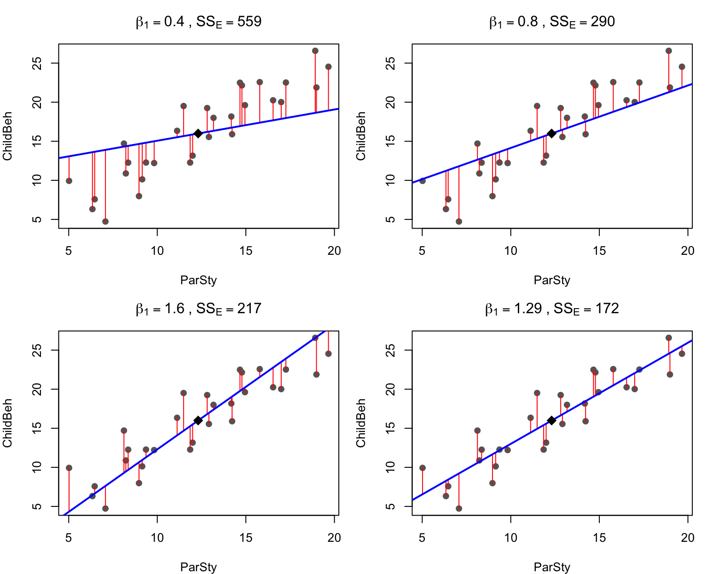{width=768}
:::
:::


::: {.cell}

:::


L'algortimo minimizza la $\text{SS}_E$ rispetto a **entrambi i parametri insieme**. La superficie $\text{SS}_E(\beta_0, \beta_1)$ è un "catino" con un unico fondo, e la stima
dei minimi quadrati è il suo punto più basso:


::: {.cell}

```{.r .cell-code  code-fold="true" code-summary="Codice del grafico"}
b0g <- seq(-6, 14, length.out = 100)
b1g <- seq(0.2, 1.7, length.out = 100)
SSE2 <- matrix(NA, nrow = length(b0g), ncol = length(b1g))
for (i in seq_along(b0g)) {        # per ogni intercetta candidata...
  for (j in seq_along(b1g)) {      # ...e ogni pendenza candidata:
    SSE2[i, j] <- sum((ChildBeh - b0g[i] - b1g[j] * ParSty)^2)
  }
}

par(mfrow = c(1, 2), mar = c(1, 1, 1, 1))
persp(b0g, b1g, SSE2, theta = 40, phi = 22, expand = 0.7,
      col = "lightblue", shade = 0.35, border = NA,
      xlab = "beta0", ylab = "beta1", zlab = "SSE")
par(mar = c(4, 4, 1, 1))
contour(b0g, b1g, SSE2, labcex = 0.7,
        levels = c(150, 250, 500, 1000, 2000, 4000, 8000, 16000),
        xlab = expression(beta[0]), ylab = expression(beta[1]))
b1_fondo <- seq(0.2, 1.7, length.out = 50)            # pendenze candidate
b0_fondo <- mean(ChildBeh) - b1_fondo * mean(ParSty)  # le intercette migliori
lines(b0_fondo, b1_fondo, lty = 2)                    # il fondovalle

b1c <- c(0.4, 0.8, 1.6)                      # le tre pendenze dei pannelli
b0c <- mean(ChildBeh) - b1c * mean(ParSty)   # le loro intercette migliori
points(b0c, b1c, pch = 18, cex = 1.4)        # un punto = una retta candidata
points(coef(mod)[1], coef(mod)[2], pch = 19, col = "red", cex = 1.4)  # lm()
```

::: {.cell-output-display}
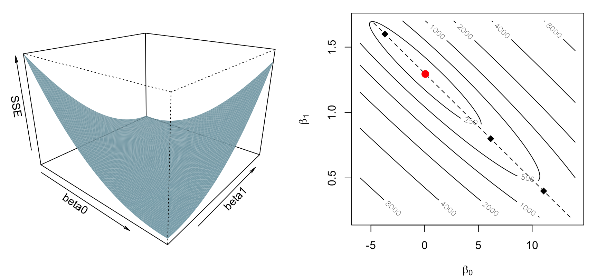{width=864}
:::
:::


::: {.cell}

:::


A sinistra lo spazio bidimensionale; a destra lo stesso visto dall'alto, a curve di livello. Il punto rosso è la coppia $(\hat\beta_0, \hat\beta_1)$ stimata da
`lm()`: il fondo. Notate che la valle è **stretta e obliqua**: intercetta e pendenza si compensano (alzando la pendenza, l'intercetta migliore scende). 

La linea tratteggiata è, per ogni pendenza, la sua intercetta migliore $\beta_0 = \bar{y} - \beta_1\bar{x}$: ogni retta "sensata" passa per il
baricentro dei dati.

Il fondo è il punto in cui la superficie
$S(\beta_0, \beta_1)$ è piatta in *entrambe* le direzioni: dove le sue due derivate parziali si annullano insieme.


$$
\beta_0 = \bar{y} - \beta_1\bar{x}
$$


$$
\beta_1 = \frac{\sum_i (x_i - \bar{x})(y_i - \bar{y})}{\sum_i (x_i - \bar{x})^2}
$$

cioè la **codevianza** di $x$ e $y$ (la somma dei prodotti degli scarti) divisa per
la **devianza** di $x$. Equivalentemente è la covarianza divisa per la varianza: i
fattori $1/(n-1)$ di entrambe si semplificano, e resta il rapporto tra le due
somme.


::: {.cell}

```{.r .cell-code}
xbar <- mean(ParSty);  ybar <- mean(ChildBeh)
b1_hat <- sum((ParSty - xbar) * (ChildBeh - ybar)) / sum((ParSty - xbar)^2)
b0_hat <- ybar - b1_hat * xbar
c(intercetta = b0_hat, pendenza = b1_hat)
```

::: {.cell-output .cell-output-stdout}

```
intercetta   pendenza 
0.06163175 1.29450140 
```


:::

```{.r .cell-code}
coef(mod)
```

::: {.cell-output .cell-output-stdout}

```
(Intercept)      ParSty 
 0.06163175  1.29450140 
```


:::
:::


Geometricamente, la formula $\beta_0 = \bar{y} - \beta_1\bar{x}$ dice che la retta
passa per il **baricentro** $(\bar{x}, \bar{y})$: l'intercetta è semplicemente la
sua altezza a $x = 0$.


::: {.cell}

```{.r .cell-code  code-fold="true" code-summary="Codice del grafico"}
xbar <- mean(ParSty);  ybar <- mean(ChildBeh)
b0 <- coef(mod)[1];  b1 <- coef(mod)[2]

plot(ParSty, ChildBeh, pch = 19, col = "grey75",
     xlim = c(-1.5, max(ParSty)), ylim = range(c(ChildBeh, b0)),
     xlab = "x", ylab = "y")
abline(mod, col = "blue", lwd = 2)
abline(v = 0, col = "grey85")
segments(0, ybar, xbar, ybar, lty = 3)                       # quota della media di y
arrows(0, ybar, 0, b0, length = 0.1, code = 3, col = "red")  # discesa di beta1 * xbar
points(xbar, ybar, pch = 18, cex = 1.8)                      # baricentro
points(0, b0, pch = 19, col = "forestgreen", cex = 1.5)      # intercetta
text(xbar, ybar, expression(group("(", list(bar(x), bar(y)), ")")), pos = 4, cex = 0.9)
text(0, b0, expression(beta[0]), pos = 4, col = "forestgreen")
text(0, (ybar + b0) / 2, expression(beta[1] * bar(x)), pos = 4, col = "red", cex = 0.9)
```

::: {.cell-output-display}
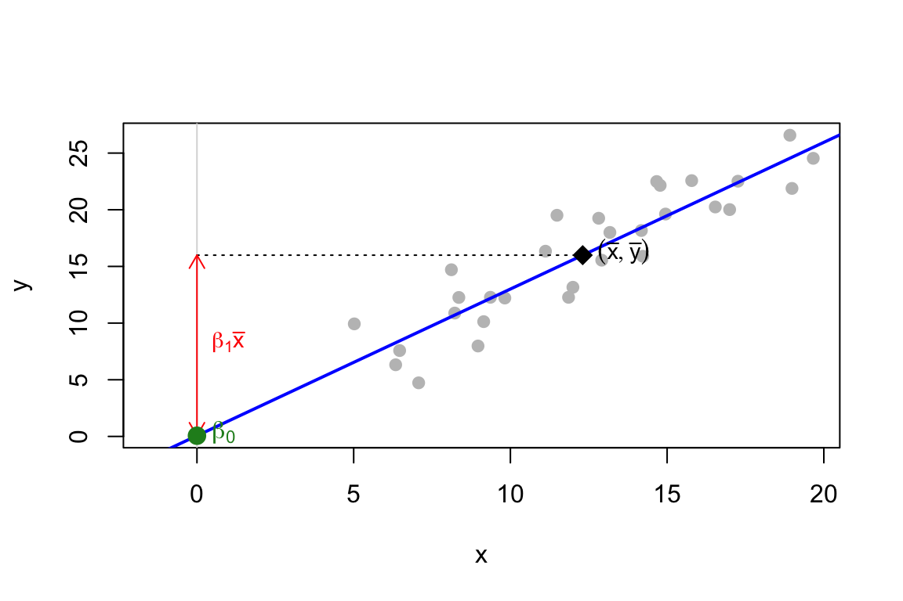{width=576}
:::
:::


Se il predittore è **centrato** ($\bar{x} = 0$), il termine $\beta_1\bar{x}$ si annulla *qualunque sia la pendenza*: l'intercetta migliore è $\bar{y}$ per **tutte** le rette candidate.


::: {.cell}

```{.r .cell-code  code-fold="true" code-summary="Codice del grafico"}
ParSty_c <- ParSty - mean(ParSty)            # predittore centrato
b0gc <- seq(9, 22, length.out = 60)
SSE2c <- matrix(NA, length(b0gc), length(b1g))
for (i in seq_along(b0gc)) {
  for (j in seq_along(b1g)) {
    SSE2c[i, j] <- sum((ChildBeh - b0gc[i] - b1g[j] * ParSty_c)^2)
  }
}

par(mfrow = c(1, 2), mar = c(4, 4, 3, 1))
contour(b0g, b1g, SSE2, labcex = 0.7,
        levels = c(150, 250, 500, 1000, 2000, 4000, 8000, 16000),
        xlab = expression(beta[0]), ylab = expression(beta[1]),
        main = "predittore originale")
lines(b0_fondo, b1_fondo, lty = 2)
contour(b0gc, b1g, SSE2c, labcex = 0.7,
        levels = c(150, 250, 500, 1000, 2000, 4000, 8000, 16000),
        xlab = expression(beta[0]), ylab = expression(beta[1]),
        main = "predittore centrato")
abline(v = mean(ChildBeh), lty = 2)          # fondovalle: verticale!
```

::: {.cell-output-display}
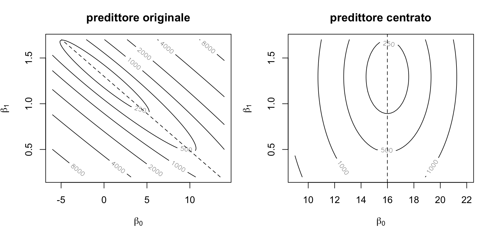{width=816}
:::
:::


Con il predittore centrato il fondovalle è **verticale** a $\beta_0 = \bar{y}$: cambiare pendenza non sposta più l'intercetta migliore. E le curve di livello si allineano agli assi: intercetta e pendenza non si compensano più — le due stime diventano indipendenti.


::: {.cell}

:::


:::


Il fit del modello può essere riassunto sfruttando la relazione tra devianza residua e devianza totale:

$$
R^2 = \frac{\text{SS}_R}{\text{SS}_T} = 1 - \frac{\text{SS}_E}{\text{SS}_T}
$$

La proporzione di variabilità spiegata **dal modello nel suo complesso** è l'$R^2$. Quando il modello avrà più predittori,
potremo scomporre la variabilità spiegata anche **effetto per effetto** (è l'$\eta^2$: lo vedremo nella @sec-eta2).

::: {.callout-note icon=false title="✏️ Esercizio 2 — Verificare la scomposizione della devianza"}
Torniamo al modello `m1` (`kid_score ~ mom_iq`).

a. Calcolate i residui "a mano" come `kidiq$kid_score - fitted(m1)` e verificate
   che coincidono con `residuals(m1)`.
b. Calcolate le tre devianze e verificate che $\text{SS}_T = \text{SS}_R + \text{SS}_E$.
c. Calcolate $R^2 = \text{SS}_R / \text{SS}_T$ e confrontatelo con
   `summary(m1)$r.squared`.
:::

::: {.callout-tip collapse="true" title="Soluzione — Esercizio 2"}

::: {.cell}

```{.r .cell-code}
res_mano <- kidiq$kid_score - fitted(m1)
all.equal(res_mano, residuals(m1))
```

::: {.cell-output .cell-output-stdout}

```
[1] TRUE
```


:::

```{.r .cell-code}
SST <- sum((kidiq$kid_score - mean(kidiq$kid_score))^2)
SSR <- sum((fitted(m1) - mean(kidiq$kid_score))^2)
SSE <- sum(residuals(m1)^2)
c(SST = SST, SSR = SSR, SSE = SSE)
```

::: {.cell-output .cell-output-stdout}

```
      SST       SSR       SSE 
180386.16  36248.82 144137.34 
```


:::

```{.r .cell-code}
SSR + SSE        # = SST
```

::: {.cell-output .cell-output-stdout}

```
[1] 180386.2
```


:::

```{.r .cell-code}
SSR / SST ; 1-(SSE/SST)
```

::: {.cell-output .cell-output-stdout}

```
[1] 0.2009512
```


:::

::: {.cell-output .cell-output-stdout}

```
[1] 0.2009512
```


:::

```{.r .cell-code}
summary(m1)$r.squared
```

::: {.cell-output .cell-output-stdout}

```
[1] 0.2009512
```


:::
:::


:::

### Due casi particolari

**Caso 1: dipendenza funzionale perfetta.** Tutti i punti giacciono esattamente
sulla retta di regressione: tutte le differenze $y_i - \hat{y}_i$ sono nulle,
quindi la devianza residua è zero e la devianza totale coincide con quella di
regressione. $R^2 = 1$.

**Caso 2: indipendenza.** La retta di regressione coincide con la media di $Y$
(pendenza nulla): sono nulle tutte le differenze $\hat{y}_i - \bar{y}$, la devianza
di regressione è zero e la devianza totale coincide con quella residua.
$R^2 \approx 0$.


::: {.cell}

```{.r .cell-code}
set.seed(1)
x  <- runif(30, 5, 20)
y_perf <- 2 + x                          # caso 1: nessun errore
y_indip <- rnorm(30, 10, 5)              # caso 2: Y non dipende da X

par(mfrow = c(1, 2), mar = c(4, 4, 3, 1))
plot(x, y_perf, pch = 19, main = expression(R^2 == 1), xlab = "X", ylab = "Y")
abline(lm(y_perf ~ x), col = "red", lwd = 2)
plot(x, y_indip, pch = 19, main = expression(R^2 %~~% 0), xlab = "X", ylab = "Y")
abline(lm(y_indip ~ x), col = "red", lwd = 2)
abline(h = mean(y_indip), lty = 2)
```

::: {.cell-output-display}
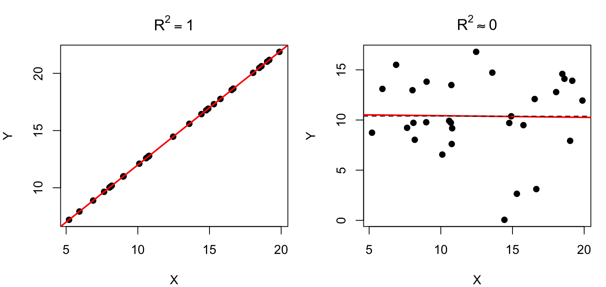{width=768}
:::
:::


::: {.cell}

:::


::: {.callout-note icon=false title="✏️ Esercizio 3 — Da che cosa dipende R²?"}
Simulate due dataset con la **stessa** relazione $y = 2 + 0.5x + \epsilon$, 

$n = 200$, $x \sim \mathcal{N}(0,1)$, $\epsilon \sim \mathcal{N}(0,\sigma)$, 

ma errori con deviazione standard diversa:
$\sigma = 0.5$ nel primo e $\sigma = 2$ nel secondo.

a. Stimate i due modelli: le stime di $\beta_1$ sono simili?
b. Confrontate gli $R^2$. Che cosa concludete?
:::

::: {.callout-tip collapse="true" title="Soluzione — Esercizio 3"}

::: {.cell}

```{.r .cell-code}
set.seed(123)
n <- 200
x <- rnorm(n)
y_preciso <- 2 + 0.5 * x + rnorm(n, 0, 0.5)
y_rumoroso <- 2 + 0.5 * x + rnorm(n, 0, 2)

mp <- lm(y_preciso ~ x)
mr <- lm(y_rumoroso ~ x)

summary(mp)
```

::: {.cell-output .cell-output-stdout}

```

Call:
lm(formula = y_preciso ~ x)

Residuals:
     Min       1Q   Median       3Q      Max 
-1.23959 -0.32809 -0.01703  0.34019  1.25931 

Coefficients:
            Estimate Std. Error t value Pr(>|t|)    
(Intercept)  2.02094    0.03529   57.27   <2e-16 ***
x            0.48537    0.03751   12.94   <2e-16 ***
---
Signif. codes:  0 '***' 0.001 '**' 0.01 '*' 0.05 '.' 0.1 ' ' 1

Residual standard error: 0.499 on 198 degrees of freedom
Multiple R-squared:  0.4582,	Adjusted R-squared:  0.4555 
F-statistic: 167.5 on 1 and 198 DF,  p-value: < 2.2e-16
```


:::

```{.r .cell-code}
summary(mr)
```

::: {.cell-output .cell-output-stdout}

```

Call:
lm(formula = y_rumoroso ~ x)

Residuals:
    Min      1Q  Median      3Q     Max 
-5.6693 -1.1845  0.1216  1.2860  4.9273 

Coefficients:
            Estimate Std. Error t value Pr(>|t|)    
(Intercept)   2.0630     0.1367  15.088  < 2e-16 ***
x             0.4381     0.1453   3.015  0.00291 ** 
---
Signif. codes:  0 '***' 0.001 '**' 0.01 '*' 0.05 '.' 0.1 ' ' 1

Residual standard error: 1.934 on 198 degrees of freedom
Multiple R-squared:  0.04389,	Adjusted R-squared:  0.03906 
F-statistic: 9.089 on 1 and 198 DF,  p-value: 0.002908
```


:::
:::


:::

## Il `summary()` spiegato {#sec-summary}


::: {.cell}

```{.r .cell-code}
summary(m1)
```

::: {.cell-output .cell-output-stdout}

```

Call:
lm(formula = kid_score ~ mom_iq, data = kidiq)

Residuals:
    Min      1Q  Median      3Q     Max 
-56.753 -12.074   2.217  11.710  47.691 

Coefficients:
            Estimate Std. Error t value Pr(>|t|)    
(Intercept) 25.79978    5.91741    4.36 1.63e-05 ***
mom_iq       0.60997    0.05852   10.42  < 2e-16 ***
---
Signif. codes:  0 '***' 0.001 '**' 0.01 '*' 0.05 '.' 0.1 ' ' 1

Residual standard error: 18.27 on 432 degrees of freedom
Multiple R-squared:  0.201,	Adjusted R-squared:  0.1991 
F-statistic: 108.6 on 1 and 432 DF,  p-value: < 2.2e-16
```


:::
:::


::: {.callout-note icon=false title="✏️ Prima di leggere oltre — Spiegate voi l'output"}
Coprite la lettura guidata qui sotto e provate a
spiegare ogni voce dell'output: che cos'è? da
dove viene? come si interpreta? 
:::

La lettura guidata, voce per voce:

- **`Call`**: il promemoria di come il modello è stato specificato (formula e
  dati).
- **`Residuals`**: la distribuzione dei residui (osservato − previsto). Se il
  modello è adeguato, mediana vicina a 0 e quartili circa simmetrici. Potete
  ricostruirla da soli: `summary(residuals(m1))`.
- **`Estimate`**: le stime dei coefficienti, già viste con `coef()`: i valori
  che minimizzano la somma dei quadrati degli errori.
- **`Std. Error`**: l'errore standard di ciascuna stima, cioè la sua incertezza:
  con campioni diversi otterremmo stime un po' diverse, e l'errore standard ne
  quantifica la variabilità. È l'incertezza che genera la **banda di
  confidenza** vista nella @sec-bande.
- **`t value` e `Pr(>|t|)`**: la statistica $t$ (stima / errore standard) e il
  relativo p-value per l'ipotesi nulla $\beta = 0$, calcolato sulla distribuzione $t$. Qui il test su `mom_iq` è significativo. Cosa significa?
- **`Residual standard error`** ($\sigma$): è — quasi — la deviazione standard
  dei residui: l'unica differenza è che al denominatore, al posto di $n - 1$, ci
  sono i **gradi di libertà residui** $n - k - 1$, dove $k$ è il numero di
  predittori (qui $434 - 1 - 1 = 432$, i "432 degrees of freedom" dell'output).
  Vale circa 18.3 punti: di tanto, in media, il modello "sbaglia" le previsioni.
- **`Multiple R-squared`**: la proporzione di variabilità di $Y$ spiegata dal
  modello, qui circa il 20%. L'idea: si parte dalla variabilità totale di $Y$ e
  si sottrae la parte che resta nei residui: è l'$R^2$ definito nella
  @sec-variabilita.
- **`Adjusted R-squared`**: l'$R^2$ **corretto per la complessità** del modello.
  Aggiungere predittori fa salire l'$R^2$ anche quando non servono a nulla; la
  versione *adjusted* tiene conto di quante osservazioni ($n$) e quanti
  predittori ($k$) stiamo usando, e rende più equo il confronto tra modelli di
  complessità diversa. Con un solo predittore e molte osservazioni, come qui, i
  due valori quasi coincidono.
- **`F-statistic`**: il test **globale** del modello contro il modello nullo
  (solo intercetta): ipotesi nulla "tutti i coefficienti, intercetta esclusa,
  sono zero", alternativa "almeno uno è diverso da zero". 


### Il `summary()` ricalcolato a mano

Per calcolare i quattro numeri serve sapere $n$, $k$ e due devianze ormai note
(@sec-devianze): la residua $\text{SS}_E$ e la totale $\text{SS}_T$:


::: {.cell}

```{.r .cell-code}
n   <- length(residuals(m1))  # numero di osservazioni
k   <- length(coef(m1)) - 1   # numero di predittori (intercetta esclusa)
SSE <- sum(residuals(m1)^2)   # variabilità residua
SST <- sum((kidiq$kid_score - mean(kidiq$kid_score))^2)  # variabilità totale

c(sigma = sqrt(SSE / (n - k - 1)), # devianza/... = sqrt(varianza)
  R2    = 1 - SSE / SST,
  R2adj = 1 - (SSE / SST) * (n - 1) / (n - k - 1), # penalizzo x k
  # rapporto SSR / SSE 
  Fstat = ((SST - SSE) / k) / (SSE / (n - k - 1))) 
```

::: {.cell-output .cell-output-stdout}

```
      sigma          R2       R2adj       Fstat 
 18.2661228   0.2009512   0.1991016 108.6428451 
```


:::
:::


Confrontate con l'output di `summary(m1)` qui sopra: tornano tutti e quattro.
Notate la logica comune: tutto ruota attorno al confronto tra quanta variabilità
c'era in partenza (la devianza totale) e quanta ne resta dopo il modello (la
devianza residua): `summary()` non fa che ricombinare le devianze della
@sec-devianze.

::: {.callout-tip collapse="true"}
## Perché si divide per $k$ e per $n-k-1$? (i gradi di libertà)

**I gradi di libertà:** Il numero di pezzi di informazione *davvero
indipendenti* che entrano in un calcolo. 

Esempio noto: la varianza campionaria
divide per $n-1$, non per $n$, perché per calcolare gli scarti $y_i - \bar y$ hai
prima stimato $\bar y$ *dagli stessi dati*; noti $\bar y$ e $n-1$ scarti, l'ultimo
è determinato (gli scarti sommano a zero). Regola generale: **ogni parametro
stimato dai dati consuma un grado di libertà.**

La devianza spiegata $\text{SS}_R$ vive nelle $k$
"direzioni" aggiunte dai $k$ predittori (le pendenze, oltre l'intercetta): ha $k$
gradi di libertà.

I residui partono da $n$ dati, ma per ottenere
i previsti $\hat y$ hai stimato $k+1$ parametri (le $k$ pendenze **più**
l'intercetta). Ogni parametro è un
vincolo sui residui: restano $n-k-1$ informazioni libere. $\text{SS}_E/(n-k-1)$ è
la varianza residua $\hat\sigma^2$.


I gradi di libertà si spezzano esattamente come le devianze:
$$
\underbrace{(n-1)}_{\text{totale}} = \underbrace{k}_{\text{regressione}} + \underbrace{(n-k-1)}_{\text{residua}},
$$
lo stesso schema di $\text{SS}_T = \text{SS}_R + \text{SS}_E$.

Così $\text{SS}_E/(n-k-1)$ è una stima **non distorta** di $\sigma^2$ (dividere per $n$
la sottostimerebbe: i residui sono resi artificialmente piccoli dall'adattamento).
Sotto l'ipotesi nulla anche il numeratore stima $\sigma^2$ → $F \approx 1$; se il
modello spiega davvero, il numeratore si gonfia mentre il denominatore resta una
stima onesta del rumore → $F$ grande.
:::


::: {.callout-note icon=false title="✏️ Prova tu — I p-value con pt() e pf()"}
Manca solo un pezzo: i **p-value**. Anche quelli si ricalcolano a mano, con le funzioni di ripartizione `pt()` e `pf()`.

Leggete dall'output di `summary(m1)` i valori che servono ($t$ dell'intercetta
= 4.36, $t$ di `mom_iq` = 10.42, $F$ = 108.6, gradi di libertà residui = 432) e:

a. ricalcolate il p-value di `mom_iq` con `pt()`. Attenzione: il test è a
   **due code** (l'effetto può essere in entrambe le direzioni), quindi la
   probabilità nella coda va raddoppiata;
b. fate lo stesso per l'intercetta e confrontate con `Pr(>|t|)`;
c. ricalcolate il p-value della $F$ con `pf()` (una coda sta volta).
d. verificate che $t^2 = F$ per `mom_iq`. Perché qui i due test coincidono?
:::

::: {.callout-tip collapse="true" title="Soluzione — Prova tu"}

::: {.cell}

```{.r .cell-code}
summary(m1)$coefficients   # da qui leggiamo i valori di t
```

::: {.cell-output .cell-output-stdout}

```
              Estimate Std. Error   t value     Pr(>|t|)
(Intercept) 25.7997778 5.91741208  4.359977 1.627847e-05
mom_iq       0.6099746 0.05852092 10.423188 7.661950e-23
```


:::

```{.r .cell-code}
2 * pt(c(4.36, 10.42), df = 432, lower.tail = FALSE)   # a-b: due code
```

::: {.cell-output .cell-output-stdout}

```
[1] 1.627680e-05 7.869965e-23
```


:::

```{.r .cell-code}
pf(108.6, df1 = 1, df2 = 432, lower.tail = FALSE)      # c: una coda sola
```

::: {.cell-output .cell-output-stdout}

```
[1] 7.79544e-23
```


:::

```{.r .cell-code}
c(t2 = 10.42^2, F = 108.6)                             # d: con k = 1, F = t²
```

::: {.cell-output .cell-output-stdout}

```
      t2        F 
108.5764 108.6000 
```


:::
:::


a–b. I p-value coincidono con quelli del `summary()`.
c. **Una coda sola**: la $F$ è un rapporto di varianze, sempre positivo, e solo
valori grandi sono evidenza contro $H_0$.
d. Con un solo predittore l'ipotesi globale "tutti i coefficienti sono zero" e
l'ipotesi sul singolo coefficiente sono la stessa ipotesi: $F = t^2$ e i due
p-value coincidono.
:::

::: {.callout-note icon=false title="✏️ Esercizio 4 — La vostra prima regressione"}
Stimate un modello in cui il punteggio del bambino è predetto dall'**età della
madre** (`mom_age`).

a. Scrivete l'equazione di regressione stimata.
b. Come interpretate la pendenza?
c. Qual è il punteggio previsto per un bambino la cui madre ha 20 anni? E 30 anni?
d. Guardando $R^2$, l'età della madre vi sembra un buon predittore?
:::

::: {.callout-tip collapse="true" title="Soluzione — Esercizio 4"}

::: {.cell}

```{.r .cell-code}
m_age <- lm(kid_score ~ mom_age, data = kidiq)
coef(m_age)
```

::: {.cell-output .cell-output-stdout}

```
(Intercept)     mom_age 
 70.9569209   0.6951862 
```


:::

```{.r .cell-code}
summary(m_age)$r.squared
```

::: {.cell-output .cell-output-stdout}

```
[1] 0.008463666
```


:::
:::


a. $\hat{Y} = 70.96 + 0.70 \cdot \text{mom\_age}$.
b. Per ogni anno in più della madre, il punteggio atteso del bambino aumenta in
   media di 0.70 punti.
c. Possiamo calcolarli a mano oppure, meglio, con `predict()`:


::: {.cell}

```{.r .cell-code}
predict(m_age, newdata = data.frame(mom_age = c(20, 30)))
```

::: {.cell-output .cell-output-stdout}

```
       1        2 
84.86064 91.81251 
```


:::
:::


d. $R^2 \approx 0.009$: l'età della madre spiega meno dell'1% della variabilità dei
   punteggi. La pendenza è positiva ma il predittore, da solo, è debolissimo.
:::

::: {.callout-note icon=false title="✏️ Esercizio 5 — Intervalli di confidenza"}
Con la funzione `confint()` calcolate l'intervallo di confidenza al
95% per i coefficienti di `m1`. Come lo interpretate, in particolare per `mom_iq`?
L'intervallo contiene lo zero?
:::

::: {.callout-tip collapse="true" title="Soluzione — Esercizio 5"}

::: {.cell}

```{.r .cell-code}
confint(m1)
```

::: {.cell-output .cell-output-stdout}

```
                 2.5 %     97.5 %
(Intercept) 14.1692789 37.4302768
mom_iq       0.4949534  0.7249957
```


:::
:::


L'intervallo per `mom_iq` va da circa 0.50 a 0.73: i dati sono compatibili con un
effetto del QI della madre compreso tra mezzo punto e tre quarti di punto per ogni
punto di QI. 
:::

## La diagnostica grafica {#sec-diagnostica}

Applicando `plot()` a un oggetto `lm` otteniamo quattro grafici diagnostici, che servono a controllare le assunzioni della @sec-assunzioni.

- **Residuals vs Fitted**: i residui contro i valori previsti. Se la relazione è davvero lineare, i punti si dispongono *a caso* attorno allo zero, senza curvature (linearità) né forme a imbuto (omoschedasticità).
- **Normal Q-Q**: confronta i quantili dei residui standardizzati con quelli di una normale; se l'assunzione di normalità regge, i punti stanno sulla diagonale.


::: {.cell}

```{.r .cell-code  code-fold="true"}
par(mfrow = c(2, 2))
plot(m1)
```

::: {.cell-output-display}
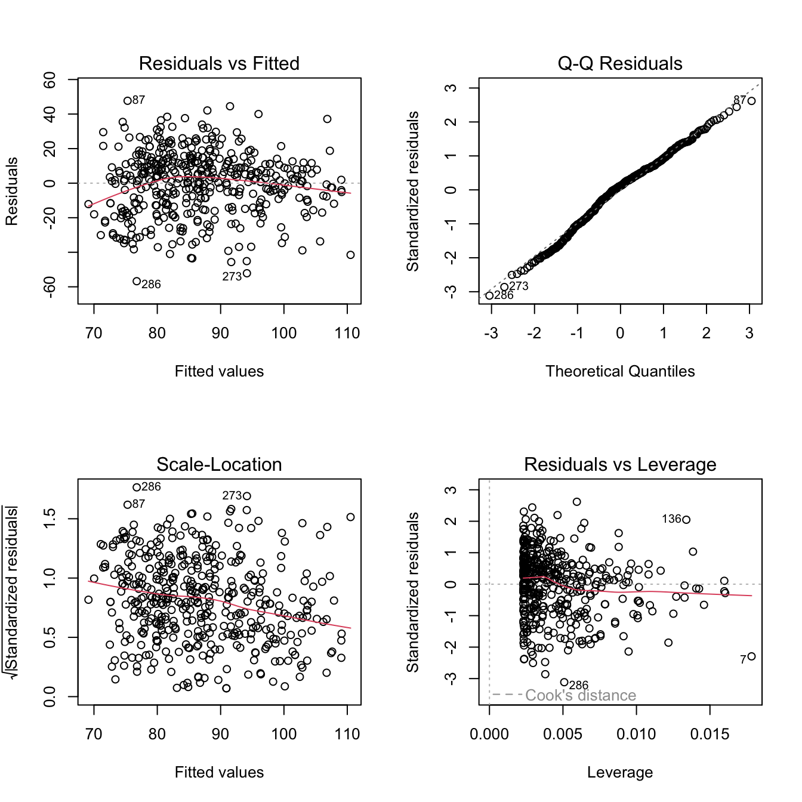{width=672}
:::
:::


::: {.cell}

:::


- **Scale-Location**: versione "stabilizzata" del primo grafico, utile per vedere se la variabilità dei residui cresce con i valori previsti (eteroschedasticità).
- **Residuals vs Leverage**: evidenzia osservazioni con grande *leva* e grande residuo, cioè i potenziali **casi influenti** (ne parleremo nella @sec-anomali, insieme alla distanza di Cook).

R etichetta automaticamente i casi più estremi (qui 87, 273, 286): non sono necessariamente un problema, ma meritano un'occhiata.

## Un predittore dicotomico {#sec-dicotomico}

Vogliamo ora valutare se il **livello di istruzione della madre** (diplomata o no)
è predittivo del punteggio del bambino. Il predittore è un `factor` con due
livelli, quindi R costruisce per noi la dummy $D$ (0 = non diplomata, 1 =
diplomata):


::: {.cell}

```{.r .cell-code}
m2 <- lm(kid_score ~ mom_hs, data = kidiq)

plot(kid_score ~ mom_hs, data = kidiq,
     xlab = "Diploma della madre", ylab = "Punteggio del bambino")
```

::: {.cell-output-display}
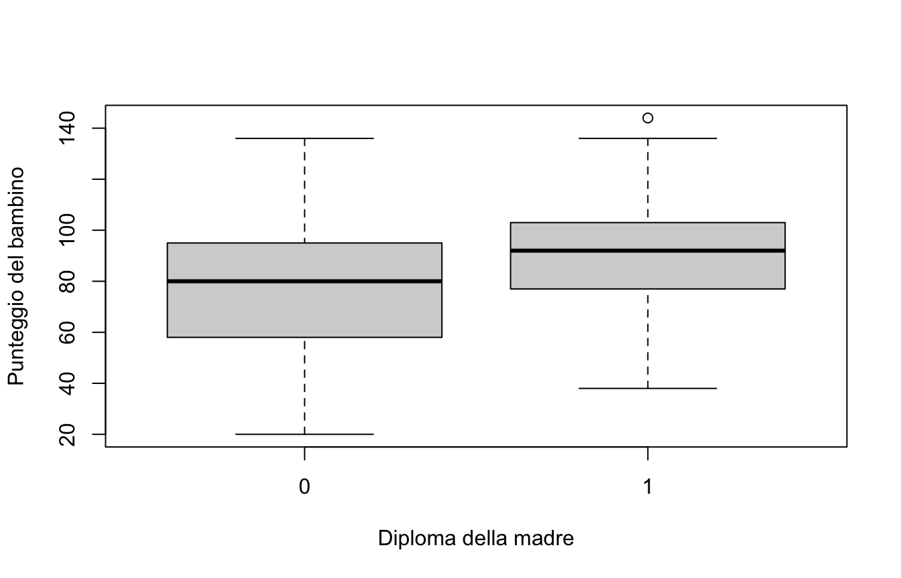{width=672}
:::
:::


(Con un predittore `factor`, `plot()` produce automaticamente dei boxplot.)


::: {.cell}

```{.r .cell-code}
coef(m2)
```

::: {.cell-output .cell-output-stdout}

```
(Intercept)     mom_hs1 
   77.54839    11.77126 
```


:::
:::


L'equazione di regressione è

$$
\hat{Y} = 77.55 + 11.77 D
$$

L'interpretazione, con una dummy, è in termini di **medie di gruppo** (cfr. @sec-codifica):

- $\beta_0 = 77.55$: punteggio medio previsto quando $D = 0$, cioè la media dei
  bambini con madre **non** diplomata;
- $\beta_1 = 11.77$: la **differenza** tra le medie dei due gruppi. I figli di
  madri diplomate ottengono in media 11.77 punti in più
  ($77.55 + 11.77 = 89.32$).


::: {.cell}

```{.r .cell-code}
summary(m2)
```

::: {.cell-output .cell-output-stdout}

```

Call:
lm(formula = kid_score ~ mom_hs, data = kidiq)

Residuals:
   Min     1Q Median     3Q    Max 
-57.55 -13.32   2.68  14.68  58.45 

Coefficients:
            Estimate Std. Error t value Pr(>|t|)    
(Intercept)   77.548      2.059  37.670  < 2e-16 ***
mom_hs1       11.771      2.322   5.069 5.96e-07 ***
---
Signif. codes:  0 '***' 0.001 '**' 0.01 '*' 0.05 '.' 0.1 ' ' 1

Residual standard error: 19.85 on 432 degrees of freedom
Multiple R-squared:  0.05613,	Adjusted R-squared:  0.05394 
F-statistic: 25.69 on 1 and 432 DF,  p-value: 5.957e-07
```


:::
:::


Il test $t$ su `mom_hs1` ci dice che la differenza tra i due gruppi è
statisticamente significativa, ma $R^2 \approx 0.056$: il diploma della madre, da
solo, spiega poco della variabilità dei punteggi.

::: {.callout-note icon=false title="✏️ Esercizio 6 — Regressione e medie di gruppo"}
Verificate "a mano" l'interpretazione dei coefficienti di `m2`:

a. calcolate la media di `kid_score` separatamente per i due gruppi di `mom_hs`
   (suggerimento: `tapply()`);
b. confrontate le medie ottenute con i coefficienti del modello;
c. (extra) confrontate l'output di `summary(m2)` con quello di un test $t$ a
   varianze uguali: `t.test(kid_score ~ mom_hs, data = kidiq, var.equal = TRUE)`.
   Che cosa notate?
:::

::: {.callout-tip collapse="true" title="Soluzione — Esercizio 6"}

::: {.cell}

```{.r .cell-code}
medie <- tapply(kidiq$kid_score, kidiq$mom_hs, mean)
medie
```

::: {.cell-output .cell-output-stdout}

```
       0        1 
77.54839 89.31965 
```


:::

```{.r .cell-code}
medie[2] - medie[1]
```

::: {.cell-output .cell-output-stdout}

```
       1 
11.77126 
```


:::

```{.r .cell-code}
coef(m2)
```

::: {.cell-output .cell-output-stdout}

```
(Intercept)     mom_hs1 
   77.54839    11.77126 
```


:::
:::


La media del gruppo 0 (77.55) coincide con l'intercetta e la differenza tra le
medie (11.77) coincide con il coefficiente della dummy.


::: {.cell}

```{.r .cell-code}
t.test(kid_score ~ mom_hs, data = kidiq, var.equal = TRUE)
```

::: {.cell-output .cell-output-stdout}

```

	Two Sample t-test

data:  kid_score by mom_hs
t = -5.0685, df = 432, p-value = 5.957e-07
alternative hypothesis: true difference in means between group 0 and group 1 is not equal to 0
95 percent confidence interval:
 -16.335924  -7.206598
sample estimates:
mean in group 0 mean in group 1 
       77.54839        89.31965 
```


:::
:::


La statistica $t$ e il p-value sono identici (a parte il segno, che dipende solo
dall'ordine dei gruppi) a quelli del coefficiente `mom_hs1` nel `summary(m2)`: il
test $t$ per due gruppi indipendenti **è** un modello lineare con un predittore
dicotomico. Molti dei test "classici" sono casi particolari del modello lineare.
:::

# La regressione multipla

Quando il modello ha più predittori, la formulazione può essere scritta:

**1. in forma matriciale:**

$$
Y = X\beta + \epsilon
$$

**2. in forma estesa:**

$$
Y = \beta_0 + \beta_1 X_1 + \beta_2 X_2 + \ldots + \beta_k X_k + \epsilon
$$

Quando il modello ha più predittori (quantitativi e/o categoriali) e una sola
variabile dipendente quantitativa $Y$, si parla di **regressione lineare
multipla**.

## Un esempio con due predittori

Consideriamo un modello che predice il punteggio del bambino a partire dal QI
**e** dal livello di istruzione della madre. In R basta sommare i predittori nella
formula:


::: {.cell}

```{.r .cell-code}
m3 <- lm(kid_score ~ mom_iq + mom_hs, data = kidiq)
coef(m3)
```

::: {.cell-output .cell-output-stdout}

```
(Intercept)      mom_iq     mom_hs1 
  25.731538    0.563906    5.950117 
```


:::
:::


L'equazione di regressione è

$$
\hat{Y} = 25.73 + 0.56 X + 5.95 D
$$

Poiché $D \in \{0, 1\}$, graficamente otteniamo **due rette parallele**: stessa
pendenza (0.56), intercette diverse (25.73 per le madri non diplomate, $25.73 +
5.95 = 31.68$ per le diplomate):


::: {.cell}

```{.r .cell-code  code-fold="true" code-summary="Codice del grafico"}
g    <- kidiq$mom_hs
cols <- c("#F8766D", "#00BFC4")          # non diplomata, diplomata
xr   <- range(kidiq$mom_iq)
yr   <- range(kidiq$kid_score)
dx <- lapply(levels(g), function(l) density(kidiq$mom_iq[g == l]))
dy <- lapply(levels(g), function(l) density(kidiq$kid_score[g == l]))

layout(matrix(c(2, 4, 1, 3), 2, 2, byrow = TRUE),
       widths = c(4, 1.2), heights = c(1.2, 4))

# 1 — scatter dei dati + le due rette parallele di m3
par(mar = c(4, 4, 0.5, 0.5))
plot(kidiq$mom_iq, kidiq$kid_score, pch = 19, col = adjustcolor(cols[g], 0.3),
     xlim = xr, ylim = yr, xlab = "QI della madre", ylab = "Punteggio del bambino")
cf <- coef(m3)
abline(cf[1],         cf[2], col = cols[1], lwd = 3)
abline(cf[1] + cf[3], cf[2], col = cols[2], lwd = 3)

# 2 — distribuzione del QI (in alto), per gruppo
par(mar = c(0, 4, 0.5, 0.5))
plot(NA, xlim = xr, ylim = c(0, max(sapply(dx, function(d) max(d$y)))),
     axes = FALSE, xlab = "", ylab = "")
for (i in 1:2) polygon(dx[[i]], col = adjustcolor(cols[i], 0.4), border = cols[i])

# 3 — distribuzione del punteggio (a destra), per gruppo: densità ruotata
par(mar = c(4, 0, 0.5, 0.5))
plot(NA, ylim = yr, xlim = c(0, max(sapply(dy, function(d) max(d$y)))),
     axes = FALSE, xlab = "", ylab = "")
for (i in 1:2) polygon(dy[[i]]$y, dy[[i]]$x, col = adjustcolor(cols[i], 0.4), border = cols[i])

# 4 — legenda
par(mar = c(0, 0, 0, 0)); plot.new()
legend("center", fill = adjustcolor(cols, 0.5), border = cols, bty = "n",
       legend = c("non diplomata", "diplomata"))
```

::: {.cell-output-display}
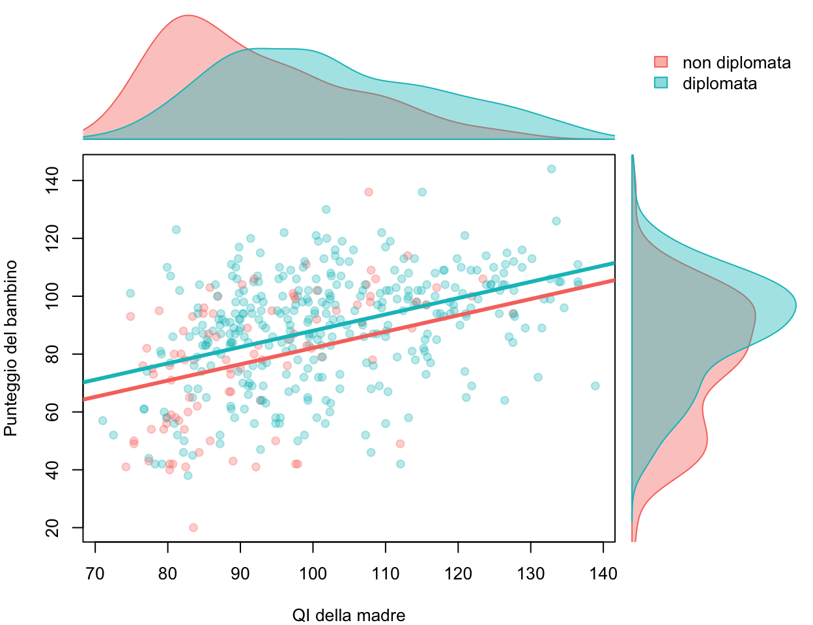{width=624}
:::

```{.r .cell-code  code-fold="true" code-summary="Codice del grafico"}
layout(1)
```
:::


Sui margini si leggono le distribuzioni dei due gruppi: le madri diplomate
(azzurro) hanno QI tendenzialmente più alti (margine in alto) e figli con punteggi
più alti (margine a destra). 
Ogni coefficiente esprime l'effetto di quel predittore **a parità degli altri**.
Ad esempio, $\beta_1 = 0.56$ è l'effetto del QI della madre *a parità di livello di istruzione*.

## L'analisi degli effetti


::: {.cell}

```{.r .cell-code}
summary(m3)
```

::: {.cell-output .cell-output-stdout}

```

Call:
lm(formula = kid_score ~ mom_iq + mom_hs, data = kidiq)

Residuals:
    Min      1Q  Median      3Q     Max 
-52.873 -12.663   2.404  11.356  49.545 

Coefficients:
            Estimate Std. Error t value Pr(>|t|)    
(Intercept) 25.73154    5.87521   4.380 1.49e-05 ***
mom_iq       0.56391    0.06057   9.309  < 2e-16 ***
mom_hs1      5.95012    2.21181   2.690  0.00742 ** 
---
Signif. codes:  0 '***' 0.001 '**' 0.01 '*' 0.05 '.' 0.1 ' ' 1

Residual standard error: 18.14 on 431 degrees of freedom
Multiple R-squared:  0.2141,	Adjusted R-squared:  0.2105 
F-statistic: 58.72 on 2 and 431 DF,  p-value: < 2.2e-16
```


:::
:::


Con `anova()` otteniamo la scomposizione della variabilità spiegata dai singoli
effetti del modello:


::: {.cell}

```{.r .cell-code}
anova(m3); a <- anova(m3)
```

::: {.cell-output .cell-output-stdout}

```
Analysis of Variance Table

Response: kid_score
           Df Sum Sq Mean Sq  F value    Pr(>F)    
mom_iq      1  36249   36249 110.2114 < 2.2e-16 ***
mom_hs      1   2380    2380   7.2369  0.007419 ** 
Residuals 431 141757     329                       
---
Signif. codes:  0 '***' 0.001 '**' 0.01 '*' 0.05 '.' 0.1 ' ' 1
```


:::

```{.r .cell-code}
SST <- sum(a$`Sum Sq`)
SSE <- a$`Sum Sq`[3]
R2 <- 1-(SSE/SST); R2
```

::: {.cell-output .cell-output-stdout}

```
[1] 0.2141465
```


:::

```{.r .cell-code}
summary(m3)$r.squared
```

::: {.cell-output .cell-output-stdout}

```
[1] 0.2141465
```


:::
:::


Entrambi gli effetti risultano significativi e il modello spiega circa il 21.4% della variabilità dei punteggi (era il 20.1% con il solo QI: l'istruzione della madre aggiunge poco, una volta tenuto conto del QI).


### La variabilità spiegata dai singoli effetti: $\eta^2$ {#sec-eta2}

Oltre all'$R^2$ complessivo (@sec-variabilita), dalla tabella ANOVA possiamo
stimare la proporzione di variabilità spiegata **da ciascun effetto**, detta
$\eta^2$: il rapporto tra la devianza dell'effetto e la devianza totale.


::: {.cell}

```{.r .cell-code}
eta2 <- a$"Sum Sq" / sum(a$"Sum Sq")
data.frame(effetto = rownames(a), eta2 = round(eta2, 3))
```

::: {.cell-output .cell-output-stdout}

```
    effetto  eta2
1    mom_iq 0.201
2    mom_hs 0.013
3 Residuals 0.786
```


:::
:::


Il QI della madre spiega da solo circa il 20% della variabilità; il diploma,
entrato dopo il QI, aggiunge poco più di un punto percentuale.

## La rappresentazione grafica degli effetti

Per visualizzare gli effetti stimati dal modello esistono comodi pacchetti
dedicati. 

- **sjPlot**:


::: {.cell layout-ncol="2"}

```{.r .cell-code}
library(sjPlot)
plot_model(m3, type = "eff", terms = "mom_iq", show.data = TRUE)
```

::: {.cell-output-display}
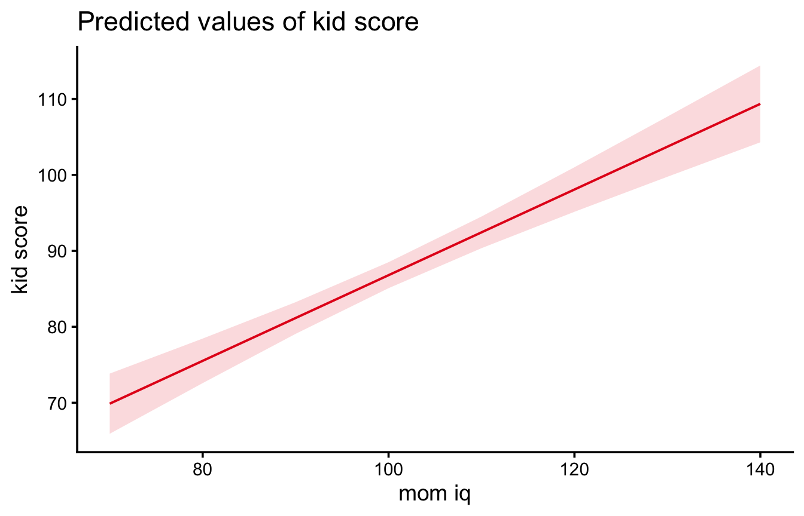{width=672}
:::

```{.r .cell-code}
plot_model(m3, type = "eff", terms = "mom_hs")
```

::: {.cell-output-display}
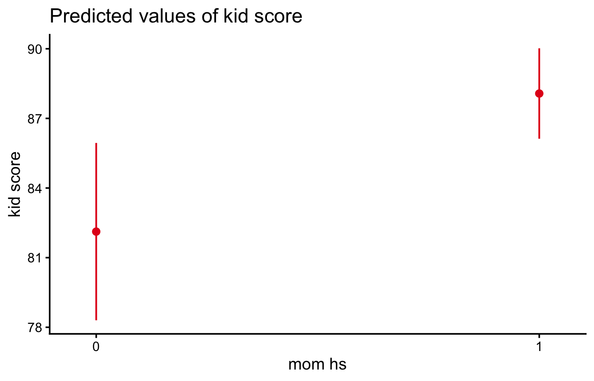{width=672}
:::
:::


::: {.cell}

```{.r .cell-code}
# tabella da esportare
tab_model(m3)
```

::: {.cell-output-display}
`````{=html}
<table style="border-collapse:collapse; border:none;">
<tr>
<th style="border-top: double; text-align:center; font-style:normal; font-weight:bold; padding:0.2cm;  text-align:left; ">&nbsp;</th>
<th colspan="3" style="border-top: double; text-align:center; font-style:normal; font-weight:bold; padding:0.2cm; ">kid score</th>
</tr>
<tr>
<td style=" text-align:center; border-bottom:1px solid; font-style:italic; font-weight:normal;  text-align:left; ">Predictors</td>
<td style=" text-align:center; border-bottom:1px solid; font-style:italic; font-weight:normal;  ">Estimates</td>
<td style=" text-align:center; border-bottom:1px solid; font-style:italic; font-weight:normal;  ">CI</td>
<td style=" text-align:center; border-bottom:1px solid; font-style:italic; font-weight:normal;  ">p</td>
</tr>
<tr>
<td style=" padding:0.2cm; text-align:left; vertical-align:top; text-align:left; ">(Intercept)</td>
<td style=" padding:0.2cm; text-align:left; vertical-align:top; text-align:center;  ">25.73</td>
<td style=" padding:0.2cm; text-align:left; vertical-align:top; text-align:center;  ">14.18&nbsp;&ndash;&nbsp;37.28</td>
<td style=" padding:0.2cm; text-align:left; vertical-align:top; text-align:center;  "><strong>&lt;0.001</strong></td>
</tr>
<tr>
<td style=" padding:0.2cm; text-align:left; vertical-align:top; text-align:left; ">mom iq</td>
<td style=" padding:0.2cm; text-align:left; vertical-align:top; text-align:center;  ">0.56</td>
<td style=" padding:0.2cm; text-align:left; vertical-align:top; text-align:center;  ">0.44&nbsp;&ndash;&nbsp;0.68</td>
<td style=" padding:0.2cm; text-align:left; vertical-align:top; text-align:center;  "><strong>&lt;0.001</strong></td>
</tr>
<tr>
<td style=" padding:0.2cm; text-align:left; vertical-align:top; text-align:left; ">mom hs [1]</td>
<td style=" padding:0.2cm; text-align:left; vertical-align:top; text-align:center;  ">5.95</td>
<td style=" padding:0.2cm; text-align:left; vertical-align:top; text-align:center;  ">1.60&nbsp;&ndash;&nbsp;10.30</td>
<td style=" padding:0.2cm; text-align:left; vertical-align:top; text-align:center;  "><strong>0.007</strong></td>
</tr>
<tr>
<td style=" padding:0.2cm; text-align:left; vertical-align:top; text-align:left; padding-top:0.1cm; padding-bottom:0.1cm; border-top:1px solid;">Observations</td>
<td style=" padding:0.2cm; text-align:left; vertical-align:top; padding-top:0.1cm; padding-bottom:0.1cm; text-align:left; border-top:1px solid;" colspan="3">434</td>
</tr>
<tr>
<td style=" padding:0.2cm; text-align:left; vertical-align:top; text-align:left; padding-top:0.1cm; padding-bottom:0.1cm;">R<sup>2</sup> / R<sup>2</sup> adjusted</td>
<td style=" padding:0.2cm; text-align:left; vertical-align:top; padding-top:0.1cm; padding-bottom:0.1cm; text-align:left;" colspan="3">0.214 / 0.210</td>
</tr>

</table>

`````
:::
:::


- **effects**:


::: {.cell}

```{.r .cell-code}
library(effects)
plot(allEffects(m3))
```

::: {.cell-output-display}
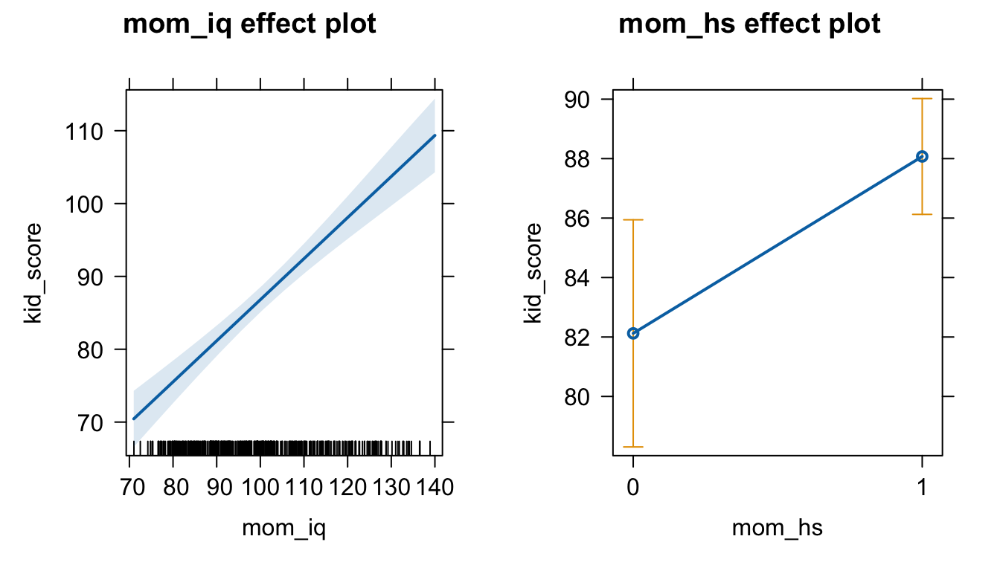{width=672}
:::
:::


Entrambi mostrano l'effetto di ciascun predittore *tenendo gli altri fissi* (ai
loro valori medi), con le relative bande di confidenza.


::: {.callout-note icon=false title="✏️ Esercizio 7 — Regressione multipla"}
Stimate un modello con `mom_iq` e `mom_age` come predittori di `kid_score`.

a. Scrivete l'equazione di regressione.
b. Confrontate il coefficiente di `mom_iq` con quello che aveva nel modello
   semplice `m1`: è cambiato molto?
c. Confrontate l'$R^2$ con quello di `m1`: quanto aggiunge l'età della madre?
d. Disegnate gli effetti del modello con `plot(allEffects(...))`.
:::

::: {.callout-tip collapse="true" title="Soluzione — Esercizio 7"}

::: {.cell}

```{.r .cell-code}
m5 <- lm(kid_score ~ mom_iq + mom_age, data = kidiq)
coef(m5)
```

::: {.cell-output .cell-output-stdout}

```
(Intercept)      mom_iq     mom_age 
 17.5962491   0.6035720   0.3881286 
```


:::

```{.r .cell-code}
summary(m5)$r.squared
```

::: {.cell-output .cell-output-stdout}

```
[1] 0.2035673
```


:::
:::


a. $\hat{Y} = 17.60 + 0.60 \cdot \text{mom\_iq} + 0.39 \cdot \text{mom\_age}$.
b. Il coefficiente di `mom_iq` passa da 0.610 a 0.604: praticamente invariato
   (QI ed età della madre sono poco correlati, quindi i loro effetti non si
   "rubano" variabilità a vicenda).
c. $R^2$ passa da 0.201 a 0.204: l'età della madre, a parità di QI, aggiunge
   pochissimo.


::: {.cell}

```{.r .cell-code}
plot(allEffects(m5))
```

::: {.cell-output-display}
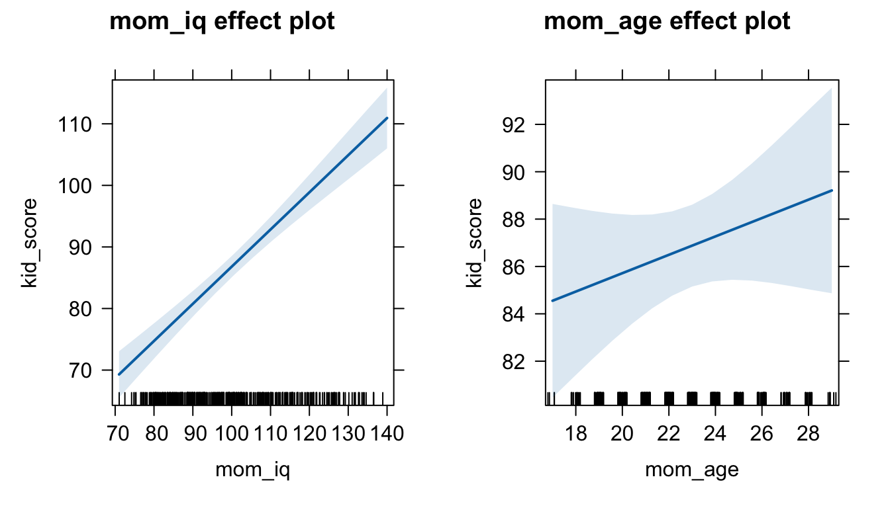{width=672}
:::
:::


Notate la diversa ampiezza delle bande di confidenza: l'effetto del QI è stimato
con molta più precisione di quello dell'età.
:::

# Gli effetti di interazione

Nel modello `m3` abbiamo imposto che l'effetto del QI fosse **lo stesso** nei due
gruppi di madri (rette parallele). Ma potrebbe non essere così: introduciamo allora
l'**interazione** tra i predittori, che in R si indica con `*`:


::: {.cell}

```{.r .cell-code}
m4 <- lm(kid_score ~ mom_iq * mom_hs, data = kidiq)
coef(m4)
```

::: {.cell-output .cell-output-stdout}

```
   (Intercept)         mom_iq        mom_hs1 mom_iq:mom_hs1 
   -11.4820211      0.9688892     51.2682234     -0.4842747 
```


:::
:::


La formula `mom_iq * mom_hs` è una scorciatoia per
`mom_iq + mom_hs + mom_iq:mom_hs`: effetti principali **più** interazione.
L'equazione di regressione diventa

$$
\hat{Y} = -11.48 + 0.97 X + 51.27 D - 0.48\, DX
$$

Il termine $DX$ (prodotto tra dummy e QI) permette alle due rette di avere
**pendenze diverse**:


::: {.cell}

```{.r .cell-code  code-fold="true" code-summary="Codice del grafico"}
g    <- kidiq$mom_hs
cols <- c("#F8766D", "#00BFC4")          # non diplomata, diplomata
xr   <- range(kidiq$mom_iq)
yr   <- range(kidiq$kid_score)
dx <- lapply(levels(g), function(l) density(kidiq$mom_iq[g == l]))
dy <- lapply(levels(g), function(l) density(kidiq$kid_score[g == l]))

layout(matrix(c(2, 4, 1, 3), 2, 2, byrow = TRUE),
       widths = c(4, 1.2), heights = c(1.2, 4))

# 1 — scatter + le due rette di m4 (pendenze diverse)
par(mar = c(4, 4, 0.5, 0.5))
plot(kidiq$mom_iq, kidiq$kid_score, pch = 19, col = adjustcolor(cols[g], 0.3),
     xlim = xr, ylim = yr, xlab = "QI della madre", ylab = "Punteggio del bambino")
cf <- coef(m4)
abline(cf[1],         cf[2],  col = cols[1], lwd = 3)   # non dipl. (D = 0)
abline(cf[1] + cf[3], cf[2] + cf[4],  col = cols[2], lwd = 3)   # dipl.     (D = 1)

# 2 — distribuzione del QI (in alto), per gruppo
par(mar = c(0, 4, 0.5, 0.5))
plot(NA, xlim = xr, ylim = c(0, max(sapply(dx, function(d) max(d$y)))),
     axes = FALSE, xlab = "", ylab = "")
for (i in 1:2) polygon(dx[[i]], col = adjustcolor(cols[i], 0.4), border = cols[i])

# 3 — distribuzione del punteggio (a destra), per gruppo: densità ruotata
par(mar = c(4, 0, 0.5, 0.5))
plot(NA, ylim = yr, xlim = c(0, max(sapply(dy, function(d) max(d$y)))),
     axes = FALSE, xlab = "", ylab = "")
for (i in 1:2) polygon(dy[[i]]$y, dy[[i]]$x, col = adjustcolor(cols[i], 0.4), border = cols[i])

# 4 — legenda
par(mar = c(0, 0, 0, 0)); plot.new()
legend("center", fill = adjustcolor(cols, 0.5), border = cols, bty = "n",
       legend = c("non diplomata", "diplomata"))
```

::: {.cell-output-display}
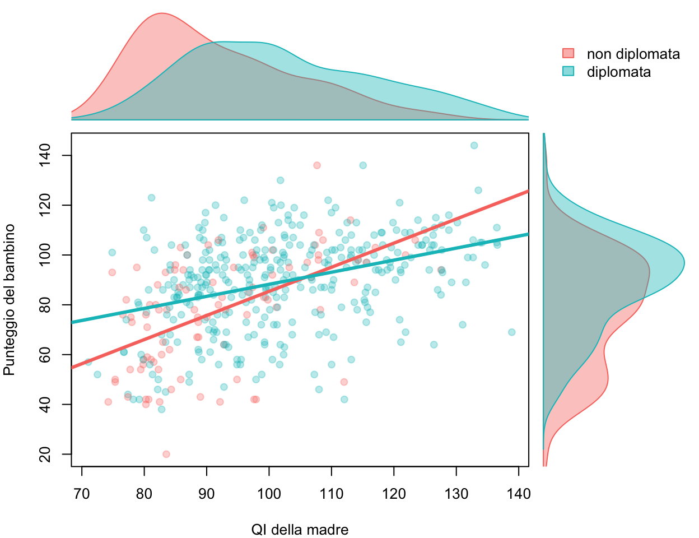{width=624}
:::
:::


Sostituendo i valori di $D$ si ottengono le equazioni delle due rette:

- madri non diplomate ($D = 0$): $\hat{Y} = -11.48 + 0.97 X$
- madri diplomate ($D = 1$): $\hat{Y} = (-11.48 + 51.27) + (0.97 - 0.48) X = 39.79 + 0.49 X$


L'interpretazione: tra le madri non diplomate il QI "pesa" molto di più (quasi un
punto per punto di QI), mentre tra le diplomate la relazione è circa la metà. Con
un'interazione, gli effetti principali **non si interpretano più da soli**:
l'effetto di un predittore dipende dal livello dell'altro.


## L'analisi degli effetti


::: {.cell}

```{.r .cell-code}
a <- anova(m4); a
```

::: {.cell-output .cell-output-stdout}

```
Analysis of Variance Table

Response: kid_score
               Df Sum Sq Mean Sq  F value    Pr(>F)    
mom_iq          1  36249   36249 112.2346 < 2.2e-16 ***
mom_hs          1   2380    2380   7.3698  0.006900 ** 
mom_iq:mom_hs   1   2878    2878   8.9123  0.002994 ** 
Residuals     430 138879     323                       
---
Signif. codes:  0 '***' 0.001 '**' 0.01 '*' 0.05 '.' 0.1 ' ' 1
```


:::

```{.r .cell-code}
SST <- sum(a$`Sum Sq`)
SSE <- a$`Sum Sq`[4]
R2 <- 1-(SSE/SST); R2
```

::: {.cell-output .cell-output-stdout}

```
[1] 0.2301036
```


:::

```{.r .cell-code}
summary(m4)$r.squared
```

::: {.cell-output .cell-output-stdout}

```
[1] 0.2301036
```


:::
:::


Anche l'interazione risulta significativa, e il modello spiega circa il 23% della
variabilità.


::: {.cell}

```{.r .cell-code}
eta2 <- a$"Sum Sq" / sum(a$"Sum Sq")
data.frame(effetto = rownames(a), eta2 = round(eta2, 3))
```

::: {.cell-output .cell-output-stdout}

```
        effetto  eta2
1        mom_iq 0.201
2        mom_hs 0.013
3 mom_iq:mom_hs 0.016
4     Residuals 0.770
```


:::
:::


## La rappresentazione grafica

Con **sjPlot** (`type = "int"` mostra proprio l'interazione):


::: {.cell}

```{.r .cell-code}
plot_model(m4, type = "int")
```

::: {.cell-output-display}
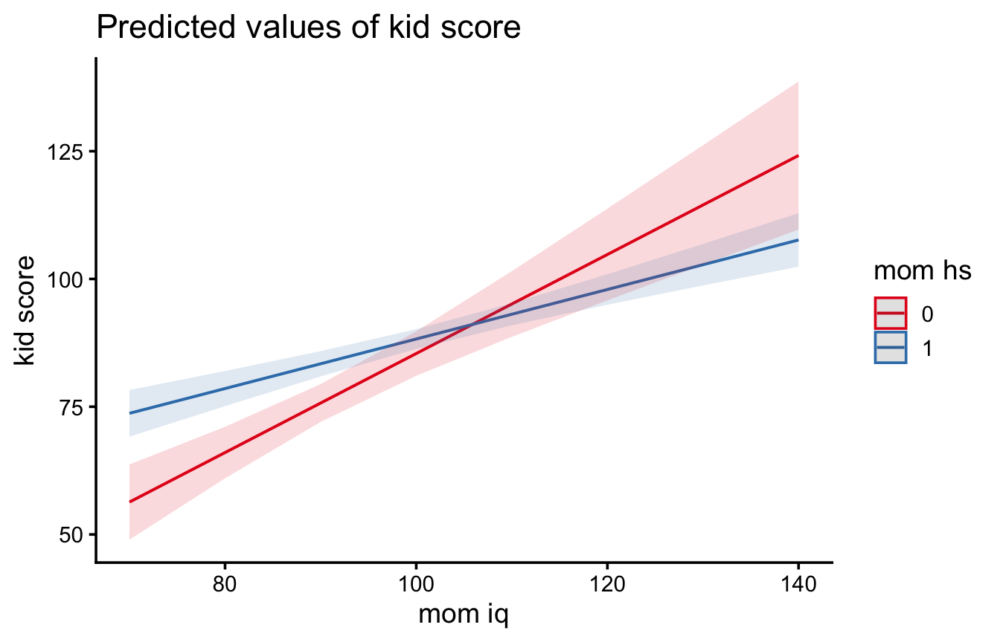{width=672}
:::
:::


Con **effects**:


::: {.cell}

```{.r .cell-code}
plot(allEffects(m4))
```

::: {.cell-output-display}
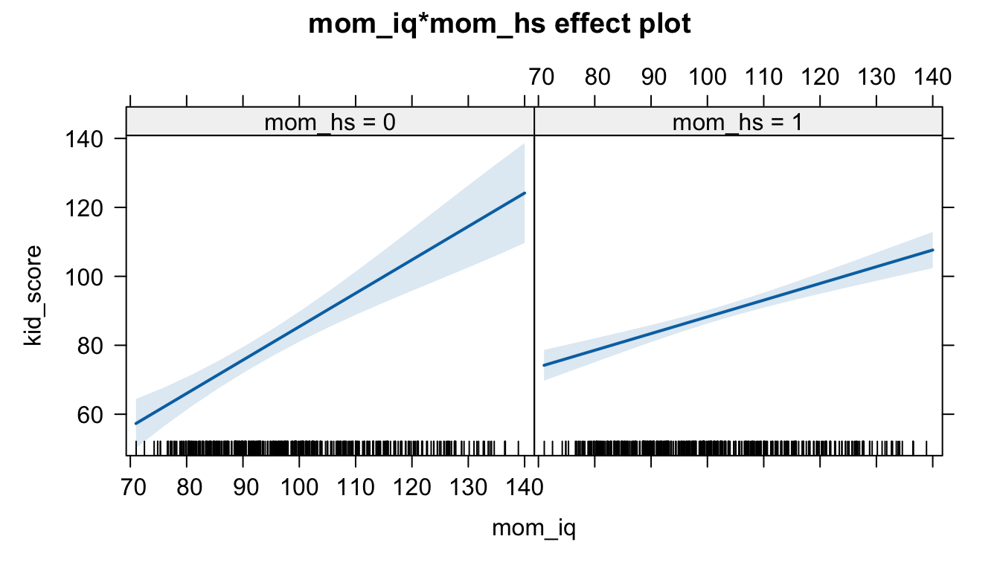{width=672}
:::
:::


::: {.callout-note icon=false title="✏️ Esercizio 8 — Interpretare un'interazione"}
Usando i coefficienti di `m4` (senza usare `predict()`, prima):

a. calcolate il punteggio previsto per un bambino con madre **non diplomata** con
   QI = 100;
b. idem, ma con madre **diplomata** con QI = 100;
c. verificate i risultati con `predict()`;
d. per quale valore di QI le due rette si incrociano?
:::

::: {.callout-tip collapse="true" title="Soluzione — Esercizio 8"}
a. $D = 0$: $\hat{Y} = -11.48 + 0.97 \cdot 100 = 85.4$.
b. $D = 1$: $\hat{Y} = 39.79 + 0.49 \cdot 100 = 88.3$.
c. Con `predict()`:


::: {.cell}

```{.r .cell-code}
predict(m4, newdata = data.frame(mom_iq = c(100, 100),
                                 mom_hs = factor(c(0, 1))))
```

::: {.cell-output .cell-output-stdout}

```
       1        2 
85.40690 88.24766 
```


:::
:::


d. **Quando si incrociano le due rette?** Scriviamole con i coefficienti del
   modello, dove $\beta_2$ è il coefficiente della dummy (`mom_hs1` = 51.27) e
   $\beta_3$ quello dell'interazione (`mom_iq:mom_hs1` = −0.48):
   $$\hat y_{\text{non dipl}}(X) = \beta_0 + \beta_1 X, \qquad \hat y_{\text{dipl}}(X) = (\beta_0+\beta_2) + (\beta_1+\beta_3)\,X.$$
   Si incrociano dove la loro **differenza** è zero. Facendo la differenza
   (diplomate − non diplomate), i termini $\beta_0$ e $\beta_1 X$ si cancellano:
   $$\hat y_{\text{dipl}} - \hat y_{\text{non dipl}} = \beta_2 + \beta_3 X \qquad (\text{qui } 51.27 - 0.48\,X),$$
   che è *l'effetto del diploma in funzione del QI*. Posto uguale a zero:
   $$\beta_2 + \beta_3 X = 0 \;\;\Longrightarrow\;\; X = -\frac{\beta_2}{\beta_3} = \frac{51.27}{0.48} \approx 106,$$
   cioè il rapporto tra il coefficiente della dummy e quello dell'interazione,
   cambiato di segno. Sotto QI ≈ 106 i figli di madri diplomate hanno punteggi
   attesi più alti, sopra la relazione si inverte — anche se, guardando il
   grafico, le due rette oltre quel punto sono molto vicine e le bande di
   confidenza si sovrappongono.
:::

# La valutazione dell'adattamento {#sec-adattamento}

## Casi anomali e casi influenti {#sec-anomali}

Non tutte le osservazioni "strane" sono uguali. 

- **outlier**: un'osservazione con $Y$ anomalo rispetto a ciò che il modello
  prevede per il suo $X$ (residuo grande);
- **caso a leva alta** (*leverage*): un'osservazione con $X$ estremo, lontano dal grosso dei dati — *potenzialmente* influente;
- **caso influente**: un'osservazione che, da sola, **cambia sensibilmente le stime** del modello. Tipicamente: leva alta **e** residuo grande insieme.

Vediamolo con dati simulati: in ciascun pannello aggiungiamo ai dati (grigi) un
solo punto rosso e confrontiamo la retta stimata con il punto (rossa, continua) e
senza (nera, tratteggiata):


::: {.cell}

```{.r .cell-code  code-fold="true"}
set.seed(20)
x <- rnorm(25, 10, 1.5)
y <- 2 + x + rnorm(25, 0, 1)

extra  <- rbind(c(10, 22),   # outlier: X centrale, Y anomalo
                c(18, 20),   # leva alta: X estremo, Y coerente
                c(18, 9))    # outlier influente: X estremo, Y anomalo
titoli <- c("Outlier", "Caso a leva alta", "Outlier influente")

par(mfrow = c(1, 3), mar = c(4, 4, 3, 1))
for (i in 1:3) {
  xx <- c(x, extra[i, 1]); yy <- c(y, extra[i, 2])
  plot(xx, yy, pch = 19, col = c(rep("grey60", 25), "red"),
       xlab = "X", ylab = "Y", main = titoli[i])
  abline(lm(y ~ x),   lty = 2, lwd = 2)               # senza il punto
  abline(lm(yy ~ xx), col = "red", lwd = 2)           # con il punto
}
```

::: {.cell-output-display}
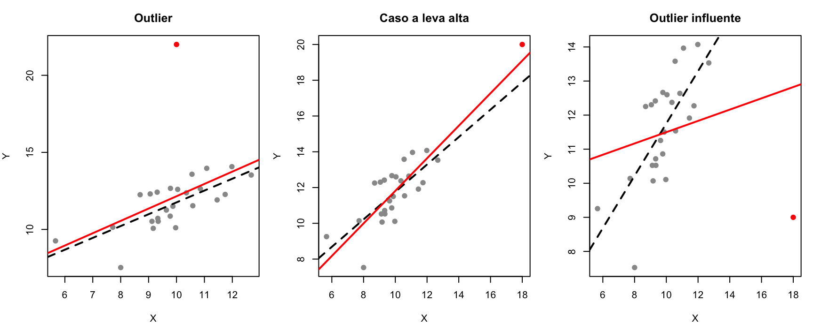{width=864}
:::
:::


::: {.cell}

:::


- l'**outlier** con $X$ centrale sposta un po' l'intercetta ma quasi per niente la
  pendenza;
- il caso a **leva alta** ma coerente con la retta non cambia;
- l'**outlier influente** (X estremo + Y anomalo) ruota vistosamente la retta.

Un modo diretto di *vedere* l'influenza è il **leave-one-out**: si rifà la
regressione togliendo un'osservazione per volta e si guarda quanto si sposta la
retta. Se la retta salta, quel punto è influente; se resta ferma, non lo è.


::: {.cell}

```{.r .cell-code  code-fold="true" code-summary="Codice del grafico"}
par(mfrow = c(1, 2), mar = c(4, 4, 3, 1))

# --- sinistra: dati simulati con un caso influente (lo stesso del pannello sopra) ---
set.seed(20)
xinf <- rnorm(25, 10, 1.5)
yinf <- 2 + xinf + rnorm(25, 0, 1)
xinf <- c(xinf, 15); yinf <- c(yinf, 9)          # outlier influente: X estremo, Y anomalo
plot(xinf, yinf, pch = 19, col = c(rep("grey60", 25), "red"),
     xlab = "X", ylab = "Y", main = "con un caso influente")
for (i in seq_along(xinf))                        # una retta per ogni punto tolto
  abline(lm(yinf[-i] ~ xinf[-i]), col = adjustcolor("blue", 0.25))
abline(lm(yinf[-26] ~ xinf[-26]), col = "darkgreen", lwd = 2)   # senza il punto rosso
abline(lm(yinf ~ xinf), col = "black", lwd = 2)                 # con tutti i dati
legend("topleft", lwd = 2, col = c("black", "darkgreen"), bty = "n", cex = 0.85,
       legend = c("tutti i dati", "senza il rosso"))
m0 <- lm(yinf ~ xinf)
# --- destra: distanza di Cook
plot(cooks.distance(m0), type = "h", col = "grey40", lwd = 4,
     xlab = "osservazione", ylab = "distanza di Cook",
     main = "distanza di Cook")
```

::: {.cell-output-display}
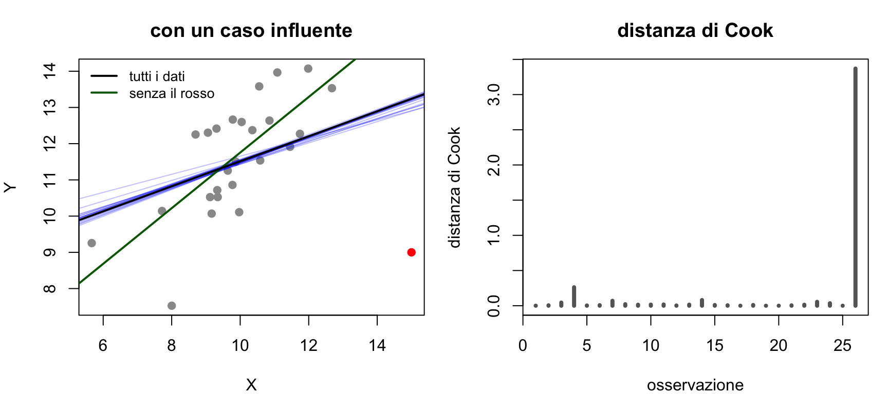{width=864}
:::
:::


A sinistra (dati simulati) il leave-one-out rende **visibile** l'influenza: la retta stimata senza il punto rosso (verde) si stacca dal fascio di tutte le altre, che invece restano ammucchiate. È lo stesso *outlier influente* del pannello qui sopra.

A destra c'è la versione *quantitativa* della stessa idea: la **distanza di Cook** misura, per ogni osservazione, di quanto cambierebbero le stime togliendola.

## Il predictive check

Un altro metodo per valutare l'adattamento di un modello consiste nel
**simulare dati dal modello** e confrontarli con i dati osservati:

- se il modello è buono, i dati simulati dovrebbero assomigliare a quelli
  osservati;
- viceversa, se il modello genera dati molto diversi da quelli osservati, non è un
  buon modello per quei dati.

Il pacchetto **performance** rende l'operazione immediata:


::: {.cell}

```{.r .cell-code}
library(performance)
check_predictions(m4)
```

::: {.cell-output-display}
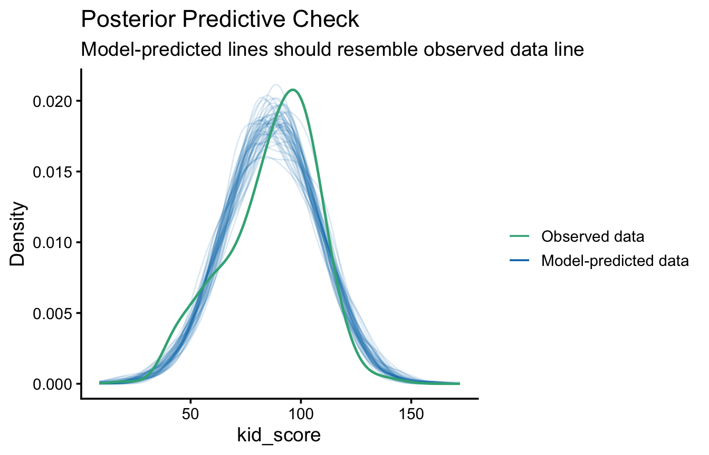{width=672}
:::
:::


Ogni curva sottile è la distribuzione di un dataset *simulato* dal modello; la
curva in evidenza è quella dei dati osservati. Qui le curve simulate ricalcano
abbastanza bene quella osservata: il modello riproduce in modo ragionevole la forma
della distribuzione dei punteggi.


# La verosimiglianza (likelihood) {#sec-likelihood}

Prima di confrontare modelli tra loro ci serve capire cosa stiamo confrontando: la **verosimiglianza** (*likelihood*).

## Dal campione alla verosimiglianza

1. Abbiamo un **campione di dati**.
2. **Ipotizziamo** che provenga da una certa distribuzione — il "processo
   generatore dei dati" — per esempio una normale con $\mu = 10$ e
   $\sigma = 1.5$.
3. Con quella distribuzione, calcoliamo la **densità di ciascun punto**
   osservato.


::: {.cell}

```{.r .cell-code}
y <- c(7.9, 9.4, 10.1, 10.8, 12.3)   # il nostro piccolo campione
dnorm(y, mean = 10, sd = 1.5)        # densità di ogni punto se Y ~ N(10, 1.5²)
```

::: {.cell-output .cell-output-stdout}

```
[1] 0.09981831 0.24551343 0.26537115 0.23070260 0.08208835
```


:::
:::


::: {.cell}

```{.r .cell-code  code-fold="true" code-summary="Codice del grafico"}
curve(dnorm(x, 10, 1.5), from = 5, to = 15, lwd = 2, xlab = "y", ylab = "f(y)",
      ylim = c(0, 0.3))
d <- dnorm(y, 10, 1.5)
segments(y, 0, y, d, col = "red", lty = 2)
points(y, rep(0, length(y)), pch = 19)
points(y, d, pch = 19, col = "red")
text(y, d + 0.015, round(d, 2), col = "red", cex = 0.8)
```

::: {.cell-output-display}
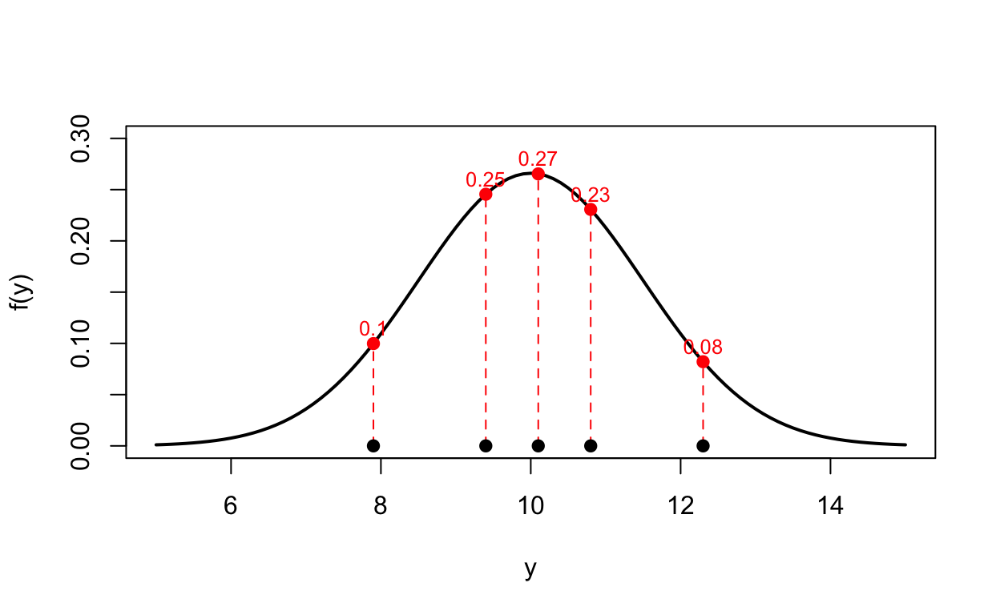{width=624}
:::
:::


Le cinque densità ci dicono quanto ciascun punto è "plausibile" sotto la
distribuzione ipotizzata. Ma il campione è uno solo: i punti sono stati osservati
**insieme**, sono eventi congiunti — e la probabilità di eventi congiunti (e
indipendenti) si ottiene **moltiplicando**. La **verosimiglianza** del campione
sotto i parametri $\theta$ è quindi il prodotto delle densità:

$$
\mathcal{L}(\theta) = \prod_i f(y_i \mid \theta)
$$


::: {.cell}

```{.r .cell-code}
prod(dnorm(y, 10, 1.5))              # verosimiglianza
```

::: {.cell-output .cell-output-stdout}

```
[1] 0.000123161
```


:::

```{.r .cell-code}
sum(dnorm(y, 10, 1.5, log = TRUE))   # log-verosimiglianza
```

::: {.cell-output .cell-output-stdout}

```
[1] -9.002018
```


:::
:::


Il prodotto di tante densità è un numero piccolissimo (con 434 osservazioni
sarebbe ingestibile): per questo si lavora quasi sempre con la
**log-verosimiglianza** $\log\mathcal{L}$, che trasforma il prodotto in una somma.
Tenetela d'occhio: è l'ingrediente di AIC e BIC nel prossimo capitolo.

## La funzione di verosimiglianza

Il numero appena calcolato dipende dall'ipotesi che abbiamo fatto ($\mu = 10$).
Ma potevamo ipotizzare distribuzioni diverse: ciascuna assegna al campione una
verosimiglianza diversa.


::: {.cell}

```{.r .cell-code  code-fold="true" code-summary="Codice del grafico"}
curve(dnorm(x, 10.1, 1.5), from = 4, to = 16, lwd = 2, xlab = "y", ylab = "f(y)")
curve(dnorm(x,  8.5, 1.5), add = TRUE, lwd = 2, col = "blue")
curve(dnorm(x, 11.5, 1.5), add = TRUE, lwd = 2, col = "red")
points(y, rep(0, length(y)), pch = 19)
L3 <- sapply(c(10.1, 8.5, 11.5), function(m) prod(dnorm(y, m, 1.5)))
legend("topleft", lwd = 2, col = c("black", "blue", "red"), bty = "n", cex = 0.9,
       legend = sprintf("mu = %.1f   L = %.5f", c(10.1, 8.5, 11.5), L3))
```

::: {.cell-output-display}
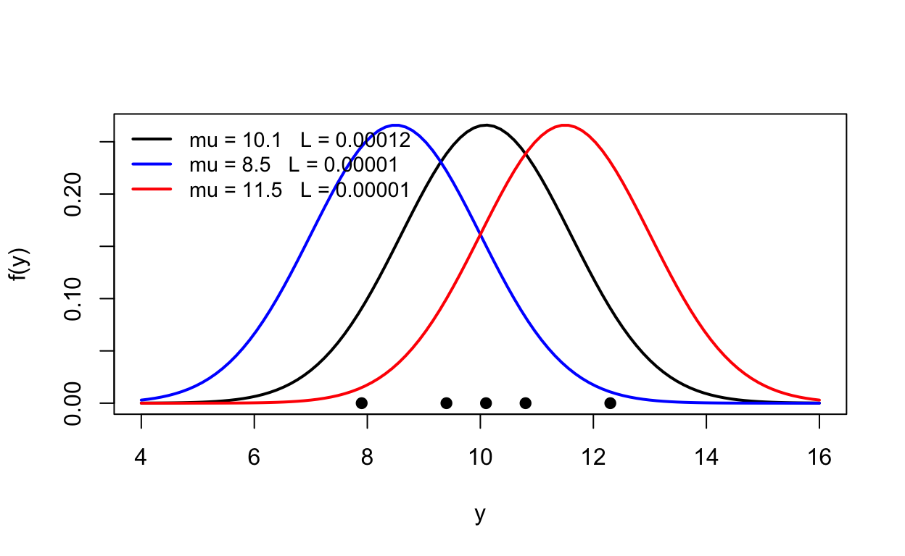{width=624}
:::
:::


L'idea allora è: proviamo **tutti** i valori candidati di $\mu$ (con $\sigma$
fissata, per semplicità), calcoliamo la verosimiglianza del campione per
ciascuno, e disegniamo i risultati. Quella che otteniamo è la **funzione di
verosimiglianza** $\mathcal{L}(\mu)$:


::: {.cell}

```{.r .cell-code}
mu_griglia <- seq(7, 13, by = 0.05)
L <- sapply(mu_griglia, function(m) prod(dnorm(y, m, 1.5)))

plot(mu_griglia, L, type = "l", lwd = 2,
     xlab = expression(mu), ylab = "verosimiglianza del campione")
abline(v = mean(y), lty = 2, col = "red")
```

::: {.cell-output-display}
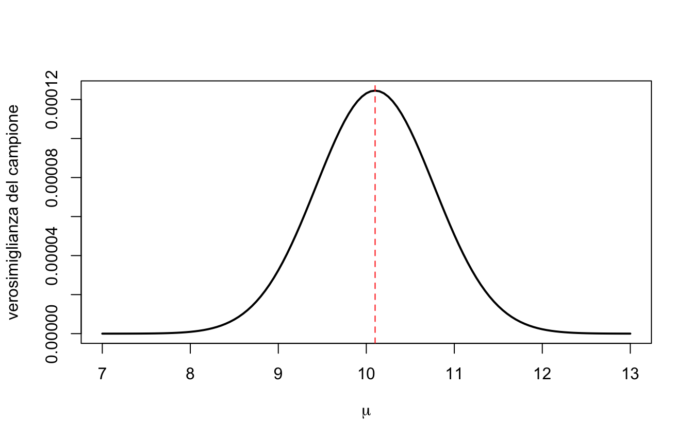{width=672}
:::
:::


La curva ha un massimo, e il massimo cade esattamente sulla **media campionaria**
(linea rossa tratteggiata): tra tutte le normali candidate, quella centrata su
$\bar{y}$ è la più compatibile con i dati osservati.

::: {.callout-important}
Attenzione alla direzione: la verosimiglianza misura quanto sono plausibili **i
dati** dato un valore dei parametri, non quanto è probabile **un parametro** dati
i dati. Per questo $\mathcal{L}(\mu)$ non è una distribuzione di probabilità: è una funzione che *ordina* i valori dei parametri per compatibilità con il campione.
:::

## A che cosa serve

1. **Ottimizzare.** Cercare il valore dei parametri che la massimizza: è il
   **metodo di massima verosimiglianza** (*Maximum Likelihood Estimation*, MLE),
   uno dei metodi di stima più usati.
2. **Confrontare modelli.** Modelli diversi assegnano agli stessi dati
   verosimiglianze diverse: confrontarle ci dice quale modello "spiega" meglio i
   dati. È la base di AIC e BIC (prossimo capitolo).
3. **Aggiornare le credenze.** Nell'inferenza bayesiana la verosimiglianza è il
   fattore che aggiorna le *priors* in *posteriors*.

## Il legame con l'assunzione di normalità

E il modello lineare? L'assunzione di normalità (@sec-assunzioni) dice che

$$
y_i \sim \mathcal{N}(\mu_i, \sigma^2), \qquad \mu_i = \beta_0 + \beta_1 x_i
$$

cioè: per ogni osservazione, una campana normale centrata sul valore previsto
dalla retta (le "campane" della @sec-normale). La verosimiglianza del modello è
allora il prodotto di quelle densità normali:

$$
\mathcal{L}(\beta_0, \beta_1, \sigma^2) = \prod_i f(y_i \mid \mu_i, \sigma^2)
$$

Ricalcoliamo "a mano" la log-verosimiglianza di `m1` come somma
dei log delle densità normali centrate sui valori previsti, e confrontiamola con
quella che R calcola con `logLik()`:


::: {.cell}

```{.r .cell-code}
mu_hat   <- fitted(m1)
sigma_ML <- sqrt(sum(residuals(m1)^2) / length(mu_hat))   # denominatore n!

sum(dnorm(kidiq$kid_score, mean = mu_hat, sd = sigma_ML, log = TRUE))
```

::: {.cell-output .cell-output-stdout}

```
[1] -1875.608
```


:::
:::


Ogni osservazione ci mette **un termine**: la
log-densità del suo punteggio sotto la normale centrata sul *suo* valore previsto.
Eccone i primi cinque, uno per bambino:


::: {.cell}

```{.r .cell-code}
contributi <- data.frame(
  mom_iq    = round(kidiq$mom_iq, 1),
  kid_score = kidiq$kid_score,                # y osservato
  mu_hat    = round(mu_hat, 1),               # valore previsto (sulla retta)
  log_dens  = round(dnorm(kidiq$kid_score, mu_hat, sigma_ML, log = TRUE), 2)
)
head(contributi, 5)
```

::: {.cell-output .cell-output-stdout}

```
  mom_iq kid_score mu_hat log_dens
1  121.1        65   99.7    -5.63
2   89.4        98   80.3    -4.29
3  115.4        85   96.2    -4.01
4   99.4        83   86.5    -3.84
5   92.7       115   82.4    -5.42
```


:::
:::


Ogni riga è un'osservazione: dove il punteggio è vicino al valore previsto
(`mu_hat`) la `log_dens` è alta. Sommando
**tutti** i 434 termini, uno per bambino, si ottiene la log-verosimiglianza
vista sopra.


::: {.cell}

```{.r .cell-code}
# funzione R
logLik(m1) # df = n parametri stimati
```

::: {.cell-output .cell-output-stdout}

```
'log Lik.' -1875.608 (df=3)
```


:::
:::


::: {.callout-important}
**L'assunzione di normalità definisce la funzione di verosimiglianza del
modello**. Assumere la normalità significa decidere che i dati vanno valutati
con dist. normali centrate sulla retta: è questa la verosimiglianza che
`logLik()` calcola, e che AIC e BIC useranno nel prossimo capitolo come metro
di paragone. Cambiare assunzione distribuzionale (per esempio una Poisson per
dei conteggi) significa cambiare verosimiglianza: è l'idea alla base dei
modelli lineari *generalizzati*.
:::

::: {.callout-note icon=false title="✏️ Esercizio 10 — La verosimiglianza all'opera"}
Usando il campione `y <- c(7.9, 9.4, 10.1, 10.8, 12.3) ` (con $\sigma = 1.5$ fissa):

a. calcolate la log-verosimiglianza per $\mu = 9$, $\mu = 10$ e $\mu = 11$:
   quale ipotesi è più sostenuta dai dati?
b. cercate il massimo della funzione di verosimiglianza su una griglia fine di
   valori di $\mu$ (`mu_griglia <- seq(8, 12, by = 0.001`): coincide con `mean(y)`?
c. ripetete il "calcolo a mano" della log-verosimiglianza per il modello
   `m_age` dell'Esercizio 4 (`kid_score ~ mom_age`) e confrontate con
   `logLik(m_age)`.
:::

::: {.callout-tip collapse="true" title="Soluzione — Esercizio 10"}

::: {.cell}

```{.r .cell-code}
sapply(c(9, 10, 11), function(m) sum(dnorm(y, m, 1.5, log = TRUE)))
```

::: {.cell-output .cell-output-stdout}

```
[1] -10.335352  -9.002018  -9.890907
```


:::

```{.r .cell-code}
mu_griglia <- seq(8, 12, by = 0.001)
ll <- sapply(mu_griglia, function(m) sum(dnorm(y, m, 1.5, log = TRUE)))
c(massimo = mu_griglia[which.max(ll)], media = mean(y))
```

::: {.cell-output .cell-output-stdout}

```
massimo   media 
   10.1    10.1 
```


:::

```{.r .cell-code}
m_age <- lm(kid_score ~ mom_age, data = kidiq)
s_ml  <- sqrt(sum(residuals(m_age)^2) / nobs(m_age))
c(a_mano = sum(dnorm(kidiq$kid_score, fitted(m_age), s_ml, log = TRUE)),
  logLik = as.numeric(logLik(m_age)))
```

::: {.cell-output .cell-output-stdout}

```
   a_mano    logLik 
-1922.444 -1922.444 
```


:::
:::


a. La log-verosimiglianza più alta è quella di $\mu = 10$: tra le tre ipotesi è
   la più vicina alla media campionaria.
b. Il massimo della griglia coincide con `mean(y)` = 10.1: per la normale (con
   $\sigma$ nota) si può dimostrare che lo stimatore di massima verosimiglianza
   di $\mu$ è proprio la media campionaria.
c. I due valori coincidono: `logLik()` non fa altro che sommare i log delle
   densità normali centrate sui valori previsti dal modello.
:::

# Confronto e selezione di modelli

> *All models are wrong, but some are useful.* — George E. P. Box

## I problemi

Sembra semplice, ma:

- possono esistere **molti modelli** che spiegano gli stessi dati;
- le **variazioni casuali** rendono difficile identificare il modello;
- il **modello vero potrebbe non essere** tra quelli effettivamente messi alla
  prova.

Un obiettivo realistico, quindi, è identificare il modello che rappresenta la
**migliore approssimazione** al modello vero.

## L'overfitting

C'è una tensione fondamentale tra due proprietà di un modello:

- la **bontà di adattamento** (*goodness of fit*): quanto bene il modello
  riproduce i dati *osservati* — e questa **cresce sempre** all'aumentare della
  complessità del modello;
- la **generalizzabilità**: quanto bene il modello prevede dati *nuovi* — e questa
  cresce fino a un certo punto, poi peggiora (curva a U rovesciata; Pitt, Myung &
  Zhang, 2002).

Un modello troppo complesso finisce per adattarsi anche al **rumore** dei dati: è
il fenomeno dell'**overfitting**.


::: {.cell}

```{.r .cell-code  code-fold="true" code-summary="Codice del grafico"}
cx  <- seq(0, 1, length.out = 200)
fit <- 1 - exp(-4 * cx)                # adattamento: cresce sempre
gen <- 1 - exp(-4 * cx) - 1.1 * cx^2   # generalizzabilità: sale, poi scende
picco <- cx[which.max(gen)]

plot(cx, fit, type = "n", ylim = c(0, 1.08), xaxt = "n", yaxt = "n",
     xlab = "numero di parametri", ylab = "prestazione del modello")
rect(picco, -0.1, 1.1, 1.2, col = adjustcolor("grey60", 0.25), border = NA)
lines(cx, fit, lwd = 3)
lines(cx, gen, lwd = 3, col = "blue")
abline(v = picco, lty = 3)
text(0.66, 1.03, "adattamento ai dati osservati")
text(0.70, 0.48, "previsione su dati nuovi", col = "blue")
text(0.86, 0.10, "overfitting", col = "grey30", font = 3)
```

::: {.cell-output-display}
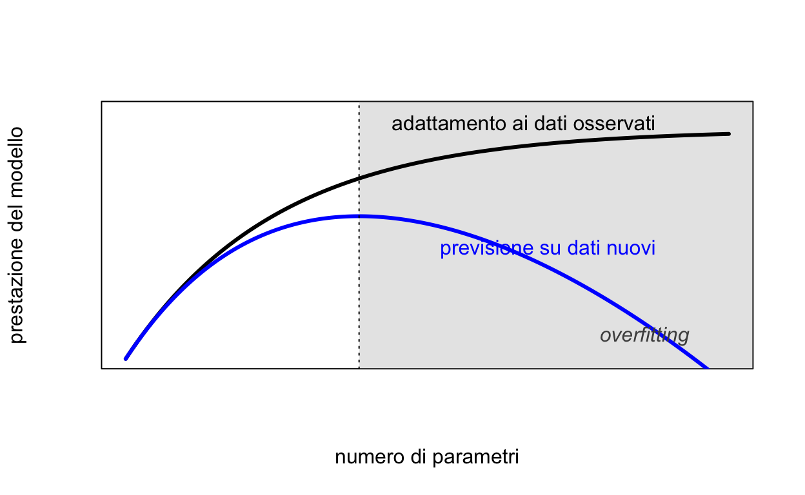{width=624}
:::
:::


La zona "buona" sta attorno alla linea tratteggiata: oltre (area grigia), il
modello continua a migliorare *sui dati osservati* ma peggiora *su dati nuovi*
(Pitt, Myung & Zhang, 2002).

> *...fitting is easy; prediction is hard.* — Richard McElreath

Vediamolo con un esempio classico (McElreath, 2023): volume cerebrale e massa corporea di
sette specie di ominidi. Con 7 punti, un polinomio di grado 6 passa *esattamente*
per tutti i punti:


::: {.cell}

```{.r .cell-code}
ominidi <- data.frame(
  specie   = c("afarensis", "africanus", "habilis", "boisei",
               "rudolfensis", "ergaster", "sapiens"),
  massa    = c(37.0, 35.5, 34.5, 41.5, 55.5, 61.0, 53.5),
  cervello = c(438, 452, 612, 521, 752, 871, 1350))

r2 <- sapply(1:6, function(g)
  summary(lm(cervello ~ poly(massa, g), data = ominidi))$r.squared)
round(r2, 2)
```

::: {.cell-output .cell-output-stdout}

```
[1] 0.49 0.54 0.68 0.81 0.99 1.00
```


:::
:::


L'$R^2$ sale monotonicamente con il grado del polinomio, fino a 1. Ma guardate
*come* lo fa:


::: {.cell}

```{.r .cell-code  code-fold="true"}
griglia <- data.frame(massa = seq(34.5, 61, length.out = 200))
par(mfrow = c(2, 3), mar = c(4, 4, 3, 1))
for (g in 1:6) {
  m  <- lm(cervello ~ poly(massa, g), data = ominidi)
  pr <- predict(m, newdata = griglia)
  plot(cervello ~ massa, data = ominidi, pch = 19,
       ylim = range(c(ominidi$cervello, pr, 0)),
       xlab = "Massa corporea (kg)", ylab = "Volume cranico (cc)",
       main = bquote("Grado" ~ .(g) * ":" ~ R^2 == .(round(summary(m)$r.squared, 2))))
  lines(griglia$massa, pr, col = "red", lwd = 2)
  abline(h = 0, lty = 3)
}
```

::: {.cell-output-display}
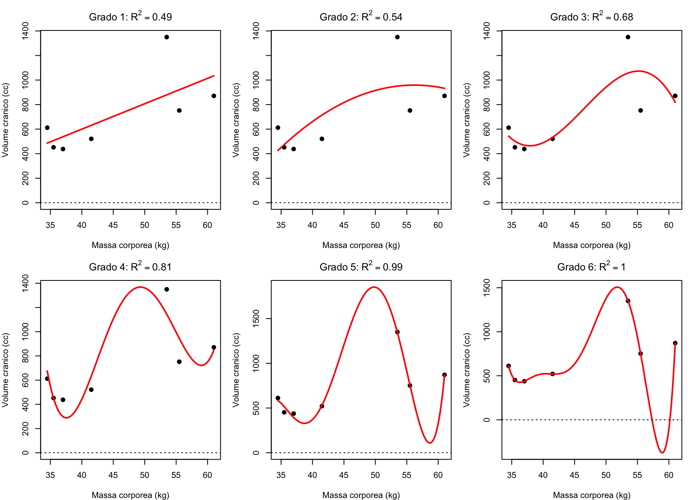{width=864}
:::
:::


Notate la scala verticale dei pannelli, che cambia da pannello a pannello: dal
grado 4 in su la curva, pur di passare per i punti, "esplode" tra
un'osservazione e l'altra.

Il polinomio di grado 6 ha $R^2 = 1$ ma, tra un punto e l'altro, arriva a prevedere
un volume cranico **negativo**: si è adattato perfettamente ai dati e ha perso ogni
capacità di generalizzare. Massimizzare il fit non è il criterio giusto per
scegliere un modello: servono criteri che tengano conto anche della complessità.

## Il confronto mediante ANOVA

Costruiamo una serie di modelli per i dati `kidiq`, dal modello **nullo** (solo
intercetta) al modello con interazione:


::: {.cell}

```{.r .cell-code}
m0 <- lm(kid_score ~ 1,               data = kidiq)
m1 <- lm(kid_score ~ mom_iq,          data = kidiq)
m2 <- lm(kid_score ~ mom_hs,          data = kidiq)
m3 <- lm(kid_score ~ mom_iq + mom_hs, data = kidiq)
m4 <- lm(kid_score ~ mom_iq * mom_hs, data = kidiq)

anova(m0, m1, m2, m3, m4)
```

::: {.cell-output .cell-output-stdout}

```
Analysis of Variance Table

Model 1: kid_score ~ 1
Model 2: kid_score ~ mom_iq
Model 3: kid_score ~ mom_hs
Model 4: kid_score ~ mom_iq + mom_hs
Model 5: kid_score ~ mom_iq * mom_hs
  Res.Df    RSS Df Sum of Sq        F    Pr(>F)    
1    433 180386                                    
2    432 144137  1     36249 112.2346 < 2.2e-16 ***
3    432 170261  0    -26124                       
4    431 141757  1     28504  88.2552 < 2.2e-16 ***
5    430 138879  1      2878   8.9123  0.002994 ** 
---
Signif. codes:  0 '***' 0.001 '**' 0.01 '*' 0.05 '.' 0.1 ' ' 1
```


:::
:::


`anova()` confronta ogni modello con il precedente tramite test $F$: l'aggiunta di
parametri riduce significativamente la devianza residua?

Si legge **riga per riga**, e ogni riga (dalla seconda) confronta quel modello con
quello della riga **sopra**. Colonna per colonna:

- **`Res.Df`** — i gradi di libertà residui del modello ($n$ meno il numero di
  parametri): partono da 433 (solo intercetta) e calano di 1 a ogni parametro
  aggiunto.
- **`RSS`** — la devianza residua $\text{SS}_E$ del modello. Cala sempre man mano
  che si aggiungono predittori (più parametri ⇒ fit migliore): 180386 → 144137 → …
- **`Df`** — quanti parametri si sono aggiunti rispetto alla riga precedente (qui
  uno per volta).
- **`Sum of Sq`** — di quanto è calata la `RSS` rispetto al modello precedente: è
  la devianza *in più* spiegata dal termine appena aggiunto. Per esempio,
  aggiungendo `mom_iq` al modello nullo: $180386 - 144137 = 36249$.
- **`F` e `Pr(>F)`** — il test $F$ chiede se quel calo è *più grande di quanto ci
  si aspetterebbe per caso*: confronta la devianza spiegata in più (per parametro
  aggiunto) con la varianza residua usata come "rumore di fondo". Attenzione: con
  *più* modelli, `anova()` usa come denominatore la varianza residua del **modello più grande** della tabella (l'ultimo), uguale per tutte le righe.

"Modello più grande" significa *con più parametri*, non "modello migliore". Tra modelli annidati il più grande adatta sempre meglio i dati osservati (la `RSS` più piccola) e fornisce la stima meno distorta di
$\sigma^2$ — ed è per questo che `anova()` lo usa al denominatore — ma proprio
perché adatta *tutto*, rumore compreso, può **overfittare**: per *scegliere* un
modello servono criteri che penalizzano la complessità (AIC e BIC, più avanti).

::: {.callout-note collapse="true"}
## La $F$ della tabella, ricalcolata a mano

Verifichiamo che le `F` escano davvero così, e che il denominatore sia **sempre**
quello di `m4` (il modello più grande). Ricordiamo che `deviance()` di un `lm` è
la sua devianza residua $\text{SS}_E$.


::: {.cell}

```{.r .cell-code}
# varianza residua del modello piu' grande
sigma2 <- deviance(m4) / df.residual(m4)        # RSS(m4) / gradi di liberta'

# ogni passo annidato aggiunge 1 parametro (Df = 1), quindi
# F = (calo di devianza / 1) / sigma2, con LO STESSO sigma2 al denominatore:
c("m1 vs m0" = (deviance(m0) - deviance(m1)) / sigma2,
  "m3 vs m2" = (deviance(m2) - deviance(m3)) / sigma2,
  "m4 vs m3" = (deviance(m3) - deviance(m4)) / sigma2)
```

::: {.cell-output .cell-output-stdout}

```
  m1 vs m0   m3 vs m2   m4 vs m3 
112.234623  88.255205   8.912313 
```


:::
:::


Tornano identiche alla colonna `F` della tabella (112.2, 88.3, 8.9) — tutte con
lo **stesso** denominatore `sigma2` (la varianza residua di `m4`).

:::


::: {.callout-warning}
Questo approccio funziona solo per modelli **annidati** (ogni modello deve essere
un caso particolare del successivo). Guardate la terza riga: confrontando `m2` con
`m1` otteniamo `Df = 0` e una somma dei quadrati *negativa* — un confronto privo di
senso, perché `m1` e `m2` non sono annidati (nessuno dei due contiene l'altro). R
esegue il calcolo lo stesso: sta a noi accorgerci del problema.
:::

## AIC e BIC

Due indici molto usati per il confronto fra modelli sono **AIC** (*Akaike
Information Criterion*; Akaike, 1974) e **BIC** (*Bayesian Information Criterion*;
Schwarz, 1978):

$$
\text{AIC} = -2\log\mathcal{L} + 2k
\qquad
\text{BIC} = -2\log\mathcal{L} + k\log n
$$

dove $\mathcal{L}$ è la verosimiglianza del modello (la @sec-likelihood), $k$ il
numero di parametri e
$n$ il numero di osservazioni. Entrambi premiano il fit (primo termine) e
**penalizzano la complessità** (secondo termine): misurano l'efficienza del modello
in termini di *previsione* dei dati, proprio quello che l'overfitting comprometteva.

Dati $k$ valori di AIC/BIC per $k$ modelli diversi, **si preferisce il modello con
il valore più basso**. Due vantaggi pratici rispetto all'ANOVA: i modelli non
devono essere annidati, e non c'è nessun p-value di mezzo.


::: {.cell}

```{.r .cell-code}
A <- AIC(m0, m1, m2, m3, m4)
A[order(A$AIC), ]
```

::: {.cell-output .cell-output-stdout}

```
   df      AIC
m4  5 3745.086
m3  4 3751.989
m1  3 3757.216
m2  3 3829.506
m0  2 3852.576
```


:::

```{.r .cell-code}
B <- BIC(m0, m1, m2, m3, m4)
B[order(B$BIC), ]
```

::: {.cell-output .cell-output-stdout}

```
   df      BIC
m4  5 3765.451
m3  4 3768.281
m1  3 3769.435
m2  3 3841.725
m0  2 3860.723
```


:::
:::


Sia per AIC sia per BIC il modello preferito è `m4`, quello con l'interazione.

## La quantificazione dell'evidenza

Un grande vantaggio di AIC/BIC è la possibilità di stimare la **plausibilità
relativa** di un modello rispetto a un altro. Il calcolo dell'**evidenza relativa** (*evidence ratio*) è molto
semplice:

1. sia $\Delta$ la differenza tra i valori di AIC (o BIC) dei due modelli;
2. si calcola $\ell = e^{\Delta/2}$.

::: {.callout-note collapse="true"}
## Da dove viene $e^{\Delta/2}$?

L'AIC è $\text{AIC} = -2\log\mathcal{L} + 2k$: la log-verosimiglianza messa su una
certa scala (il fattore $-2$), più una penalità per i $k$ parametri. Per tornare a
una quantità in scala di *verosimiglianza* basta disfare quella scala:
$$
\exp\!\left(-\frac{\text{AIC}}{2}\right) = \exp(\log\mathcal{L} - k) = \mathcal{L}\,e^{-k}.
$$
Il $\div 2$ annulla il $-2$, l'`exp` annulla il `log`: resta la verosimiglianza
massimizzata $\mathcal{L}$, *scontata* di $e^{-k}$ per la complessità — una
**verosimiglianza penalizzata**.

L'evidenza relativa è semplicemente il **rapporto** di queste quantità per i due
modelli:
$$
\frac{\exp(-\text{AIC}_A/2)}{\exp(-\text{AIC}_B/2)}
= \exp\!\left(\frac{\text{AIC}_B-\text{AIC}_A}{2}\right) = e^{\Delta/2}.
$$
Ecco perché si usa $e^{\Delta/2}$: dice quante volte un modello è più plausibile
dell'altro. Se i due avessero lo **stesso** numero di parametri le penalità si
cancellerebbero e $e^{\Delta/2}$ sarebbe esattamente il rapporto di verosimiglianza
$\mathcal{L}_A/\mathcal{L}_B$; con $k$ diversi, è quel rapporto *aggiustato* per la
differenza di complessità.
:::

Confrontiamo ad esempio il modello con interazione (`m4`) con quello senza (`m3`):


::: {.cell}

```{.r .cell-code}
(DAIC <- AIC(m3) - AIC(m4))
```

::: {.cell-output .cell-output-stdout}

```
[1] 6.903268
```


:::

```{.r .cell-code}
exp(DAIC / 2)
```

::: {.cell-output .cell-output-stdout}

```
[1] 31.55191
```


:::

```{.r .cell-code}
(DBIC <- BIC(m3) - BIC(m4))
```

::: {.cell-output .cell-output-stdout}

```
[1] 2.830223
```


:::

```{.r .cell-code}
exp(DBIC / 2)
```

::: {.cell-output .cell-output-stdout}

```
[1] 4.116947
```


:::
:::


- **Conclusione con AIC**: il modello con interazione è circa **32 volte più
  plausibile** di quello senza interazione.
- **Conclusione con BIC**: il modello con interazione è circa **4 volte più
  plausibile** di quello senza.

(Il BIC penalizza la complessità più severamente dell'AIC, da cui la differenza.)

## Verosimiglianza relativa e pesi di Akaike

Possiamo estendere il ragionamento a tutti i modelli insieme, calcolando per
ciascuno la verosimiglianza relativa rispetto al modello peggiore (qui il nullo):


::: {.cell}

```{.r .cell-code}
A <- AIC(m0, m1, m2, m3, m4)
A$delta <- max(A$AIC) - A$AIC
A$rl    <- exp(A$delta / 2)
A[order(A$AIC), ]
```

::: {.cell-output .cell-output-stdout}

```
   df      AIC     delta           rl
m4  5 3745.086 107.49072 2.194387e+23
m3  4 3751.989 100.58745 6.954849e+21
m1  3 3757.216  95.36065 5.096855e+20
m2  3 3829.506  23.07053 1.022590e+05
m0  2 3852.576   0.00000 1.000000e+00
```


:::
:::


Il modello `m4` (`kid_score ~ mom_iq * mom_hs`) risulta circa $2.19 \times 10^{23}$
volte più verosimile del modello nullo.

Infine, possiamo **normalizzare** le verosimiglianze relative per ottenere i
**pesi di Akaike**, interpretabili come la probabilità di ciascun modello $M_i$,
dati i dati e l'insieme dei modelli considerati $\mathcal{M}$:

$$
w_i = \text{Prob}(M_i \,|\, \text{dati}, \mathcal{M}) =
\frac{\ell_i}{\sum_{j=1}^{J} \ell_j}
$$

dove $J$ è il numero di modelli considerati (nel nostro caso $J = 5$).


::: {.cell}

```{.r .cell-code}
A$w <- A$rl / sum(A$rl)
barplot(A$w, names.arg = rownames(A), xlab = "modelli", ylab = "peso di Akaike")
```

::: {.cell-output-display}
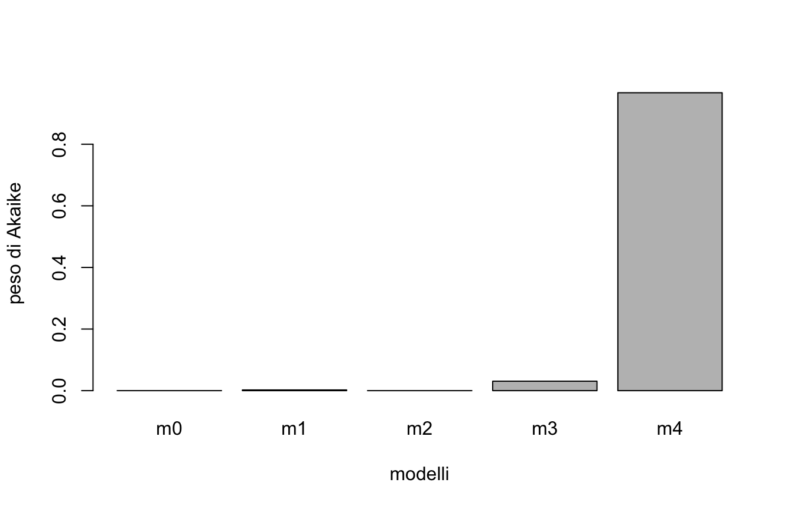{width=672}
:::
:::


Praticamente tutto il peso va a `m4`: dato questo insieme di modelli, è di gran
lunga il candidato migliore.

Il pacchetto **MuMIn** automatizza l'intera procedura e produce una tabella di
selezione completa:


::: {.cell}

```{.r .cell-code}
library(MuMIn)
(AICtable <- model.sel(m0, m1, m2, m3, m4, rank = AIC))
```

::: {.cell-output .cell-output-stdout}

```
Model selection table 
    (Int) mom_iq mom_hs mom_hs:mom_iq df    logLik    AIC  delta weight
m4 -11.48 0.9689      +             +  5 -1867.543 3745.1   0.00  0.967
m3  25.73 0.5639      +                4 -1871.995 3752.0   6.90  0.031
m1  25.80 0.6100                       3 -1875.608 3757.2  12.13  0.002
m2  77.55             +                3 -1911.753 3829.5  84.42  0.000
m0  86.80                              2 -1924.288 3852.6 107.49  0.000
Models ranked by AIC(x) 
```


:::
:::


E' possibile anche utilizzare il pacchetto `performance` (usato anche in precedenza per il predictive check cfr. @sec-adattamento)

::: {.cell}

```{.r .cell-code}
performance::compare_performance(m0, m1, m2, m3, m4)
```

::: {.cell-output .cell-output-stdout}

```
# Comparison of Model Performance Indices

Name | Model |  AIC (weights) | AICc (weights) |  BIC (weights) |    R2
-----------------------------------------------------------------------
m0   |    lm | 3852.6 (<.001) | 3852.6 (<.001) | 3860.7 (<.001) | 0.000
m1   |    lm | 3757.2 (0.002) | 3757.3 (0.002) | 3769.4 (0.099) | 0.201
m2   |    lm | 3829.5 (<.001) | 3829.6 (<.001) | 3841.7 (<.001) | 0.056
m3   |    lm | 3752.0 (0.031) | 3752.1 (0.031) | 3768.3 (0.176) | 0.214
m4   |    lm | 3745.1 (0.967) | 3745.2 (0.966) | 3765.5 (0.725) | 0.230

Name | R2 (adj.) |   RMSE |  Sigma
----------------------------------
m0   |     0.000 | 20.387 | 20.411
m1   |     0.199 | 18.224 | 18.266
m2   |     0.054 | 19.807 | 19.853
m3   |     0.210 | 18.073 | 18.136
m4   |     0.225 | 17.888 | 17.971
```


:::

```{.r .cell-code}
plot(performance::compare_performance(m0, m1, m2, m3, m4))
```

::: {.cell-output-display}
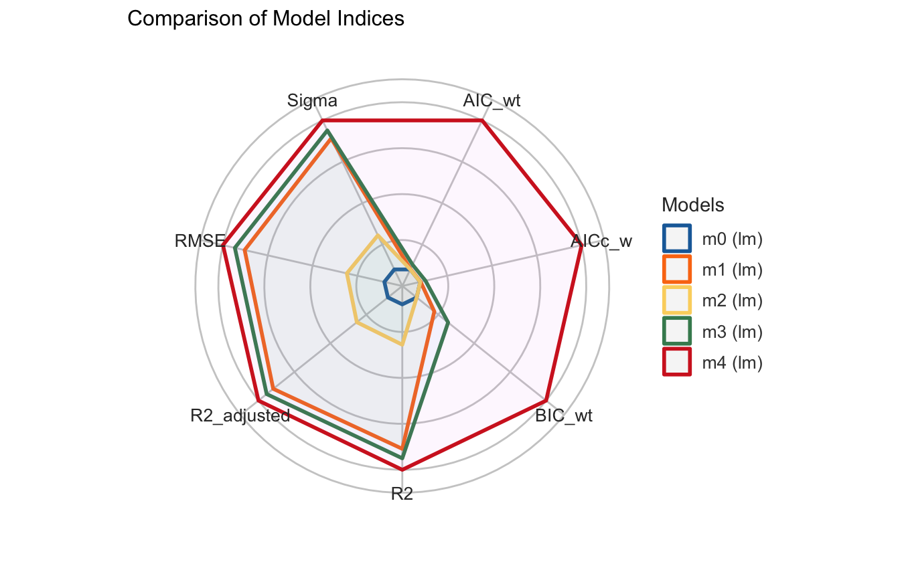{width=672}
:::
:::


E per i confronti a coppie possiamo costruire la matrice delle evidenze relative
(in scala logaritmica, per leggibilità):


::: {.cell}

```{.r .cell-code}
ER <- outer(A$rl, A$rl, "/")
rownames(ER) <- colnames(ER) <- rownames(A)
round(log(ER), 1)
```

::: {.cell-output .cell-output-stdout}

```
     m0    m1    m2    m3    m4
m0  0.0 -47.7 -11.5 -50.3 -53.7
m1 47.7   0.0  36.1  -2.6  -6.1
m2 11.5 -36.1   0.0 -38.8 -42.2
m3 50.3   2.6  38.8   0.0  -3.5
m4 53.7   6.1  42.2   3.5   0.0
```


:::
:::


Ogni cella riporta il logaritmo dell'evidenza del modello di riga rispetto al
modello di colonna: valori positivi favoriscono il modello di riga (es. `m4` vs
`m3`: $\log \ell = 3.5$, cioè $\ell \approx 32$, come calcolato prima).

La stessa matrice si può leggere a colori:


::: {.cell}

```{.r .cell-code  code-fold="true" code-summary="Codice del grafico"}
logER <- log(ER)
n <- nrow(logER)
par(mar = c(4, 4, 3, 1))
image(1:n, 1:n, t(logER[n:1, ]), col = hcl.colors(25, "Magenta", alpha = .8),
      axes = FALSE, xlab = "", ylab = "",
      main = "log evidenza relativa (riga vs colonna)")
axis(1, at = 1:n, labels = colnames(logER))
axis(2, at = 1:n, labels = rev(rownames(logER)), las = 1)
for (i in 1:n) for (j in 1:n)
  text(j, n + 1 - i, round(logER[i, j], 1), cex = 1.2,col = "black")
box()
```

::: {.cell-output-display}
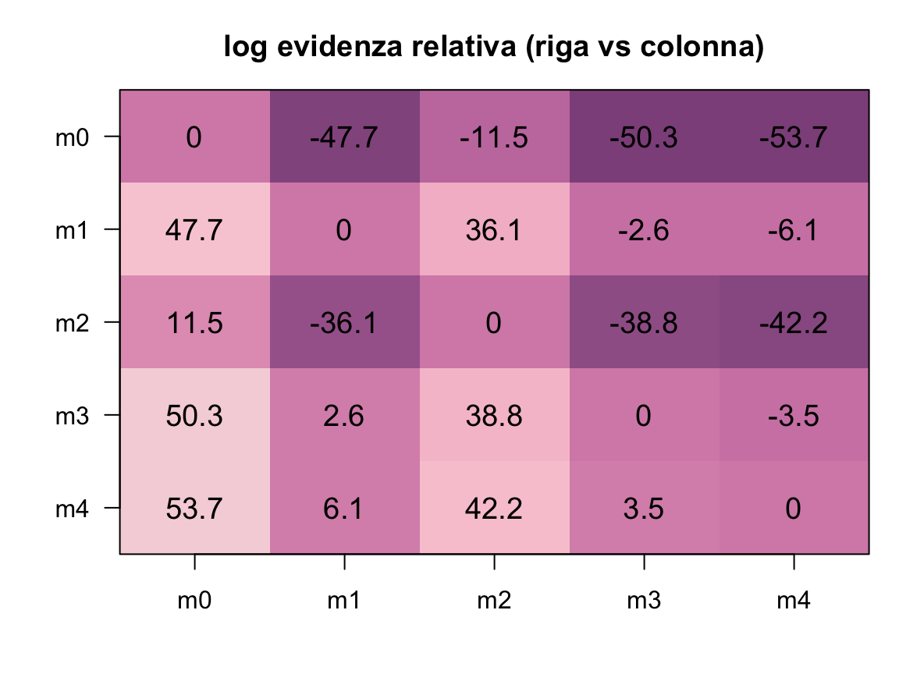{width=576}
:::
:::


## I vantaggi dei criteri di informazione

Riassumendo, rispetto al confronto basato su test e p-value:

- si possono confrontare **tutti i modelli** che condividono lo stesso modello
  nullo, anche non annidati;
- i valori di AIC/BIC calcolati sono **indipendenti dall'ordine e dal numero** dei
  modelli considerati;
- evidenze relative e pesi di Akaike danno al lettore un quadro molto più ricco dei
  meriti relativi dei modelli in competizione, quantificando la fiducia statistica
  nel modello con l'AIC più basso (Burnham & Anderson, 2002; Wagenmakers & Farrell,
  2004).

Esempio di frase per un articolo: "il modello `m4` risulta circa $2.19 \times
10^{23}$ volte più verosimile del modello nullo, con peso di Akaike $w = 0.97$
nell'insieme dei cinque modelli considerati".

::: {.callout-note icon=false title="✏️ Esercizio 11 — Un'analisi completa"}
Mettiamo insieme tutto quello che abbiamo visto. Partendo dal modello `m4`
(`kid_score ~ mom_iq * mom_hs`), chiedetevi se vale la pena aggiungere le altre
variabili disponibili:

a. stimate i modelli che aggiungono a `m4`: l'età della madre (`mom_age`); la
   condizione lavorativa (`mom_work`); entrambe;
b. costruite la tabella di confronto con AIC, delta e pesi di Akaike);
c. quale modello scegliete? Con quanta fiducia?
d. controllate la diagnostica e il predictive check del modello scelto;
e. scrivete due righe di conclusione "da articolo".
:::

::: {.callout-tip collapse="true" title="Soluzione — Esercizio 11"}

::: {.cell}

```{.r .cell-code}
mA <- lm(kid_score ~ mom_iq * mom_hs,                      data = kidiq)
mB <- lm(kid_score ~ mom_iq * mom_hs + mom_age,            data = kidiq)
mC <- lm(kid_score ~ mom_iq * mom_hs + mom_work,           data = kidiq)
mD <- lm(kid_score ~ mom_iq * mom_hs + mom_age + mom_work, data = kidiq)

tab <- AIC(mA, mB, mC, mD)
tab$delta <- tab$AIC - min(tab$AIC)
tab$w     <- exp(-tab$delta / 2) / sum(exp(-tab$delta / 2))
tab[order(tab$AIC), ]
```

::: {.cell-output .cell-output-stdout}

```
   df      AIC     delta          w
mA  5 3745.086 0.0000000 0.49239740
mB  6 3745.934 0.8486496 0.32213197
mC  8 3747.997 2.9113243 0.11484966
mD  9 3748.970 3.8839180 0.07062097
```


:::
:::


Il modello più semplice `mA` resta il preferito ($w \approx 0.49$), seguito da `mB`
($\Delta \approx 0.8$): un delta sotto 2 indica che i due modelli sono
sostanzialmente equivalenti, e in questi casi conviene la **parsimonia**. Né l'età
né la condizione lavorativa della madre migliorano la capacità predittiva
abbastanza da giustificare i parametri aggiuntivi.


::: {.cell}

```{.r .cell-code}
par(mfrow = c(2, 2))
plot(mA)
```

::: {.cell-output-display}
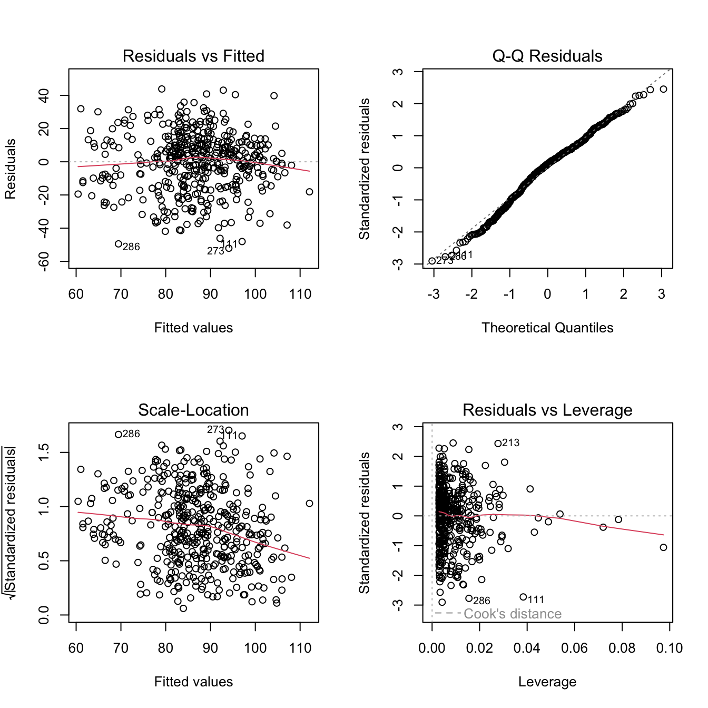{width=672}
:::

```{.r .cell-code}
par(mfrow = c(1, 1))
```
:::


::: {.cell}

```{.r .cell-code}
check_predictions(mA)
```

::: {.cell-output-display}
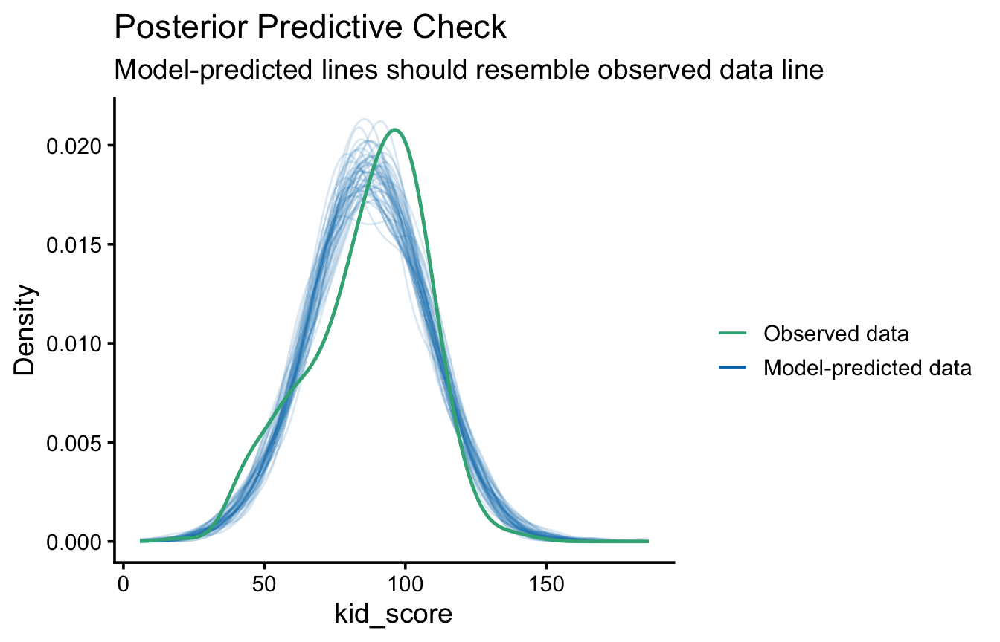{width=672}
:::
:::


Possibile conclusione: "Tra i modelli considerati, quello con QI della madre,
diploma e loro interazione risulta il migliore (AIC = 3745.1, $w = 0.49$);
l'aggiunta di età e condizione lavorativa della madre non migliora la capacità
predittiva ($\Delta\text{AIC} < 4$, a fronte di più parametri). Il modello spiega
circa il 23% della variabilità dei punteggi, con un errore medio di previsione di
circa 18 punti."
:::

# Riferimenti bibliografici

**Testi di riferimento:**

- Fox, J. (1997). *Applied Regression Analysis, Linear Models, and Related Methods*. SAGE.
- Fox, J. (2002). *An R and S-Plus Companion to Applied Regression*. SAGE.
- Gelman, A., Hill, J., Vehtari, A. (2020). *Regression and Other Stories*. Cambridge University Press.
- McElreath, R. (2020). *Statistical rethinking: A Bayesian course with examples in R and Stan* (2nd ed.). Chapman and Hall/CRC. https://doi.org/10.1201/9780429029608

**In italiano:**

- Bortot, P., Ventura, L., Salvan, A. (2000). *Inferenza Statistica: Applicazioni con S-PLUS e R*. Cedam, Padova.
- Grigoletto, M., Ventura, L., Pauli, F. (2017). *Modello lineare. Teoria e applicazioni con R*. Giappichelli, Torino.
- Pastore, M. (2015). *Analisi dei dati in psicologia (con applicazioni in R)*. Il Mulino, Bologna.

**Sul confronto fra modelli:**

- Burnham, K. P., Anderson, D. R. (2002). *Model Selection and Multimodel Inference*. Springer.
- Wagenmakers, E.-J., Farrell, S. (2004). AIC model selection using Akaike weights. *Psychonomic Bulletin & Review*, 11, 192–196.

**Pacchetti R utilizzati in questa dispensa:**

- **ggplot2** (Wickham, 2016) — grafici;
- **sjPlot** (Lüdecke, 2023) — visualizzazione degli effetti dei modelli;
- **effects** (Fox & Weisberg, 2019) — visualizzazione degli effetti dei modelli;
- **performance** (Lüdecke et al., 2021) — predictive check e diagnostica;
- **MuMIn** (Bartoń, 2020) — selezione di modelli.


::: {.cell}

```{.r .cell-code}
sessionInfo()
```

::: {.cell-output .cell-output-stdout}

```
R version 4.4.2 (2024-10-31)
Platform: aarch64-apple-darwin20
Running under: macOS Sequoia 15.6.1

Matrix products: default
BLAS:   /Library/Frameworks/R.framework/Versions/4.4-arm64/Resources/lib/libRblas.0.dylib 
LAPACK: /Library/Frameworks/R.framework/Versions/4.4-arm64/Resources/lib/libRlapack.dylib;  LAPACK version 3.12.0

locale:
[1] en_US.UTF-8/en_US.UTF-8/en_US.UTF-8/C/en_US.UTF-8/en_US.UTF-8

time zone: Europe/Rome
tzcode source: internal

attached base packages:
[1] stats     graphics  grDevices utils     datasets  methods   base     

other attached packages:
[1] MuMIn_1.48.4       performance_0.14.0 effects_4.2-2      carData_3.0-5     
[5] sjPlot_2.8.17      ggplot2_4.0.2     

loaded via a namespace (and not attached):
 [1] sjlabelled_1.2.0   tidyselect_1.2.1   dplyr_1.2.0        farver_2.1.2      
 [5] S7_0.2.1           fastmap_1.2.0      TH.data_1.1-3      bayestestR_0.17.0 
 [9] sjstats_0.19.0     digest_0.6.39      estimability_1.5.1 lifecycle_1.0.5   
[13] survival_3.8-3     magrittr_2.0.4     compiler_4.4.2     rlang_1.1.7       
[17] tools_4.4.2        yaml_2.3.12        knitr_1.51.2       labeling_0.4.3    
[21] htmlwidgets_1.6.4  RColorBrewer_1.1-3 multcomp_1.4-29    withr_3.0.2       
[25] purrr_1.2.1        stats4_4.4.2       nnet_7.3-20        grid_4.4.2        
[29] datawizard_1.3.0   xtable_1.8-4       colorspace_2.1-1   emmeans_1.10.7    
[33] scales_1.4.0       MASS_7.3-64        insight_1.4.4      cli_3.6.5         
[37] mvtnorm_1.3-3      survey_4.4-2       rmarkdown_2.30     reformulas_0.4.4  
[41] generics_0.1.4     otel_0.2.0         rstudioapi_0.18.0  parameters_0.28.3 
[45] minqa_1.2.8        DBI_1.2.3          stringr_1.6.0      splines_4.4.2     
[49] effectsize_1.0.1   mitools_2.4        vctrs_0.7.1        boot_1.3-31       
[53] Matrix_1.7-2       sandwich_3.1-1     jsonlite_2.0.0     hms_1.1.4         
[57] see_0.10.0         tidyr_1.3.2        glue_1.8.0         nloptr_2.1.1      
[61] codetools_0.2-20   stringi_1.8.7      gtable_0.3.6       ggeffects_2.2.0   
[65] lme4_1.1-36        tibble_3.3.1       pillar_1.11.1      htmltools_0.5.9   
[69] R6_2.6.1           Rdpack_2.6.2       evaluate_1.0.5     lattice_0.22-6    
[73] haven_2.5.4        rbibutils_2.3      snakecase_0.11.1   Rcpp_1.1.1        
[77] coda_0.19-4.1      nlme_3.1-167       xfun_0.56          zoo_1.8-12        
[81] forcats_1.0.1      sjmisc_2.8.10      pkgconfig_2.0.3   
```


:::
:::


---


